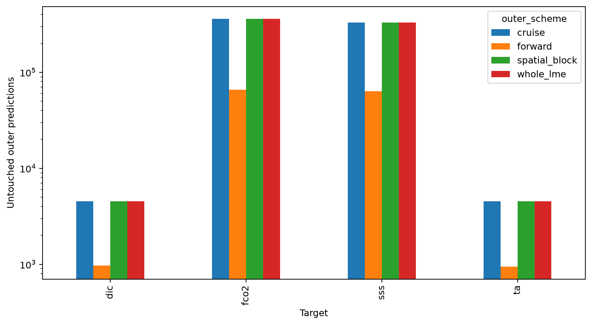
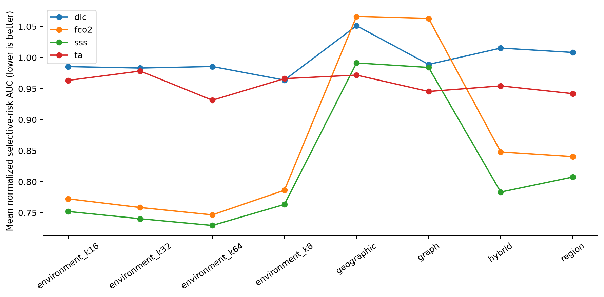
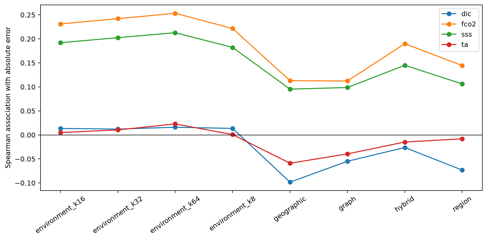
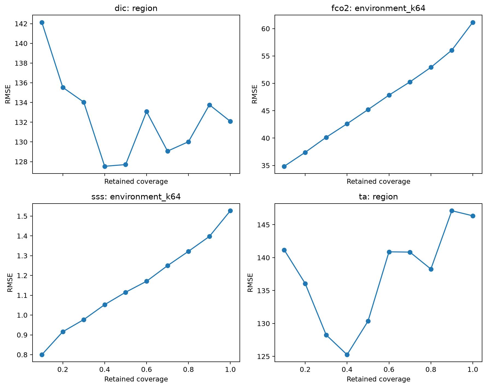
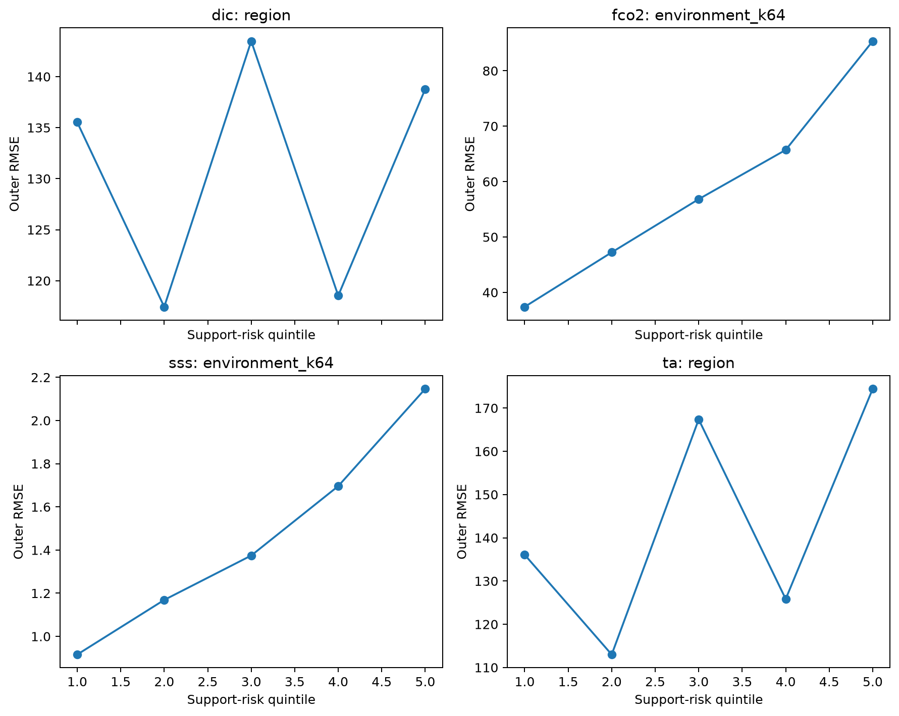
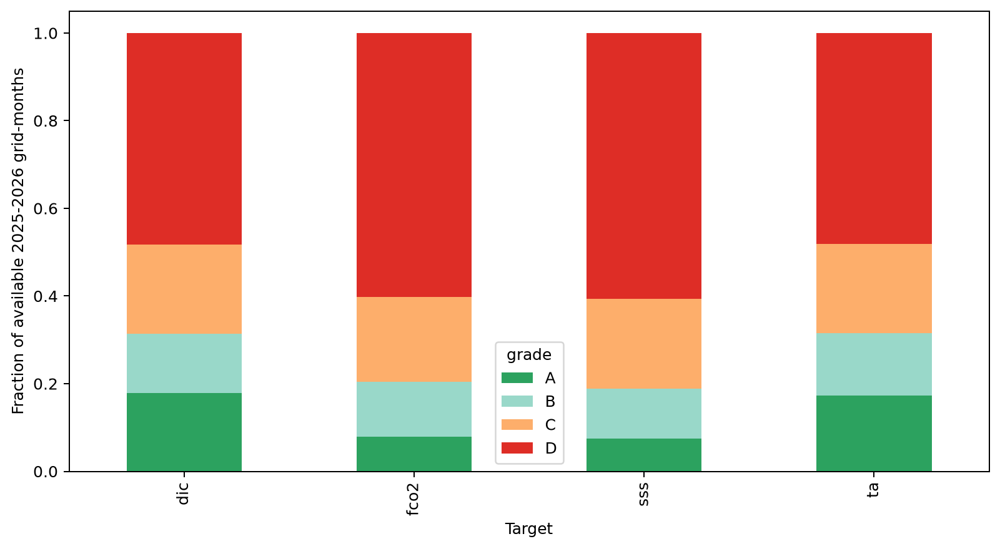

# Quantitative applicability infrastructure for ReCAD P1.5

## Scientific question and permitted claim

Issue #24 asks whether label-free geographic, regional, water-connected, or environmental support can predict untouched outer-fold error for SSS, fCO2, TA, and DIC. The permitted claim is an applicability-method decision and a development-stage grid-month support index. It is not a final product validation result.

## Data, splits, and leakage controls

The run used only labels exposed by the frozen v2.2 train/development gateway. Locked-test and external-independent labels remained sealed. Cruise folds, fixed 5-degree spatial blocks, complete LME assignments, and the frozen forward split were evaluated separately. For every outer partition, ridge alpha was selected by three-fold cruise GroupKFold inside the outer-training rows. Outer labels were removed from the prediction call and were consulted only after predictions and support indices were frozen.

Training, calibration, and independent support have separate fields. The independent-support field is null and carries the `INDEPENDENT_SUPPORT_SEALED` reason bit until P3. Water-connected distance uses the frozen 148,795-node coastal graph and cannot cross disconnected land barriers. Environmental scaling and nearest-neighbour trees are fitted from the corresponding outer-training rows only.

## Candidate models and training

The prediction model is a deterministic nested Ridge residual probe, used to create calibration-safe residuals rather than to choose the final SSS/fCO2/TA architecture. SSS is fitted as a residual over background SSS; the other targets are direct probes. Candidate alpha values are [0.1, 10.0, 1000.0]. Applicability candidates are geographic distance, LME/basin/regime-month support, coastal-graph distance, standardized environmental k-neighbour distance for k=[8, 16, 32, 64], and a label-free rank hybrid. The complex-method gate requires at least 1.0% lower normalized AURC than the best simple method and monotonic-step score of at least 0.75.

## Main development results

- **dic:** retained `region`; rejected complex method. Best complex versus simple AURC change: +4.4%. Monotonic method exists: False.
- **fco2:** retained `environment_k64`; retained complex method. Best complex versus simple AURC change: +11.2%. Monotonic method exists: True.
- **sss:** retained `environment_k64`; retained complex method. Best complex versus simple AURC change: +9.6%. Monotonic method exists: True.
- **ta:** retained `region`; rejected complex method. Best complex versus simple AURC change: +1.1%. Monotonic method exists: False.

The output contains 2,230,337 untouched outer predictions and 7,361,632 target-specific strict-input-ready grid-month support records for 2025-2026. Exact values by target, scheme, method, and grade are in Tables 1-6.

## Decision and limitations

The Issue #24 infrastructure gate passes because at least one target has a method with the preregistered monotonic outer-error behavior. SSS and fCO2 satisfy this requirement; TA and DIC do not, so this infrastructure cannot yet assign them empirically calibrated accuracy grades. Complex graph/environment/hybrid metrics are retained target by target only where their AURC margin passes; otherwise the simpler geographic/region baseline is the required operational choice.

The probe model is deliberately not a production model. Chl-a, bathymetry, and explicit coast distance are absent from the frozen v2.2 observation cache and therefore were not silently reconstructed after preregistration. TA/DIC support is North-American evidence even though the schema is globally mappable. A/B/C/D grades quantify demonstrated support, while final target accuracy, interval calibration, and publishability remain the responsibility of Issues #25-#28.

## Figure and table index

Every figure is backed by CSV source data under `tables/`; hashes and mappings are in `archive_manifest.json`.

Figure 1. Untouched outer-prediction counts for cruise, fixed spatial-block, complete-LME, and forward-time evaluation. The logarithmic axis shows the much smaller TA and DIC anchor sets without treating record count as independent evidence.

Figure 2. Mean normalized selective-risk area under the risk-coverage curve for each label-free support method. Lower values mean that low-risk records retain lower error as mapped coverage expands.

Figure 3. Mean Spearman association between each support-risk score and untouched outer absolute error. Positive association is desirable but is interpreted together with monotonic strata and selective-risk area.

Figure 4. Outer RMSE versus retained coverage for the method retained by the preregistered simple-versus-complex rule. Each line averages evaluation schemes rather than mixing their records.

Figure 5. Untouched outer RMSE from the lowest to highest support-risk quintile for each retained method. Monotonic increases provide the operational evidence needed for A/B/C/D grading.

Figure 6. Development-stage A/B/C/D support grades across strict-input-ready 2025-2026 coastal grid-months. These are applicability grades, not independent accuracy validation or permission to publish a target product.

