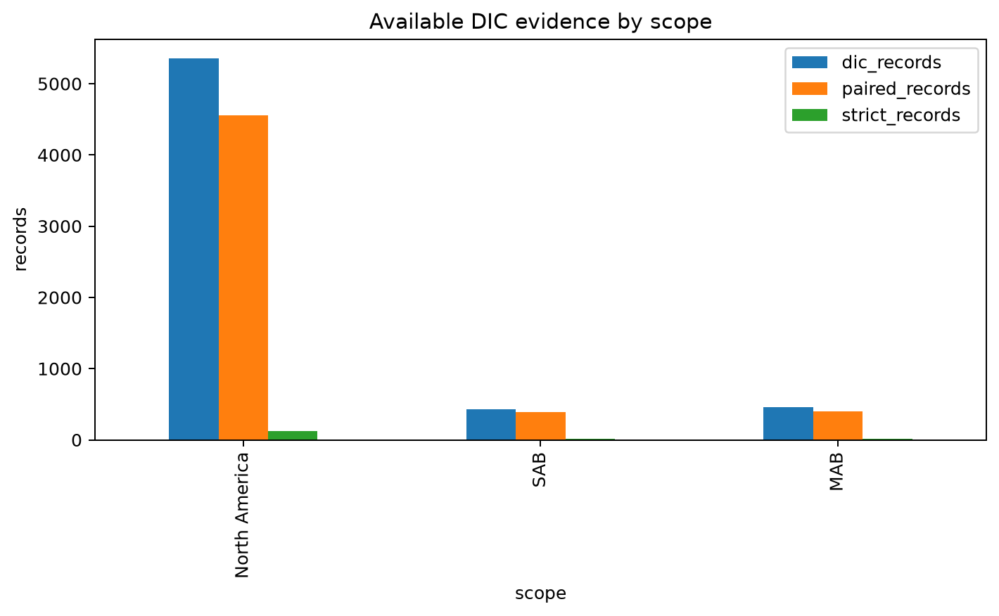
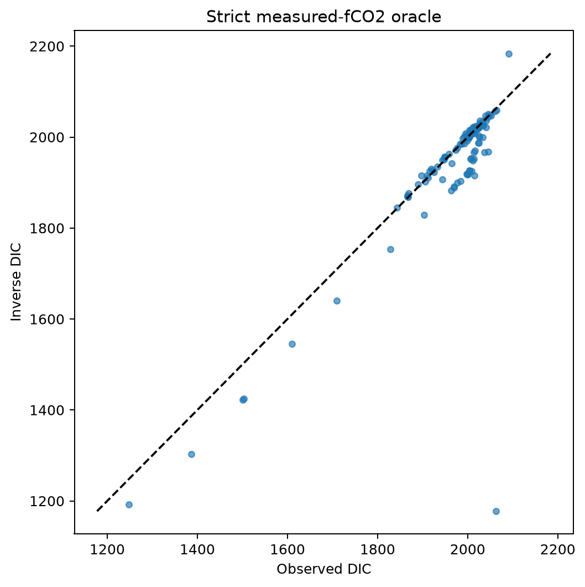
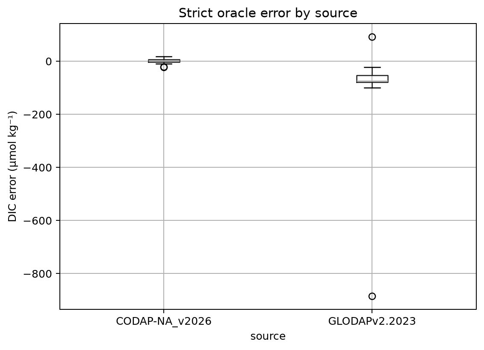
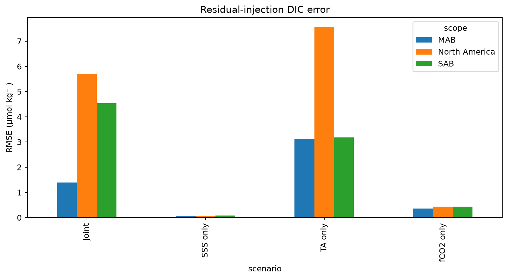
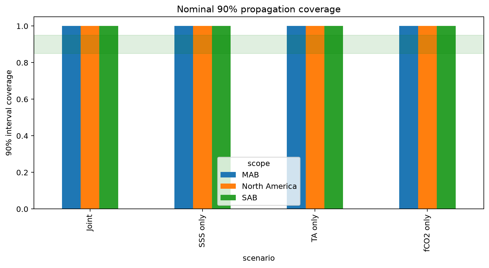
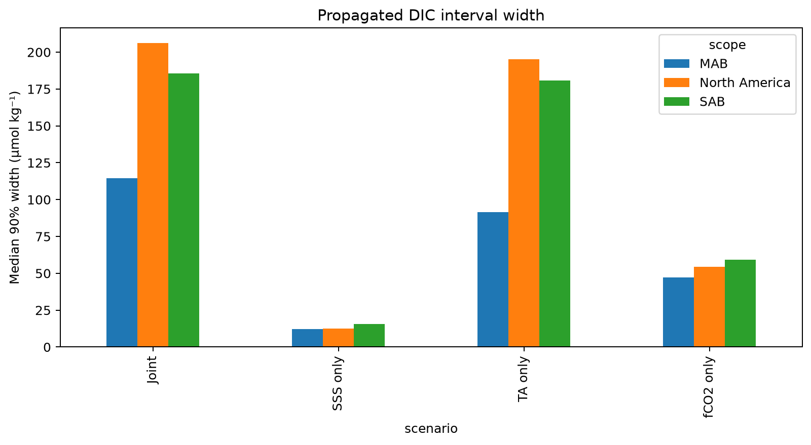
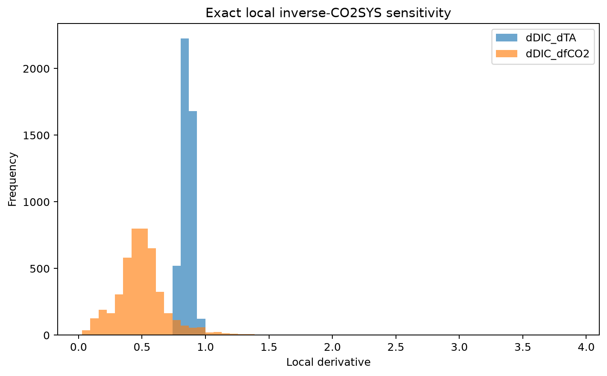
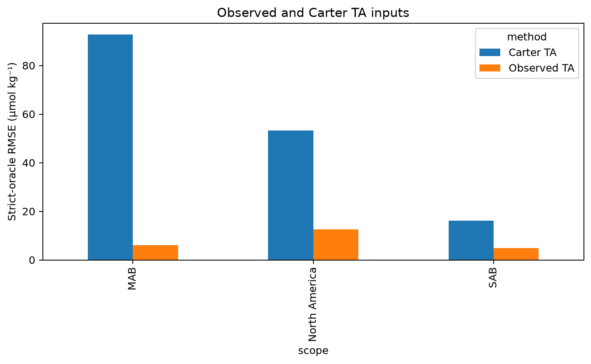

# Exact inverse-CO2SYS DIC validation and uncertainty propagation

## Scientific question and permitted claim

This preregistered Issue #10 experiment asks whether DIC can be inferred from TA and fCO2 with exact PyCO2SYS and calibrated propagated uncertainty. The permitted result is a structural and development diagnostic. It does not validate a DIC product because upstream TA is diagnostic-only/fail and fCO2 is diagnostic-only.

## Data, splits, and leakage controls

The gateway read only frozen train/development DIC labels. Locked test and external-independent labels remained sealed. There are 5,356 DIC records from 301 cruises; 4,554 records support paired-carbon propagation, while only 119 records from 8 cruises also contain eligible measured fCO2 (method 1/2, QC=2). Calculated method-3 fCO2 was excluded from the strict oracle.

## Candidate models and training

No DIC machine-learning model was fitted. Exact PyCO2SYS used TA+fCO2 with the preregistered constants. A numerical round trip used observed TA+DIC to calculate reference fCO2 and invert it back. The uncertainty experiment sampled complete frozen development residual banks hierarchically by cruise for SSS, fCO2, and TA, with 2000 draws for each of seeds 100, 101, and 102. Carter/ESPER TA was evaluated only where it overlaps strict development anchors.

## Main development results

The exact paired-carbon round trip is numerical, with North America RMSE 5.21e-13 µmol kg⁻¹. On the genuinely measured-fCO2 strict subset, observed-TA inverse DIC has RMSE 89.5, MAE 30.4, bias -24.4 µmol kg⁻¹ and R² 0.480; exact forward closure remains below 2.67e-12 µatm. The joint residual-injection diagnostic has North America median-prediction RMSE 5.7 µmol kg⁻¹, but this small centered-simulation error is not end-to-end skill. Its 50% and 90% coverages are both 1.000, above the preregistered ranges, while the median 90% interval is 206.1 µmol kg⁻¹ wide: the uncertainty is strongly overdispersed and fails calibration. TA-only propagation dominates (RMSE 7.56; median 90% width 195.2), compared with fCO2-only (RMSE 0.43; width 54.3) and SSS-only (RMSE 0.071; width 12.4). On the same 70-record, two-cruise overlap, replacing observed TA with Carter TA raises strict-oracle RMSE from 12.7 to 53.3 µmol kg⁻¹ and changes bias from +3.1 to +19.5 µmol kg⁻¹; the limited overlap makes this an audit, not regional validation. Component results and regional SAB/MAB values are in Tables 2-7.

## Decision and limitations

Decision: `diagnostic_only`. Exact inversion is technically sound, but the DIC product gate fails because TA and fCO2 have not passed their upstream product gates. The strict subset spans only eight cruises overall; SAB and MAB do not reach five strict cruises. The larger paired-carbon experiment starts from fCO2 calculated using observed DIC, so it quantifies error propagation and cannot establish independent DIC predictive skill. Both nominal coverage gates fail through severe overcoverage. Residual banks come from different observation networks, so cross-target error dependence is unidentified.

## Figure and table index

Every figure is backed by a CSV under `tables/`; hashes and mappings are in `archive_manifest.json`.

Figure 1. DIC evidence counts in unsealed train/development. The strict measured-fCO2 subset contracts from 5,356 DIC records to 119 records and only eight cruises.

Figure 2. Exact TA plus measured-fCO2 inverse DIC against observed DIC for the strict subset. Scatter includes sampling and carbonate-parameter mismatch, not solver approximation.

Figure 3. Strict inverse-DIC errors separated by CODAP-NA and GLODAP source. Source structure warns against treating the 119 records as an exchangeable product-validation sample.

Figure 4. DIC RMSE after injecting frozen upstream development residuals into exact PyCO2SYS. TA error dominates the joint propagation and prevents a publishable DIC product.

Figure 5. Empirical coverage of propagated nominal 90% DIC intervals on paired-carbon anchors. This is a residual-injection calibration diagnostic, not independent pointwise validation.

Figure 6. Median propagated 90% DIC interval width by error source and region. Joint intervals quantify the precision cost of uncertain TA, fCO2, and SSS inputs.

Figure 7. Exact PyCO2SYS local derivatives on paired observed TA-DIC states. One-unit TA errors transfer nearly one-for-one into DIC, while fCO2 sensitivity is smaller per unit.

Figure 8. Strict measured-fCO2 DIC RMSE using observed TA versus Carter/ESPER TA where development records overlap. The small overlap makes this an audit rather than a product comparison.

