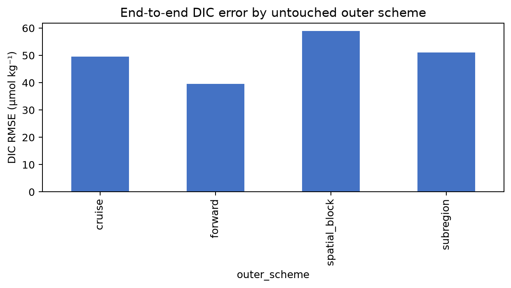
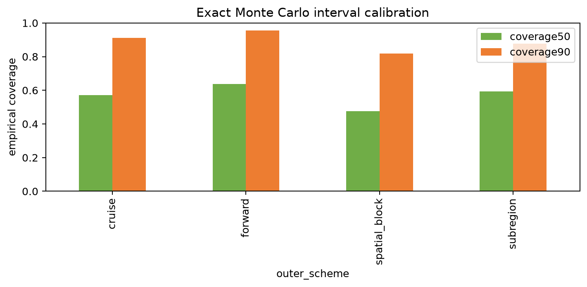
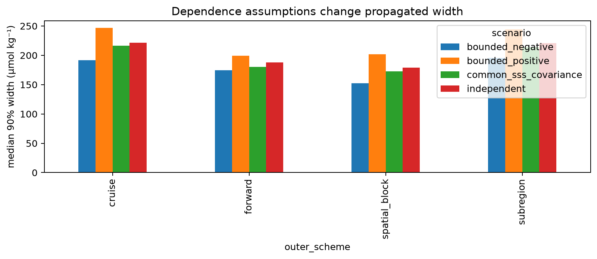
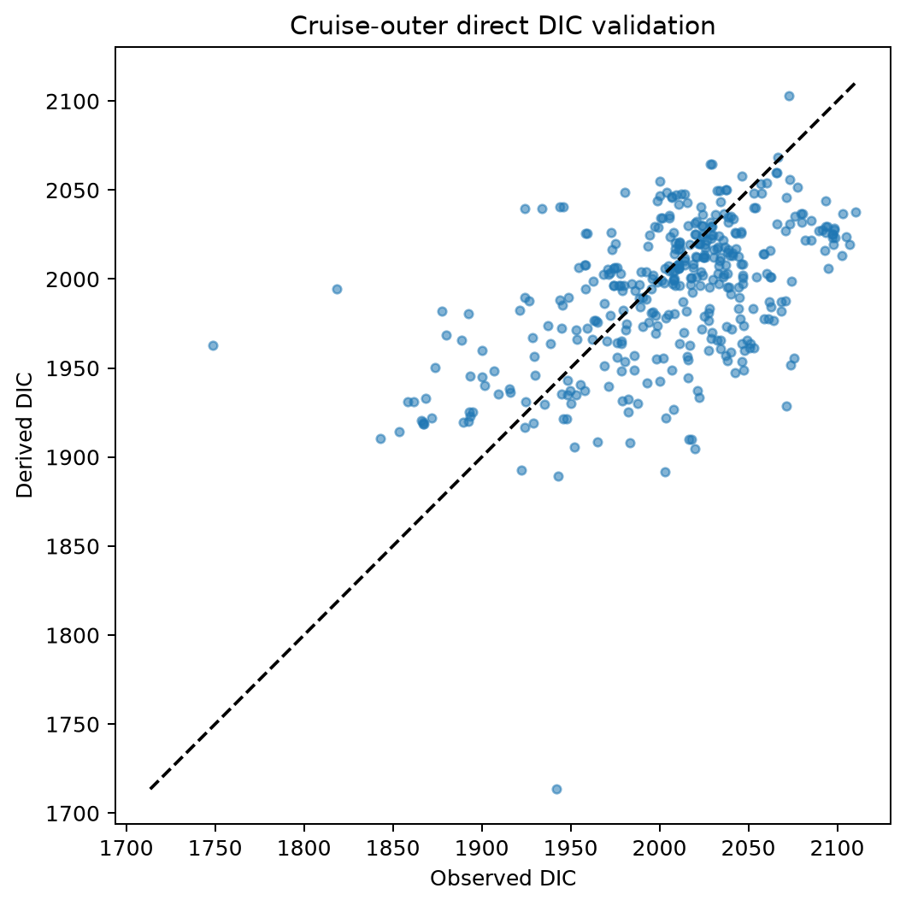
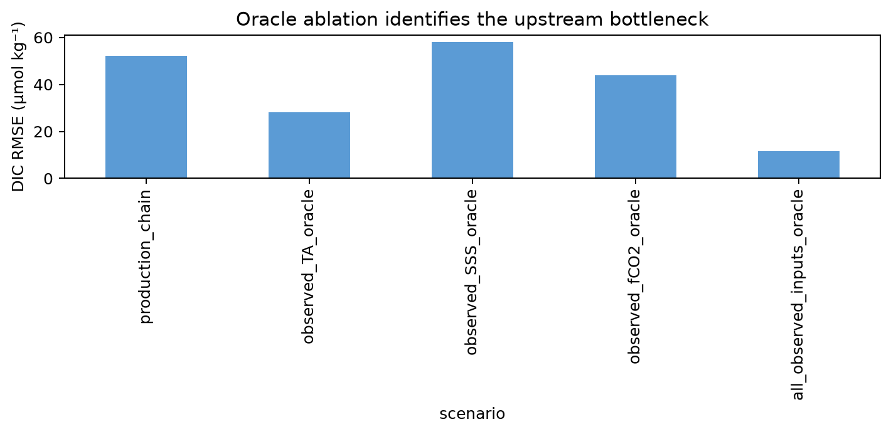
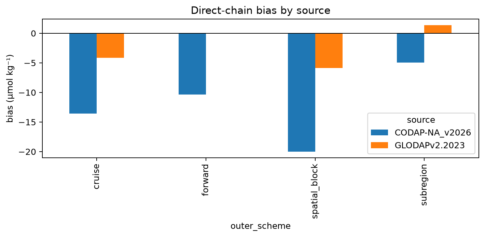
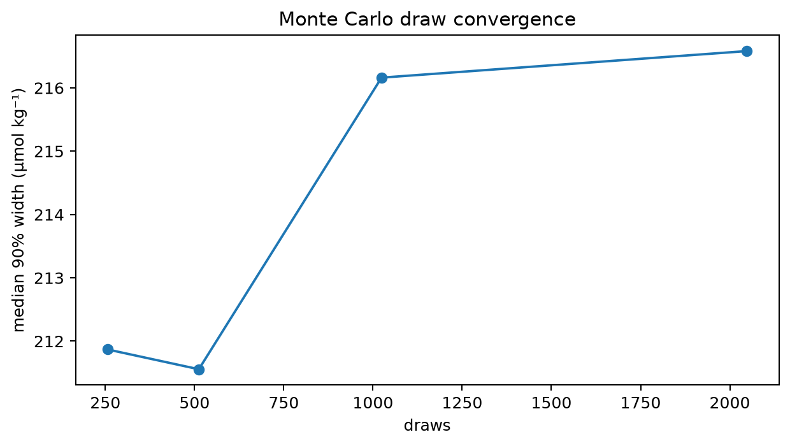
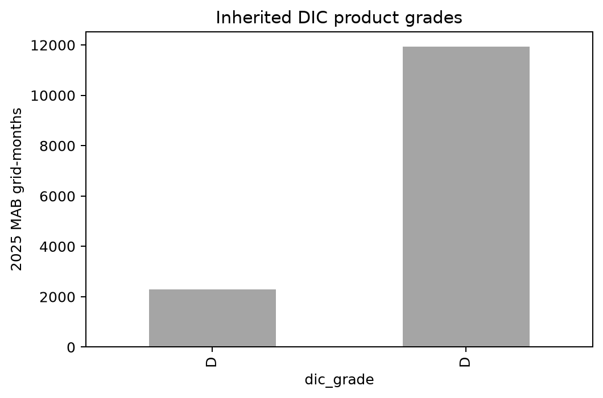

# Issue #28 derived-DIC reliability report

## Scientific question and permitted claim

Can DIC be released as a qualified MAB derived product when SSS, fCO2, and TA are predictions? The answer is **`diagnostic_only`**. This experiment permits a diagnostic claim only: PyCO2SYS propagation is operational and directly testable, but the current MAB upstream chain does not support a released DIC product. Exact closure is an engineering result, not validation.

## Data, splits, and leakage controls

The anchor is direct surface DIC from CODAP-NA/GLODAP, filtered to parameter methods 1/2 in LME 7 at 35.20-41.75°N. There are 461 source rows before matching and 1,304 outer predictions spanning 31 cruises and 12 years. Issue #27 TA OOF folds define cruise, 5° spatial-block, complete-subregion, and forward exclusions. A matching MAB SOCAT fCO2 model is fit after the same exclusion and a nested 20% cruise calibration holdout. DIC labels never enter SSS, fCO2, or TA fitting. Locked and external-independent labels remain sealed.

CODAP-NA and GLODAP source, direct/adjusted parameter method, unit, surface temperature basis, zero-nutrient approximation, and QC availability are audited in Table 1. The frozen solver uses pressure 0 dbar, total silicate/phosphate 0 µmol kg⁻¹, pH scale 1, carbonic constants 10, bisulfate 1, and total borate 1. This nutrient assumption is a model limitation.

## Candidate models and training

The production-chain diagnostic combines Issue #25 cross-fitted SSS, full-budget 1,500-iteration CatBoost fCO2 residual models, and the frozen Issue #27 hierarchical TA candidate. Four dependence assumptions are compared. The common-SSS construction uses one salinity draw in SSS, TA, and fCO2; independent residual covariance cannot be estimated directly because the observation systems lack enough row-matched joint OOF residuals. PyCO2SYS central finite differences provide the Jacobian. Exact chunked Monte Carlo is run for all validation rows, so low-salinity and nonlinear states do not rely on a linear approximation.

## Main development results

End-to-end RMSE for cruise/spatial/subregion/forward is 49.61, 58.90, 51.06, and 39.53 µmol kg⁻¹; R² is 0.180, -0.156, 0.131, and 0.265. Under common-SSS propagation, median 90% widths are 216.2, 172.8, 214.1, and 180.6 µmol kg⁻¹. Maximum inverse/forward closure error is 5.68e-12 µatm.

The strict grade rule inherits the weakest SSS/fCO2/TA grade. Issue #26 qualified only Caribbean fCO2 and Issue #27 classified the MAB TA atlas as D, so 2025 MAB DIC is fully suppressed. Direct validation remains scientifically useful for locating upstream error, but cannot override those frozen product statuses.

## Decision and limitations

Decision: **`diagnostic_only`**. Failed preregistered gates: positive_r2_all_schemes, coverage50, coverage90, median_width90, grade_ab_retained, all_upstreams_qualified. Grade A/B retained fraction is 0.000. Empirical residual covariance is not identifiable from the current disjoint SOCAT and CODAP/GLODAP sampling; bounded-correlation results therefore remain a sensitivity envelope, while the common-SSS term is a structural covariance model. No locked DIC/TA labels or 41-cruise external CODAP set were opened. A future DIC product requires a qualified MAB fCO2 product, a TA model that passes Issue #27-type spatial and interval gates, and then a newly frozen direct-DIC audit.

## Figure and table index

Tables 1-10 contain the source audit, chain metrics, propagation comparison, oracle ablation, Monte Carlo convergence, source bias, reason bits, chemistry/closure checks, grade counts, and 2025 atlas counts. Row-level predictions and the grid-month provenance atlas are stored in the ignored experiment output directory.

Figure 1. Direct-observation DIC RMSE for the complete predicted SSS-fCO2-TA chain under cruise, spatial-block, subregion, and forward outer exclusions; no DIC label trained any upstream model.

Figure 2. Empirical 50% and 90% coverage from 2,048-draw exact PyCO2SYS Monte Carlo intervals using the shared-SSS covariance construction, compared across untouched outer schemes.

Figure 3. Median propagated 90% DIC interval width under independent errors, bounded negative and positive correlations, and a common-SSS structural covariance factor.

Figure 4. Cruise-outer derived DIC against direct CODAP-NA/GLODAP observations in MAB; dispersion around the identity line is predictive error rather than numerical closure error.

Figure 5. RMSE after replacing one or all upstream quantities with observations; the comparison separates TA, fCO2, and SSS representation limits from carbonate-solver behavior.

Figure 6. Mean DIC prediction error separated by source and outer scheme; small GLODAP strata are retained visibly and are not pooled away into the CODAP-NA majority.

Figure 7. Preregistered 256-2,048 draw convergence diagnostic on a fixed cruise-outer anchor subset; the final run uses the frozen 2,048-draw budget.

Figure 8. Grid-month count of inherited 2025 MAB DIC grades; Issue #26 fCO2 and Issue #27 TA statuses force suppression even where SSS itself has support.
