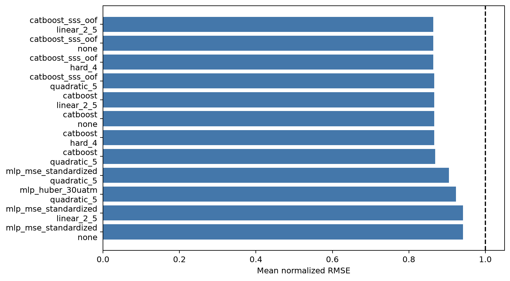
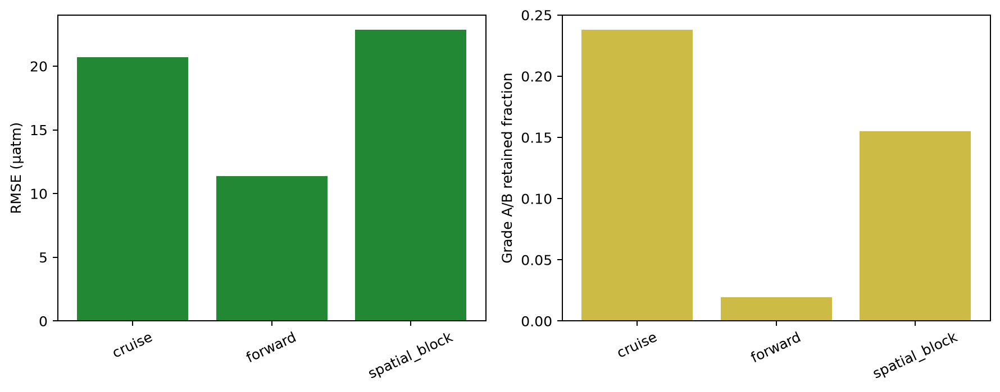
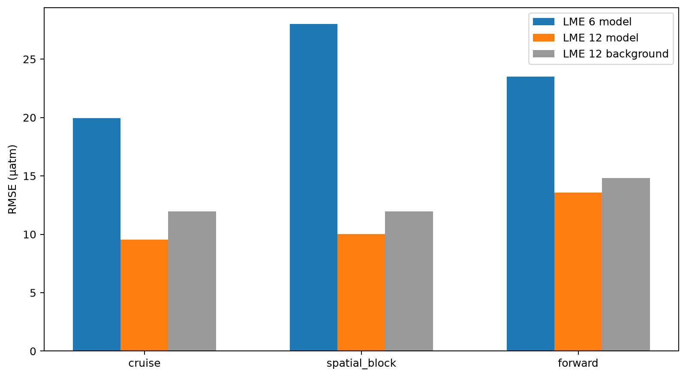
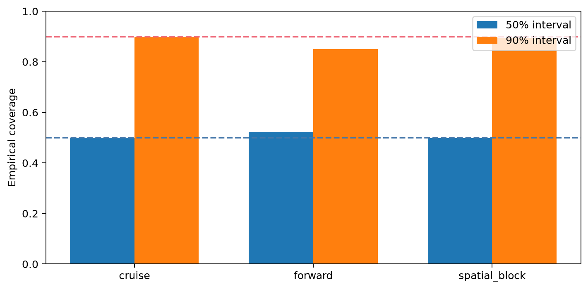
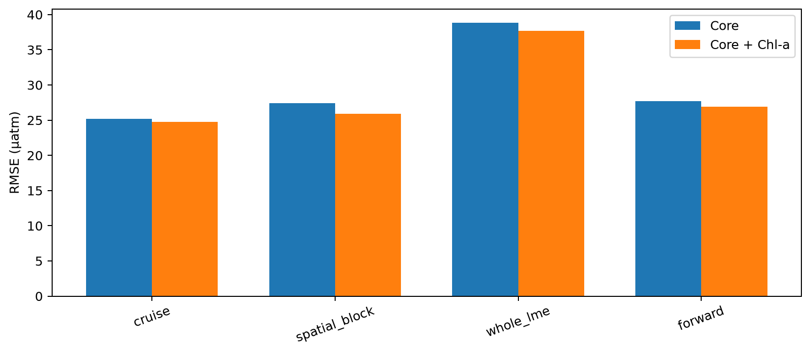
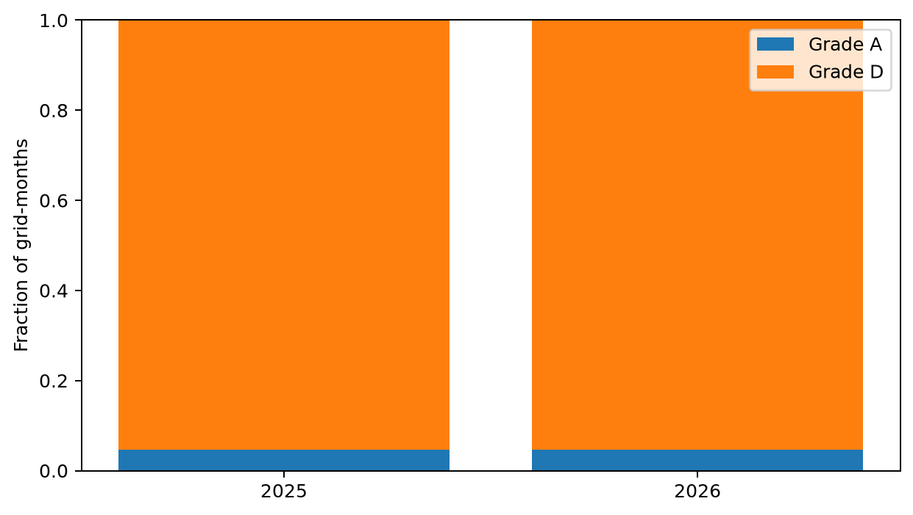
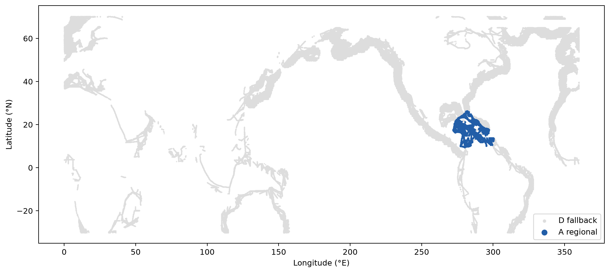
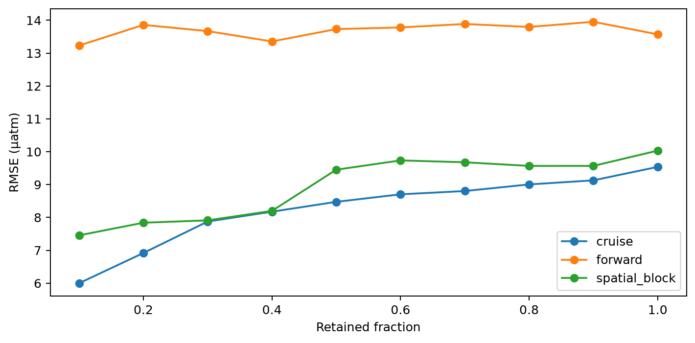

# P1 fCO2 support-aware regional product — reviewer archive

**Decision: `pass_regional` for Caribbean Sea (LME 12) only.** The locked fCO2 test and external-independent labels remain sealed. This result nominates the regional candidate for a future locked audit; it is not independent validation and does not support a global fCO2 claim.

## Scientific question and permitted claim

This experiment asks whether support-aware residual learning can produce a calibrated coastal fCO2 product in a defensible subset of the frozen domain. The permitted claim is development evidence from untouched cruise, spatial-block, whole-LME, and forward outer predictions. Caribbean Sea is the only confirmed publishable development region. All other regions are explicitly grade D and background-only in the atlas.

## Data, splits, and leakage controls

SOCATv2026 fCO2 is the response. Predictors are monthly SST, GLORYS/OOF-corrected SSS, ADT, wind speed, atmospheric pCO2/xCO2, coordinates, month, and frozen LME/basin/regime identifiers. Every outer model is fit without its held cruises, 5-degree blocks, complete LMEs, or 2019-2021 forward cruises. SSS corrections are joined from Issue #25 cross-fitted predictions. Model budgets and gates were committed before each corresponding run. The temporal interval inflation uses only a nested 2016-2018 pseudo-forward split inside the training era. No locked or external labels were read.

## Candidate models and training

The first stage compares fixed 1500-tree CatBoost, standardized-target MLP with MSE, physically scaled 30 µatm Huber MLP, and CatBoost with OOF-corrected SSS. Each is evaluated with no, linear 2-5, quadratic-5, and hard-4 support shrinkage. CatBoost plus OOF SSS and linear 2-5 shrinkage ranks first. Because the global selective gate left a documented whole-LME failure, the preregistered conditional branch trains independent LME CatBoost experts for regions selected only by training metadata. Cruise OOF nominates LMEs; spatial-block and forward predictions confirm them. Unseen LMEs fall back to the seasonal-trend background and grade D.

Chl-a is tested as a single-factor addition on identical finite-Chl-a rows. Bathymetry and distance-to-coast are absent from the frozen v2.2 assets, so that block is recorded as unavailable instead of being ingested after outcomes were seen. The coastal graph branch was not triggered because Issue #24 selected environmental-k64 over graph applicability.

## Main development results

The global selective A/B subset is strong for cruise and spatial-block testing but contains no whole-LME A/B rows and retains only 1.95% of forward rows. The conditional regional experiment nominates LMEs 6 and 12 from cruise OOF. LME 6 fails spatial skill and q90. Caribbean Sea passes every frozen regional confirmation check:

| outer_scheme | n | rmse | mae | q90_absolute_error | skill_vs_background | coverage50 | coverage90 |
| --- | --- | --- | --- | --- | --- | --- | --- |
| cruise | 78059 | 9.538 | 6.140 | 12.561 | 0.364 | 0.500 | 0.900 |
| forward | 15252 | 13.571 | 9.038 | 20.094 | 0.161 | 0.523 | 0.850 |
| spatial_block | 78059 | 10.033 | 6.249 | 12.894 | 0.295 | 0.498 | 0.894 |

The nested temporal calibration multiplies Caribbean Sea q50/q90 widths by 1.556/1.325. Final atlas widths are 6.97 µatm (50%) and 16.64 µatm (90%). The atlas contains:

| grade | grid_months |
| --- | --- |
| A | 85501 |
| D | 1754907 |

The Chl-a common-support ablation reduces RMSE by 1.75% (cruise), 5.53% (spatial block), 2.91% (whole LME), and 2.83% (forward). Its cache ends in December 2020, so Chl-a is not used for the 2025/available-2026 atlas.

## Decision and limitations

The final status is `pass_regional`, restricted to Caribbean Sea (LME 12). This passes a preregistered development gate and permits a future one-time locked fCO2 audit; it does not unlock labels in Issue #26. LME 6 and every other LME remain nonpublication regions. Whole-LME transfer failed as a product strategy, so the atlas makes this limitation operational: nonconfirmed regions receive the training-only background, grade D, a suppression flag, and reason bits.

The direct evaluation cache is North-American-adjacent, the background and regional model inherit SOCAT sampling patterns, and the 2026 coverage is provisional. Chl-a coverage is stale; bathymetry/coast-distance inputs remain a future preregistered data-version change. External-independent validation remains reserved for P3.

## Figure and table index

Figure 1. Mean outer-scheme RMSE normalized by the training-only seasonal-trend background for every preregistered model and support-shrinkage pair. Lower is better; the dashed line is background parity. CatBoost with strictly cross-fitted SSS and linear 2-5 environmental shrinkage ranked first before regional specialization.

Figure 2. RMSE and retained fraction for the global support-selective candidate within grade A/B development rows. Cruise and spatial-block subsets are accurate, while whole-LME has no retained A/B rows and forward retention is too small, motivating the preregistered regional-expert branch rather than a global claim.

Figure 3. Regional-expert RMSE against the seasonal-trend background for the two LMEs nominated using cruise OOF only. Caribbean Sea (LME 12) improves cruise, spatial-block, and forward partitions; Southeast U.S. Continental Shelf (LME 6) fails spatial confirmation and is excluded.

Figure 4. Empirical 50% and 90% interval coverage for Caribbean Sea (LME 12). Cruise OOF supplies base conformal widths; a nested 2016-2018 pseudo-forward calibration fitted only inside the training era inflates future intervals, bringing the untouched 2019-2021 forward coverage to the preregistered acceptance range.

Figure 5. CatBoost RMSE with and without log10 MODIS chlorophyll-a on exactly the same finite-Chl-a observations. Chl-a improves all four outer schemes, but the local cache ends in December 2020, so it is evidence for a future refreshed input rather than a valid 2025 product feature.

Figure 6. Grid-month counts in the 2025 core and available 2026 provisional atlas. Only confirmed Caribbean Sea cells with adequate environmental, cruise, effective-group, and SSS support receive grade A; every other grid-month is retained as an auditable grade-D background fallback and is excluded from publication claims.

Figure 7. July 2025 selective fCO2 atlas status. Blue points are grade-A Caribbean Sea regional predictions; light-gray points are grade-D background fallbacks outside the confirmed regional domain or without required support. The map is a development applicability product, not independent validation.

Figure 8. Caribbean Sea RMSE as progressively higher environmental-k64 risk observations are retained. Curves are shown for cruise, spatial-block, and forward partitions; the ordering diagnoses support sensitivity while the formal regional gate remains based on the frozen grade and interval rules.

Source CSVs for all aggregate figures are in `tables/`. Row-level OOF predictions, Chl-a predictions, final checkpoints, and atlas partitions remain in the ignored local output directory and are hash-referenced by the manifest.
