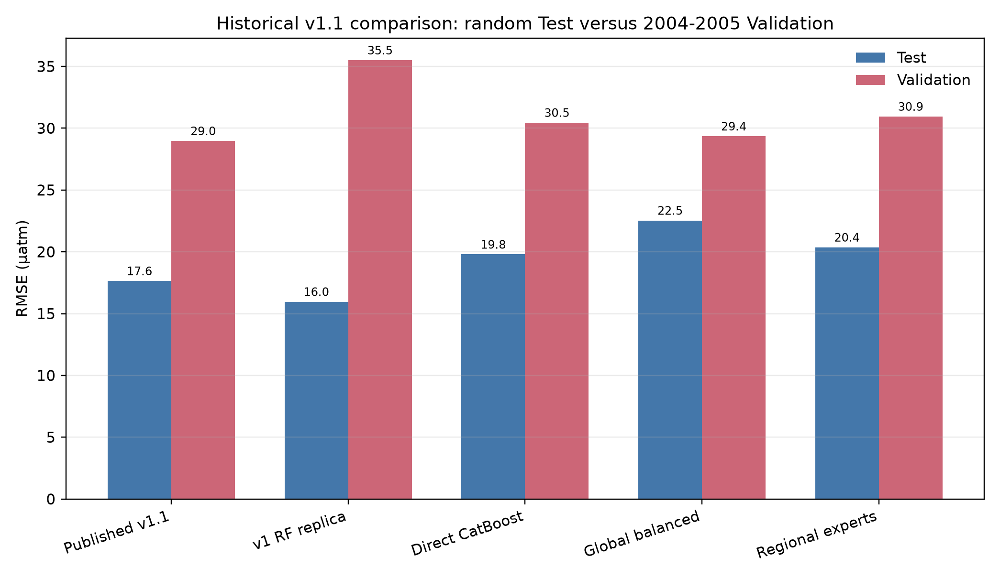
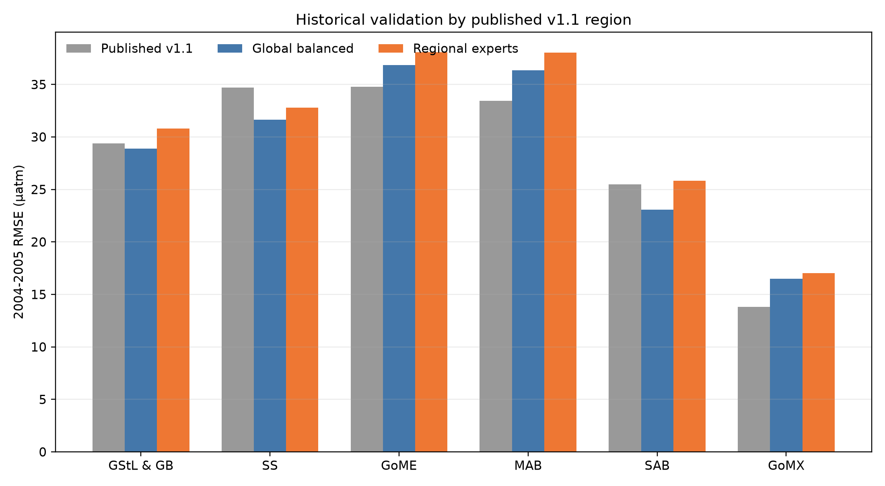
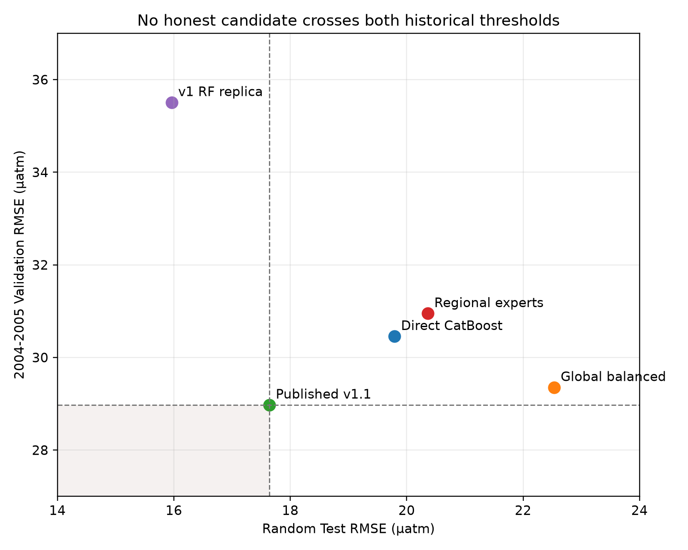
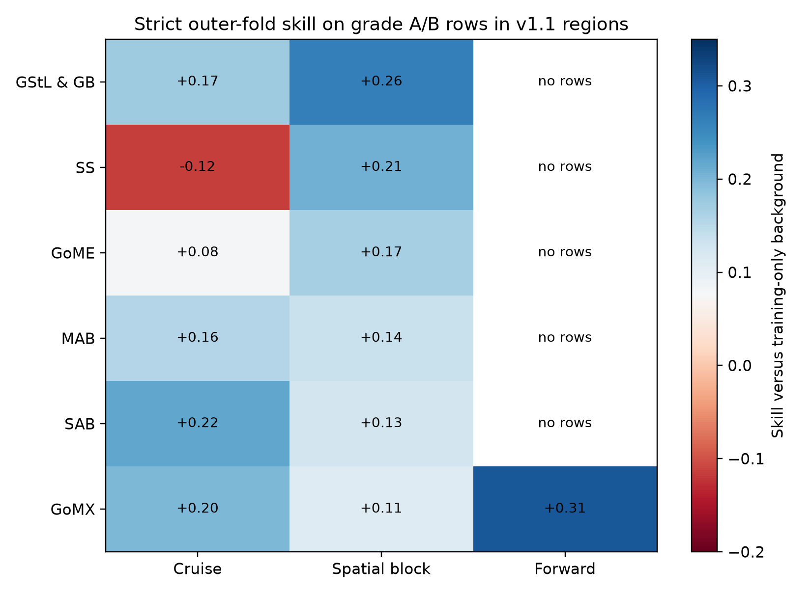

# ReCAD v1.1 parity and strict-transfer audit

**Decision: historical dual parity fails, and no original v1.1 region passes the strict product gate.** Current locked fCO2 and external-independent labels remained sealed. The published v1.1 table is retained as a historical comparison, not as independent evidence.

## Why this experiment was needed

Issue #32 tests whether the v2 design can reproduce and exceed ReCAD v1.1 on its original North American Atlantic domain before claiming a global product. Two questions are separated: whether a model can beat the published random and 2004-2005 numbers, and whether it transfers across cruises, spatial blocks, and future years without using held labels.

## Protocol and models

Stage A was committed before training. It uses exact v1.1 geometric regions, the historical masks through 2021, three seeds, a training-only regional/month seasonal-trend background, and two CatBoost residual candidates: one globally balanced model and six hard regional experts. Stage B was registered after Stage A failed. It reconstructs the exact seven v1 inputs—longitude, latitude, month, SSS, SST, ADT, and atmospheric pCO2—and compares a 300-tree bagged RF replica with direct CatBoost. Neither stage performs label-informed local calibration.

## Historical comparison

| candidate | random Test RMSE | 2004-2005 RMSE | interpretation |
| --- | ---: | ---: | --- |
| Published v1.1 | 17.642 | 28.975 | Historical reported product after local calibration |
| v1 RF replica | 15.964 | 35.507 | Excellent interpolation; poor temporal transfer |
| Direct CatBoost | 19.793 | 30.456 | Balanced but misses both historical thresholds |
| Global balanced residual | 22.536 | 29.353 | Closest honest temporal reproduction |
| Hard regional experts | 20.365 | 30.950 | Helps random Test, harms temporal transfer |

The dual-parity gate requires RMSE below both 17.642 and 28.975 µatm. No honest candidate passes. Blending the RF and residual candidates also produces a continuous tradeoff rather than a point below both thresholds.

Figure 1. Aggregate historical comparison on the original v1.1 random Test and 2004-2005 Validation masks. The exact RF replica wins the random split but fails temporal transfer; the global balanced residual model nearly reproduces the published Validation value but misses the random Test threshold.

Figure 2. Historical 2004-2005 RMSE by the six published regions. No Stage-A architecture uniformly improves the published table. The table is comparison-only because the v1.1 local calibration used SOCAT labels across the full period.

Figure 3. Random-split and 2004-2005 errors for each honest candidate. Dashed lines show the published v1.1 values; the shaded lower-left quadrant is the preregistered dual-parity region. No candidate enters it without label-informed post-calibration.

## v1.1 method audit

The archived v1 code first trains a 300-tree bagged ensemble with minimum leaf size 1 and all seven predictors at every split (`v1/trainRFER7.m`). The reconstruction notebook then fits local linear coefficients between the RF product and SOCAT across the full time series before calculating the reported split metrics (`v1/Data_Calibrate_SOMFNN_coastalv2.ipynb`, calibration cells 25-31 and metric cells 39-41). Because 2004-2005 SOCAT participates in that calibration, the published “Validation” result is not independent of the final calibrated product. This does not invalidate the old product, but it prevents using 28.975 µatm as proof of out-of-time generalization.

## Strict transfer audit

The current Issue #26 global support-aware candidate was remapped to the same six regions using untouched outer predictions. Grade A/B rows must be present in cruise, spatial-block, and forward schemes, have positive background skill, stay below the corresponding published regional RMSE, and keep q90 absolute error at or below 35 µatm. No region passes. SAB is promising on cruise and spatial-block rows but has no surviving forward A/B rows; GoMX has forward support but misses its very stringent published regional threshold in spatial transfer.

Figure 4. Skill versus the training-only seasonal-trend background on grade A/B rows under untouched cruise, spatial-block, and forward outer folds, remapped to the original v1.1 regions. Missing forward cells mean no A/B observations survived the support rule. No region passes all required schemes and error gates.

## Decision and next experiment

Issue #32 closes as a negative but decisive benchmark. The exact old RF is retained as an interpolation baseline, while the global balanced residual model is retained as the temporal-transfer baseline. Neither is a publishable global architecture. The next global experiment must train a global backbone with soft regional adapters or mixture-of-experts, optimize macro-region and worst-region loss, and use strictly cross-fitted SSS. Model selection must use cruise, spatial-block, and forward outer folds; the old random split and 2004-2005 table remain descriptive only. Current locked and external-independent labels stay sealed until that candidate passes the development gates.

## Reproducibility

Aggregate source tables, decisions, protocol hashes, and figure captions are stored with this report. Row-level predictions and checkpoints remain in the ignored experiment output and are referenced by hashes in `archive_manifest.json`.

The official Zenodo v1.1 product was retrieved through the remote staging server and verified locally against the published MD5 (`0d414d5c84698059f04f0ff2ad2e69ca`). It contains the reconstructed fCO2/pCO2 fields and uncertainty, but no SOCAT labels or split masks; its metadata is archived in `tables/v11_product_provenance.json`.
