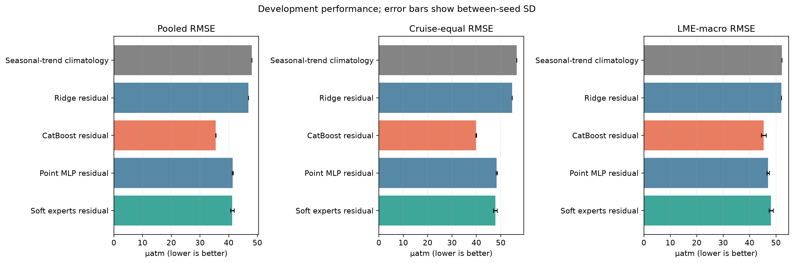
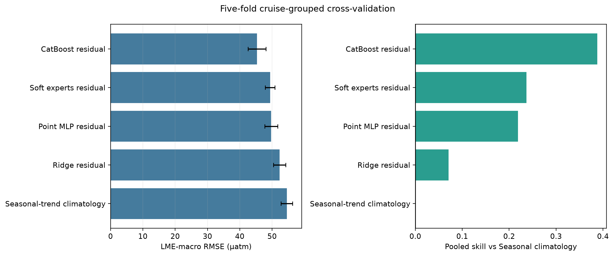
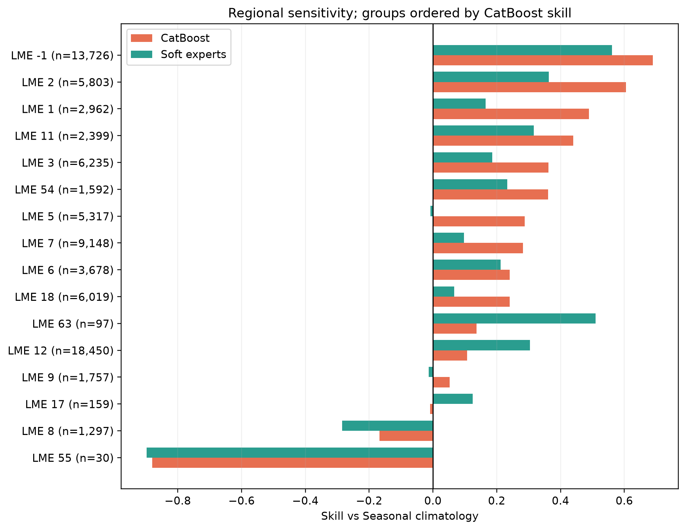
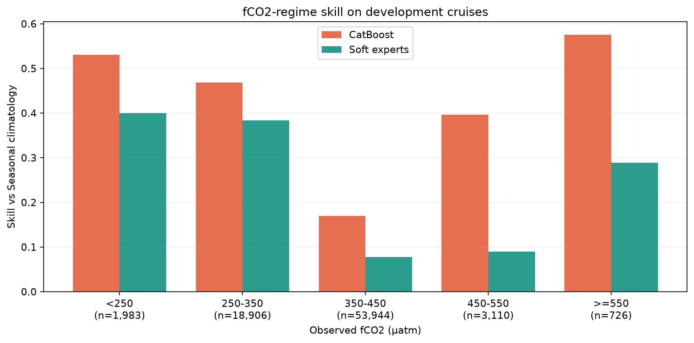
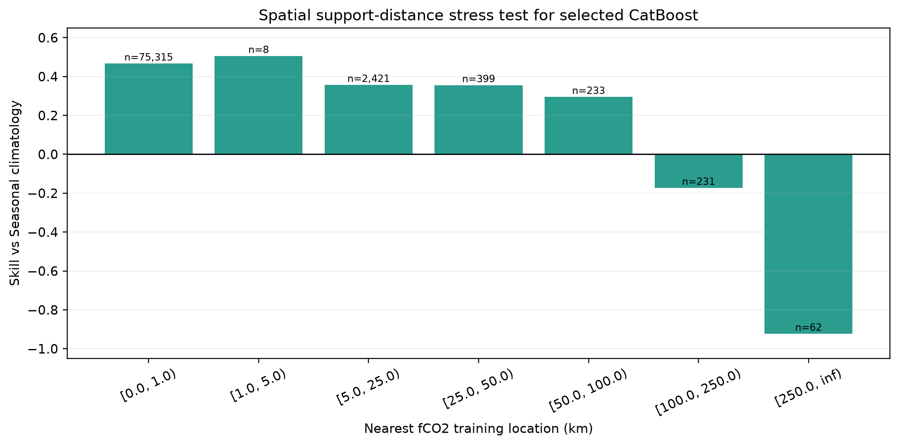
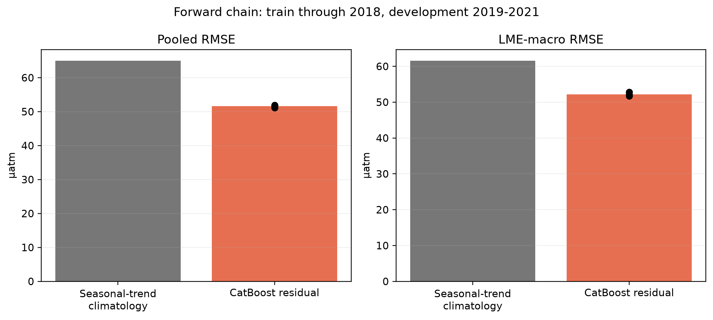
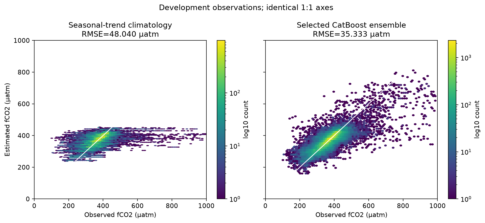
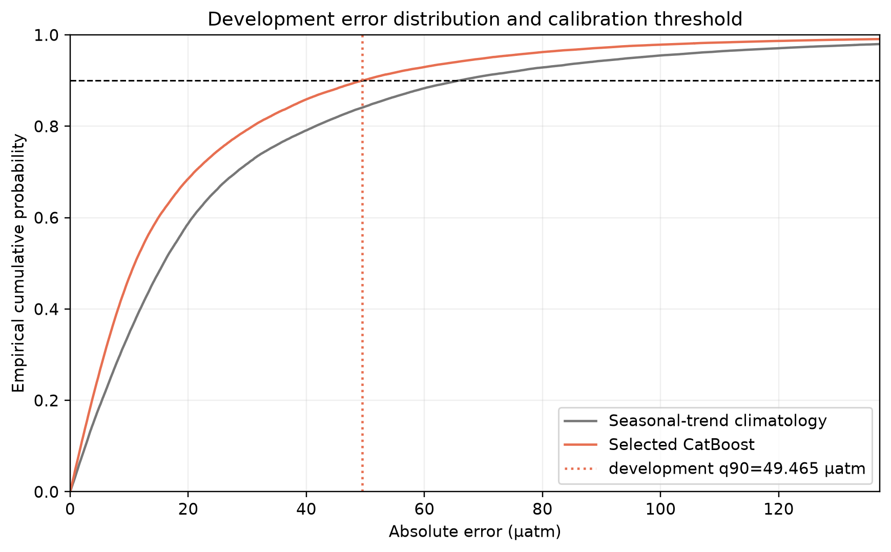

# Reviewer archive: P1.2 coastal fCO2 viability

## Executive finding

The preregistered development criterion selected CatBoost residual. Relative to the training-only seasonal-trend climatology, it reduced cruise-equal RMSE by 29.5% and LME-macro RMSE by 13.1%, but worst-LME RMSE worsened by 17.3%. The full development gate failed because `worst_lme_degradation_le_10pct, support_bin_skill_positive` did not pass. The result is `diagnostic_only`: it demonstrates substantial in-support skill but does not authorize opening the locked test.

## Scientific question and permitted claim

The experiment asks which practical baseline most reliably improves monthly coastal fCO2 over a seasonal-trend climatology across unseen cruises, regions, fCO2 regimes, and forward time. The frozen cache spans North-American-adjacent waters (0-70.125 N, 180-315 E). The allowed claim is restricted to grouped development and cross-validation evidence in this domain. Locked-test and external-independent labels were not opened.

## Data, splits, and leakage controls

- SOCAT `fCO2rec` is the target; the seasonal-trend climatology is fitted from training labels only.
- Train: 359,603 valid records from 2,499 cruises.
- Development: 78,669 records from 534 cruises, through 2025.
- Five-fold CV holds out complete cruises. The forward chain trains on cruise maximum year <=2018 and evaluates development cruises assigned to 2019-2021.
- The data manifest SHA256 is `46b01085fbb577b24dbb62b6ff7b7a53a5d402d6ab93d4c076d67f37f32e9e9f`; all 12 files passed full hash verification.
- `locked_test_opened=false`; `external_opened=false`.

## Candidate models and training

All learned models predict a correction added to the seasonal-trend climatology. Candidates were Ridge, CatBoost, a point MLP, and an eight-way top-2 soft mixture of experts. Neural candidates used 5,000 optimizer steps with batch size 2,048 and seeds 100/101/102. CatBoost used up to 1,500 trees and the same three seeds. Checkpoints and the final family were selected only by development LME-macro RMSE.

## Main development results

| model | pooled_rmse_mean | cruise_equal_rmse_mean | lme_macro_rmse_mean | worst_lme_rmse_mean | skill_vs_background_mean |
|---|---|---|---|---|---|
| CatBoost residual | 35.506 | 39.902 | 45.346 | 102.831 | 0.454 |
| Point MLP residual | 41.392 | 48.355 | 46.989 | 101.747 | 0.258 |
| Ridge residual | 46.9 | 54.684 | 52.024 | 94.012 | 0.047 |
| Seasonal-trend climatology | 48.04 | 56.575 | 52.194 | 87.659 | 0.0 |
| Soft experts residual | 41.248 | 47.787 | 48.126 | 103.742 | 0.263 |

CatBoost has the lowest pooled, cruise-equal, and LME-macro RMSE and is therefore the selected development model. Its worst-LME RMSE is 102.83 µatm, worse than the climatology's 87.66 µatm, so aggregate improvement does not satisfy the regional safety gate.

## Cruise-grouped cross-validation

| model | folds | lme_macro_rmse_mean | lme_macro_rmse_sd | pooled_skill_mean | pooled_skill_sd |
|---|---|---|---|---|---|
| CatBoost residual | 5 | 45.341 | 2.757 | 0.388 | 0.033 |
| Point MLP residual | 5 | 49.738 | 2.02 | 0.219 | 0.043 |
| Ridge residual | 5 | 52.355 | 1.889 | 0.071 | 0.039 |
| Seasonal-trend climatology | 5 | 54.555 | 1.8 | 0.0 | 0.0 |
| Soft experts residual | 5 | 49.391 | 1.478 | 0.237 | 0.048 |

CatBoost is also strongest in five-fold cruise-grouped CV. This agreement supports the model ranking, while the failed worst-region and support-distance gates limit the allowable product claim.

## Region, fCO2 range, and extrapolation stress tests

12/14 LMEs with at least 100 records have positive selected-model skill. All 5 observed-fCO2 bands have positive skill. Support-distance skill is positive through [50.0, 100.0) but turns negative in [100.0, 250.0), [250.0, inf); the >250 km bin contains only 62 records. LME 55 (n=30) is the worst region and is reported rather than removed after inspection.

## Forward-time evidence

| model | seeds | pooled_rmse_mean | pooled_rmse_sd | lme_macro_rmse_mean | lme_macro_rmse_sd | pooled_skill_mean | pooled_skill_sd |
|---|---|---|---|---|---|---|---|
| CatBoost residual | 3 | 51.58 | 0.396 | 52.212 | 0.536 | 0.371 | 0.01 |
| Seasonal-trend climatology | 1 | 65.038 | nan | 61.601 | nan | 0.0 | nan |

CatBoost has mean forward pooled skill 0.371; all three seeds are positive.

## Fit and uncertainty diagnostics

The development absolute-error 90th percentile is 49.465 µatm and gives development coverage 0.900. Because the same development data calibrated this interval, it is a frozen parameter awaiting locked-test coverage evaluation, not independent calibration evidence.

## Decision and limitations

Decision: `diagnostic_only_do_not_open_locked_test`. The development gate failed, so Issue #8 closes as `diagnostic_only` and the locked test remains sealed. No global claim is allowed because the frozen evaluation cache is regional. Sparse LMEs, degradation beyond 100 km from training support, background-product assimilation dependence, and development-calibrated uncertainty remain limitations. A future preregistered iteration may introduce a support-domain mask, stronger regional balancing, and process variables, but cannot reinterpret this failed gate. The archive contains the exact source tables for every plotted aggregate; large row-level predictions and checkpoints remain in the hashed local experiment directory.

## Figure and table index

1. Development comparison: `fig01`; source `table01`.
2. Five-fold cruise CV: `fig02`; source `table02`.
3. LME sensitivity: `fig03`; source `table04`.
4. fCO2 bands: `fig04`; source `table05`.
5. Forward chain: `fig05`; source `table03`.
6. fCO2 training support distance: `fig06`; source `table06`.
7. Observation-prediction density: `fig07`; source is the hashed local standard prediction table.
8. Absolute-error calibration: `fig08`; aggregate source `table08`, row source is the hashed local candidate prediction table.

`archive_manifest.json` records the data/code provenance, evidence boundary, figure-to-source mapping, and SHA256 of every archived file.
