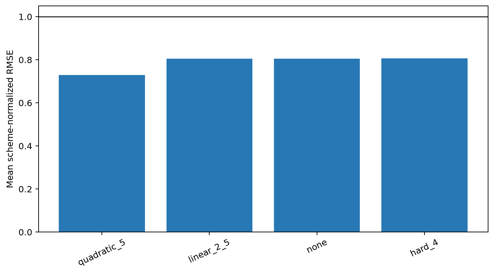
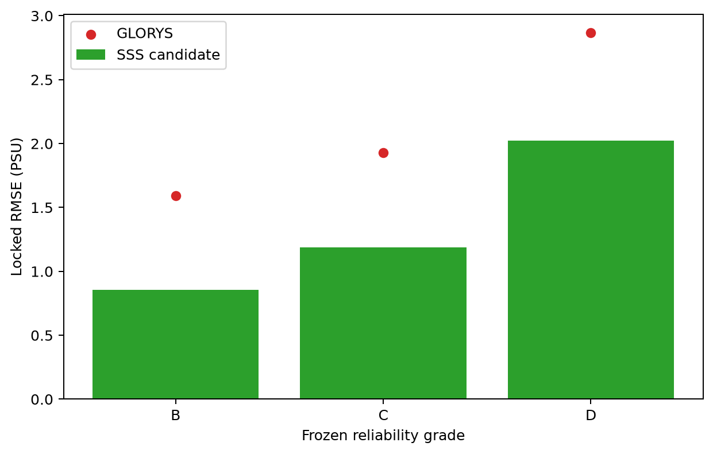
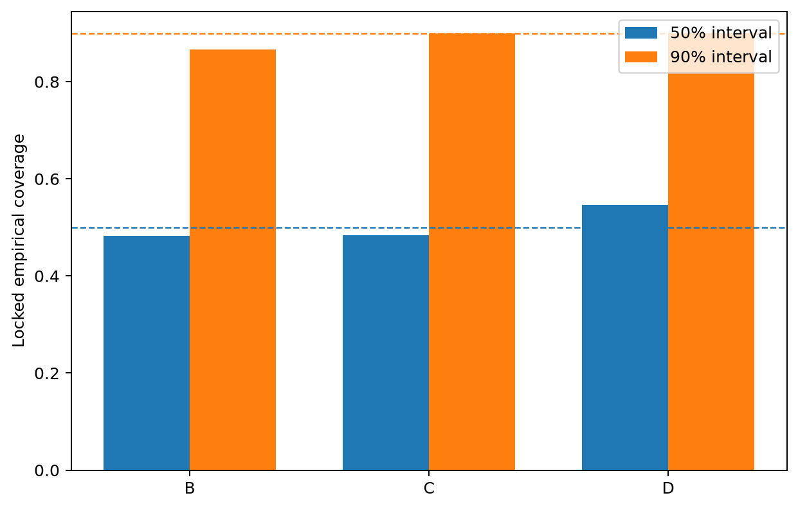
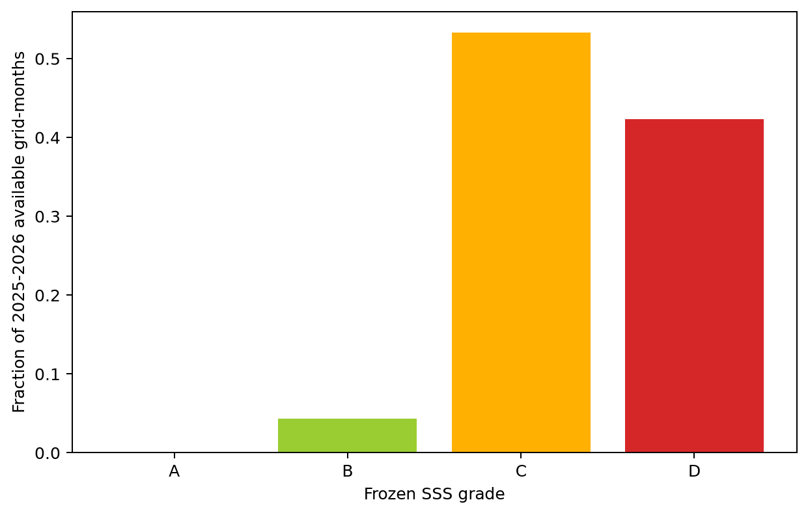
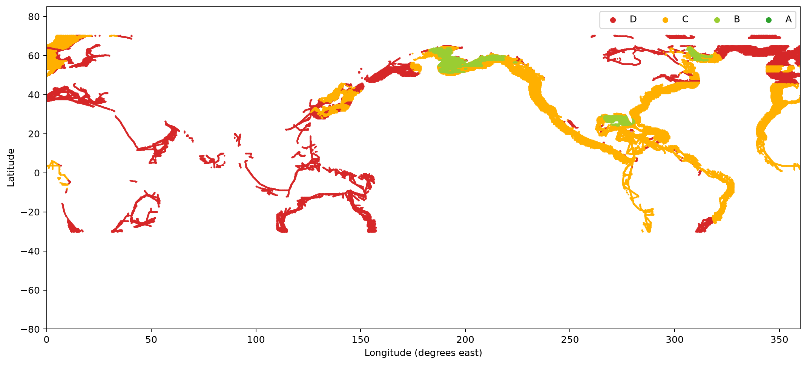
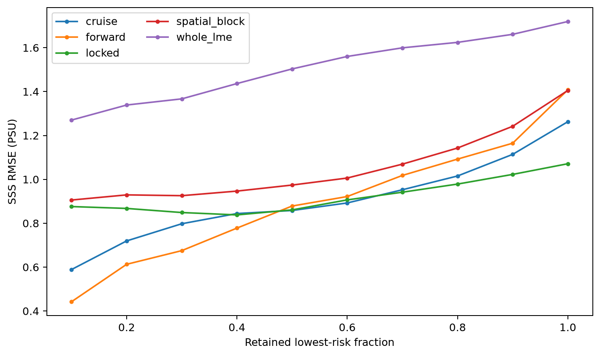
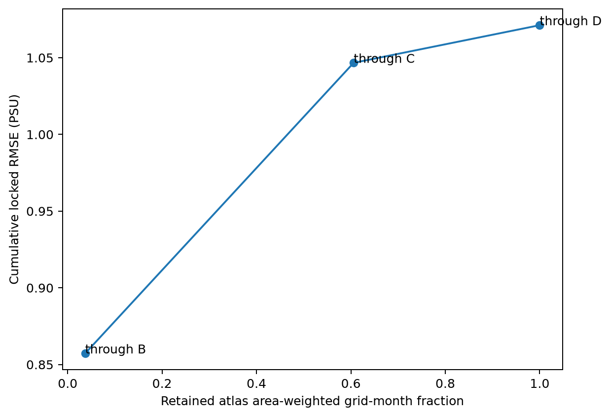

# P1.5b SSS reliability atlas and one-time locked audit

## Scientific question and permitted claim

This experiment asks where and with what error the frozen coastal SSS residual candidate is usable. The permitted claim is an internally locked, North-American-adjacent reliability result plus a global applicability atlas. External-independent validation remains reserved for P3.

## Data, splits, and leakage controls

SOCATv2026 in-situ salinity is the label and GLORYS monthly SSS is the background. Complete-cruise, fixed 5-degree spatial-block, whole-LME, and forward-time outer partitions were inherited from Issue #24. Every fold trained for a fixed 4,000 steps without consulting held-fold labels. Cruise OOF, in which each observation occurs once, calibrated the final interval model. The audited grant opened internal locked SSS labels exactly once after the tracked decision froze all choices.

## Candidate models and training

The Issue #7 eight-expert top-two architecture predicts a residual added to GLORYS. `environment_k64` is the frozen applicability variable. Four correction rules were compared on development OOF evidence; `quadratic_5` was frozen before locked access. Intervals use finite-sample 50%/90% absolute-error quantiles in environmental-risk decile x GLORYS-salinity cells, with global fallback below 200 calibration records.

*Figure 1. Mean RMSE across cruise, spatial-block, whole-LME, and forward-time outer partitions, normalized by GLORYS RMSE for each preregistered residual-shrinkage rule. Lower is better; the black line is parity with GLORYS. This development-only comparison froze the shrinkage method before locked labels were opened.*

## Main development results

The model retained positive skill in cruise, spatial-block, whole-LME, and forward-time evaluation. The complete values, calibration coverage, salinity/estuary strata, and risk-coverage curve are archived as source tables. Development evidence selected shrinkage and froze uncertainty; it did not use locked labels.

Cruise, spatial-block, whole-LME, and forward-time RMSE were 1.263, 1.405, 1.719, and 1.408 PSU, with skill over GLORYS of 0.574, 0.472, 0.210, and 0.582. Cross-fitted 90% coverage was 0.898, 0.895, 0.853, and 0.925 in the same order.

## One-time locked audit

The frozen SSS candidate received **`diagnostic_only`**. The one-time internal locked set contained 75,627 observations. Locked pooled RMSE was 1.071 PSU versus 1.804 PSU for GLORYS, giving skill 0.647; MAE was 0.566 PSU and R² was 0.786. The frozen 50% and 90% intervals achieved 0.484 and 0.884 coverage.

Seven of eight gates passed. The failure was localized to LME 17, the North Brazil Shelf (n=149): candidate RMSE 3.565 PSU versus GLORYS 2.631 PSU, a ratio of 1.355 and skill -0.835. The preregistered worst-LME limit was 1.10, so strong pooled and A/B results cannot promote this version beyond `diagnostic_only`.

*Figure 2. Internal locked-test RMSE for the frozen SSS candidate and GLORYS within each preregistered A/B/C/D grade. Each locked observation is scored once with the already frozen model and grade rule; lower is better.*

*Figure 3. Empirical locked coverage of the frozen nominal 50% and 90% SSS intervals by reliability grade. Dashed lines mark nominal coverage; deviations diagnose calibration without retrospective rescaling.*

## Reliability atlas

Each strict-input-ready 2025 grid-month and available provisional 2026 grid-month stores prediction, 50%/90% interval, `environment_k64`, evidence counts, A/B/C/D grade, and reason bits. A requires q90 at most 0.5 PSU; B at most 1.0 PSU; C at most 2.0 PSU; D suppresses wider error or inadequate environmental, cruise, group, or calibration support.

*Figure 4. Fraction of all strict-input-ready 2025 core and available 2026 provisional coastal grid-months assigned to each frozen SSS reliability grade. D values remain in the audit table but are suppressed from the publishable product.*

*Figure 5. Frozen SSS reliability grades for strict-input-ready coastal grid cells in July 2025. The North-American SOCAT development domain dominates demonstrated support; remote global cells become C/D or return toward GLORYS through residual shrinkage. This map is an applicability atlas, not external validation.*

No grid-month earned A because the narrowest development-calibrated 90% cell width exceeded the fixed 0.5 PSU A boundary. Across 1,840,408 available grid-months, 79,837 (4.3%) were B, 980,998 (53.3%) were C, and 779,573 (42.4%) were D.

*Figure 6. SSS RMSE as progressively higher-risk observations are retained under the frozen environment-k64 ranking. Development outer schemes and the one-time locked audit are shown separately; a rising curve means the applicability score orders error usefully.*

*Figure 7. Cumulative one-time locked RMSE versus the area-weighted fraction of 2025 core and available 2026 provisional atlas grid-months retained through each frozen grade. The curve states the accuracy paid for broader mapped coverage.*

## Decision and limitations

| gate | passed |
|---|---|
| overall_positive_skill | true |
| grade_ab_positive_skill | true |
| grade_ab_mae | true |
| coverage50 | true |
| coverage90 | true |
| positive_lme_fraction | true |
| worst_lme_no_collapse | false |
| forward_evidence | true |

A failed frozen check downgrades the product to diagnostic-only; the locked set cannot be reused to redesign it. The global atlas measures similarity to the frozen observation domain and does not prove global accuracy. Very fresh water remains difficult even where relative skill over GLORYS is positive. Row-level predictions, checkpoints, and atlas parquet partitions remain in the local hashed output and are excluded from Git.

## Figure and table index

Figures 1-7 correspond to shrinkage selection, locked grade skill, locked interval coverage, atlas grade coverage, the July 2025 global grade map, risk-coverage, and cumulative grade retention. Their aggregate sources are under `tables/`; the map source is the hashed local atlas partition. Captions appear directly below every figure and are duplicated in `CAPTIONS.md`.
