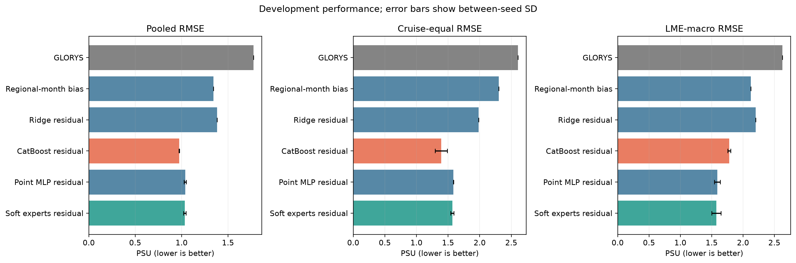
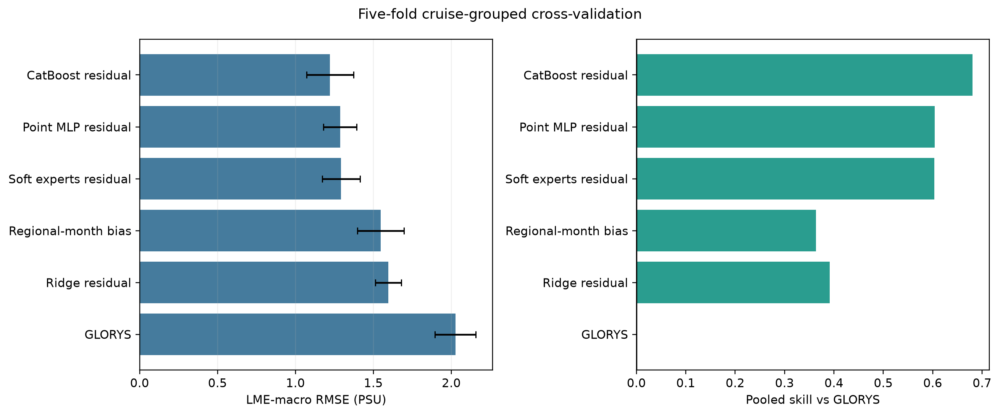
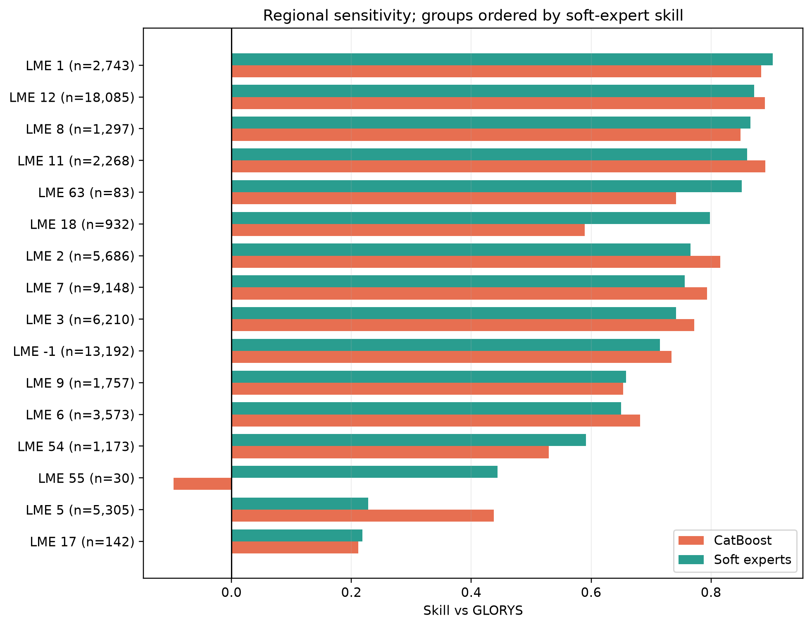
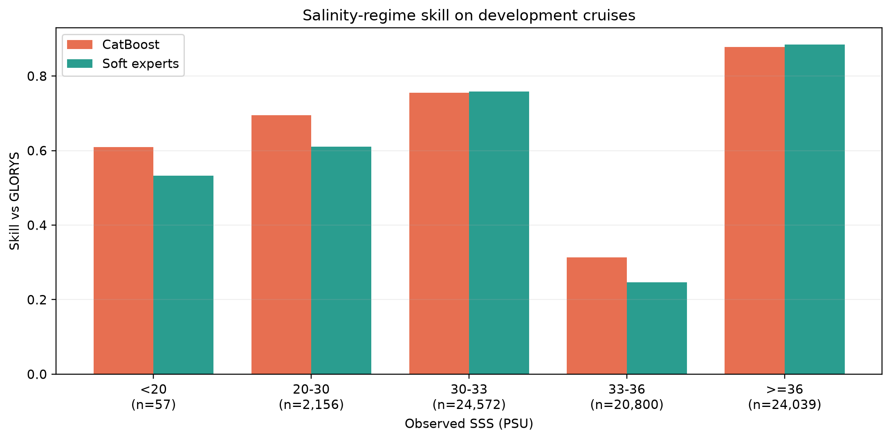
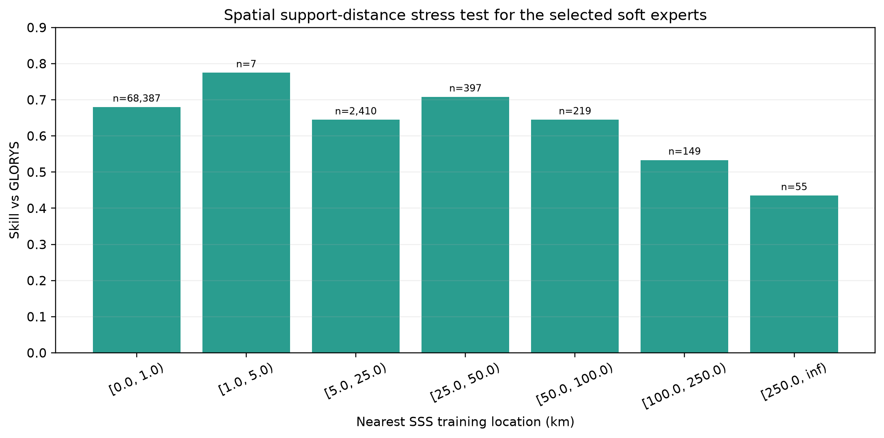
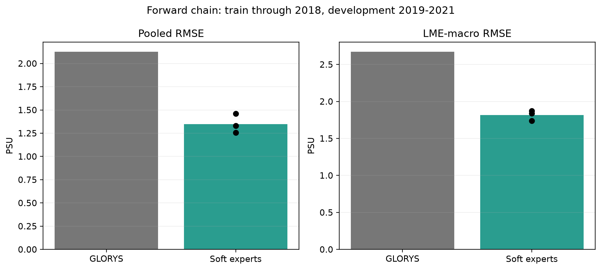
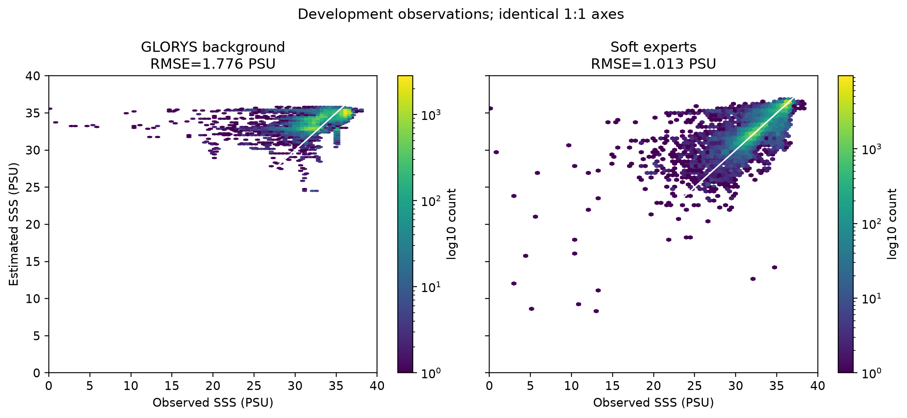
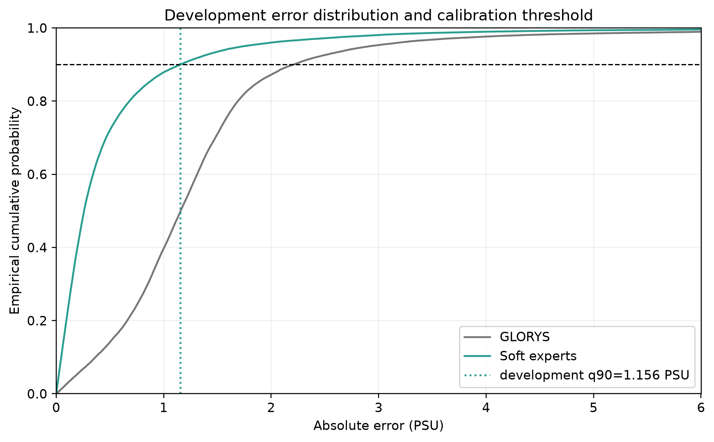

# Reviewer archive: P1.1 coastal SSS viability

## Executive finding

The preregistered development criterion selected the top-2 soft-expert residual model. Relative to unmodified GLORYS, it reduced cruise-equal RMSE by 39.9%, LME-macro RMSE by 40.1%, and worst-LME RMSE by 25.7%. All development gates passed. This nominates a regional candidate for the one-time locked test; it does not establish final regional or global product skill.

## Scientific question and permitted claim

The experiment asks whether predictor-only residual correction can improve monthly coastal SSS over GLORYS across unseen cruises, regions, salinity regimes, and forward time. The frozen cache spans North-American-adjacent waters (0-70.125 N, 180-315 E). The allowed claim is restricted to grouped development and cross-validation evidence in this domain. Locked-test and external-independent labels were not opened.

## Data, splits, and leakage controls

- SOCAT in-situ salinity is the target; GLORYS SSS is only a predictor and background baseline.
- Train: 330,961 valid records from 2,255 cruises.
- Development: 71,624 records from 479 cruises, through 2025.
- Five-fold CV holds out complete cruises. The forward chain trains on cruise maximum year <=2018 and evaluates development cruises assigned to 2019-2021.
- The data manifest SHA256 is `46b01085fbb577b24dbb62b6ff7b7a53a5d402d6ab93d4c076d67f37f32e9e9f`; all 12 files passed full hash verification.
- `locked_test_opened=false`; `external_opened=false`.

## Candidate models and training

All learned models predict a correction added to GLORYS SSS. Candidates were GLORYS, a shrunk regional-month bias, Ridge, CatBoost, a point MLP, and an eight-way top-2 soft mixture of experts. Neural candidates used 5,000 optimizer steps with batch size 2,048 and seeds 100/101/102. CatBoost used up to 1,500 trees and the same three seeds. Checkpoints were selected only by development LME-macro RMSE.

## Main development results

| model | pooled_rmse_mean | cruise_equal_rmse_mean | lme_macro_rmse_mean | worst_lme_rmse_mean | skill_vs_background_mean |
|---|---|---|---|---|---|
| GLORYS | 1.776 | 2.607 | 2.629 | 9.184 | 0.0 |
| CatBoost residual | 0.973 | 1.392 | 1.781 | 9.613 | 0.7 |
| Point MLP residual | 1.039 | 1.585 | 1.591 | 6.367 | 0.658 |
| Regional-month bias | 1.342 | 2.301 | 2.124 | 8.766 | 0.428 |
| Ridge residual | 1.381 | 1.983 | 2.2 | 9.71 | 0.395 |
| Soft experts residual | 1.035 | 1.567 | 1.574 | 6.822 | 0.66 |

*Development-set SSS RMSE for GLORYS and five residual-correction candidates under pooled, cruise-equal, and LME-macro aggregation. Points are means across seeds 100-102 and error bars show one standard deviation; lower is better. Soft experts win the preregistered LME-macro criterion, while CatBoost has the lowest pooled and cruise-equal RMSE.*

CatBoost has the lowest pooled and cruise-equal RMSE. Soft experts have the lowest preregistered LME-macro metric among candidate families and were therefore selected. The distinction is scientifically relevant: the soft-expert advantage is strongly influenced by LME 55, which has only 30 development records. CatBoost remains a prespecified sensitivity comparator for the locked evaluation; locked results cannot be used to choose retrospectively between them.

## Cruise-grouped cross-validation

| model | folds | lme_macro_rmse_mean | lme_macro_rmse_sd | pooled_skill_mean | pooled_skill_sd |
|---|---|---|---|---|---|
| GLORYS | 5 | 2.027 | 0.131 | 0.0 | 0.0 |
| CatBoost residual | 5 | 1.222 | 0.15 | 0.681 | 0.045 |
| Point MLP residual | 5 | 1.286 | 0.107 | 0.604 | 0.032 |
| Regional-month bias | 5 | 1.547 | 0.15 | 0.364 | 0.043 |
| Ridge residual | 5 | 1.596 | 0.084 | 0.391 | 0.069 |
| Soft experts residual | 5 | 1.293 | 0.122 | 0.603 | 0.033 |

*Five-fold cruise-grouped cross-validation for the same candidate families. Bars show mean LME-macro RMSE and pooled skill relative to GLORYS across folds; error bars show one standard deviation. CatBoost is the strongest cross-validation sensitivity comparator.*

CatBoost is strongest in five-fold CV, while both neural candidates retain large positive skill. This tension with the frozen development selection is reported rather than resolved after observing results.

## Region, low salinity, and extrapolation stress tests

All 14/14 LMEs with at least 100 records have positive selected-model skill. The <20 PSU and 20-30 PSU strata contain 57 and 2,156 records and both have positive skill. Every SSS support-distance bin is positive, although the >250 km bin contains only 55 records and is not strong evidence for remote extrapolation.

*Development skill by Large Marine Ecosystem (LME), comparing the selected soft-expert ensemble with CatBoost; positive skill indicates lower MSE than GLORYS. Labels give development record counts. The soft-expert selection advantage is sensitive to sparse LME 55 (n=30).*

*Development skill of the selected soft-expert ensemble across observed-SSS bands, with record counts shown separately. Skill remains positive in every reported band, including low-salinity coastal observations, but the freshest bands have much smaller support.*

*Development skill of the selected soft-expert ensemble by distance to the nearest SSS training support, with record counts by bin. Positive skill persists in all populated bins, but distant support bins contain fewer observations and remain an extrapolation risk.*

## Forward-time evidence

| model | seeds | pooled_rmse_mean | pooled_rmse_sd | lme_macro_rmse_mean | lme_macro_rmse_sd | pooled_skill_mean | pooled_skill_sd |
|---|---|---|---|---|---|---|---|
| GLORYS | 1 | 2.125 | nan | 2.67 | nan | 0.0 | nan |
| Soft experts residual | 3 | 1.348 | 0.105 | 1.815 | 0.07 | 0.596 | 0.063 |

*Forward-chain development skill for seeds 100-102: training cruises end by 2018 and evaluation uses cruises assigned to 2019-2021. All seeds retain positive pooled skill relative to GLORYS; the horizontal line marks zero skill.*

Soft experts have mean forward pooled skill 0.596; all three seeds are positive.

## Fit and uncertainty diagnostics

*Hexbin density of development observations against GLORYS and the three-seed mean soft-expert prediction on identical 0-40 PSU axes. The white line is 1:1 and color is log10 record count. Displayed RMSE is the row-pooled ensemble RMSE, not the across-seed mean reported in Table 1.*

*Development absolute-error empirical distributions for GLORYS and the selected soft-expert ensemble. The dashed line is the development-calibrated 90th-percentile error threshold (1.156 PSU); its 0.900 development coverage is not independent calibration evidence.*

The development absolute-error 90th percentile is 1.156 PSU and gives development coverage 0.900. Because the same development data calibrated this interval, it is a frozen parameter awaiting locked-test coverage evaluation, not independent calibration evidence.

## Decision and limitations

Decision: `nominate_for_issue_11_locked_gate`. The development gate passed, but final status remains pending Issue #11. No global claim is allowed because the frozen evaluation cache is regional. Sparse LMEs, rare extreme fresh water, spatial support beyond 250 km, background-product assimilation dependence, and development-calibrated uncertainty remain limitations. The archive contains the exact source tables for every plotted aggregate; large row-level predictions and checkpoints remain in the hashed local experiment directory.

## Figure and table index

1. Development comparison: `fig01`; source `table01`.
2. Five-fold cruise CV: `fig02`; source `table02`.
3. LME sensitivity: `fig03`; source `table04`.
4. Salinity bands: `fig04`; source `table05`.
5. Forward chain: `fig05`; source `table03`.
6. SSS training support distance: `fig06`; source `table06`.
7. Observation-prediction density: `fig07`; source is the hashed local standard prediction table.
8. Absolute-error calibration: `fig08`; aggregate source `table08`, row source is the hashed local candidate prediction table.

`archive_manifest.json` records the data/code provenance, evidence boundary, figure-to-source mapping, and SHA256 of every archived file.
