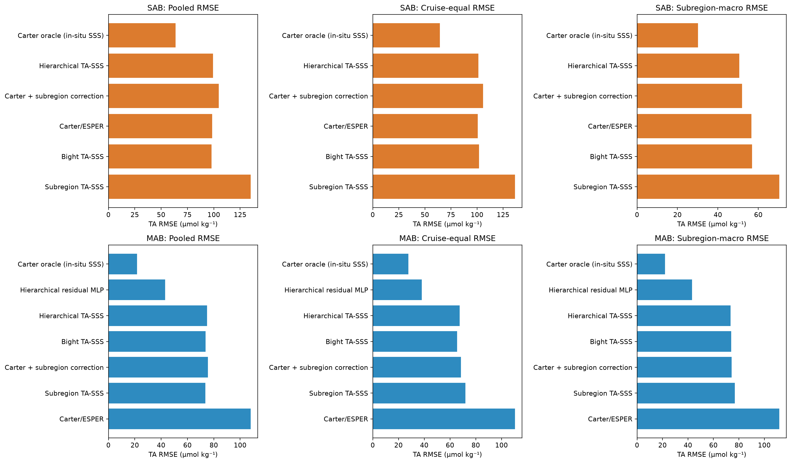
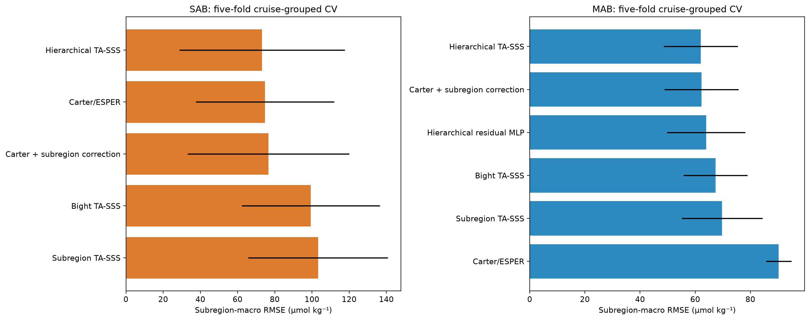
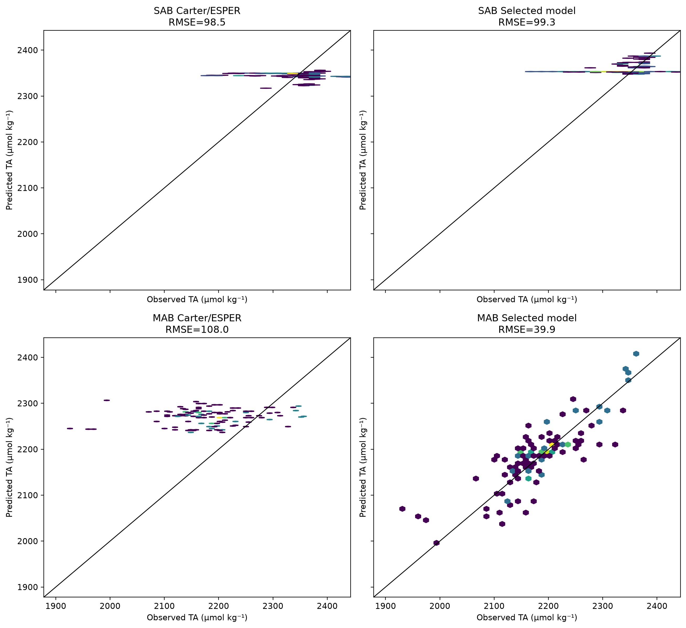
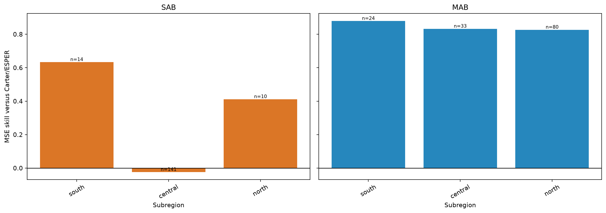
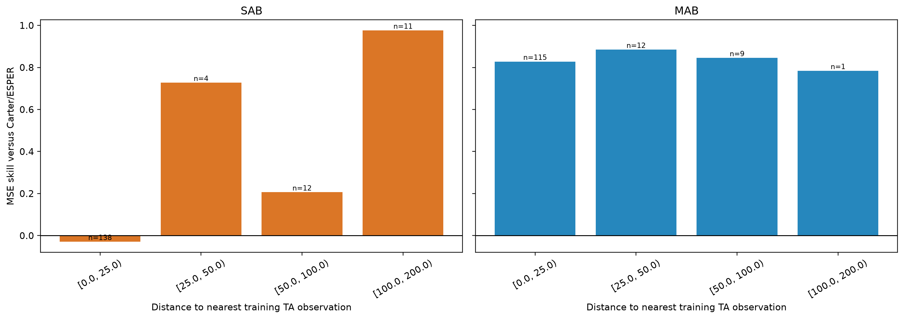
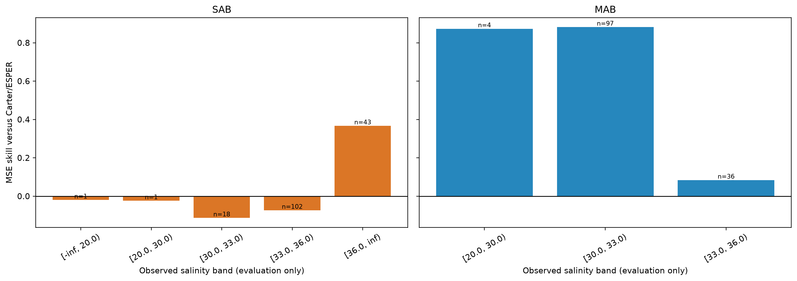
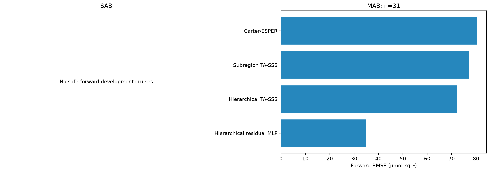
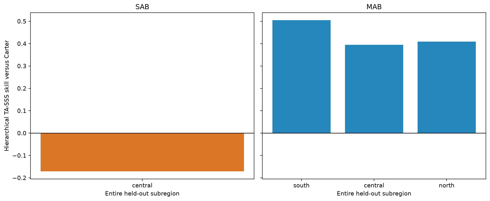
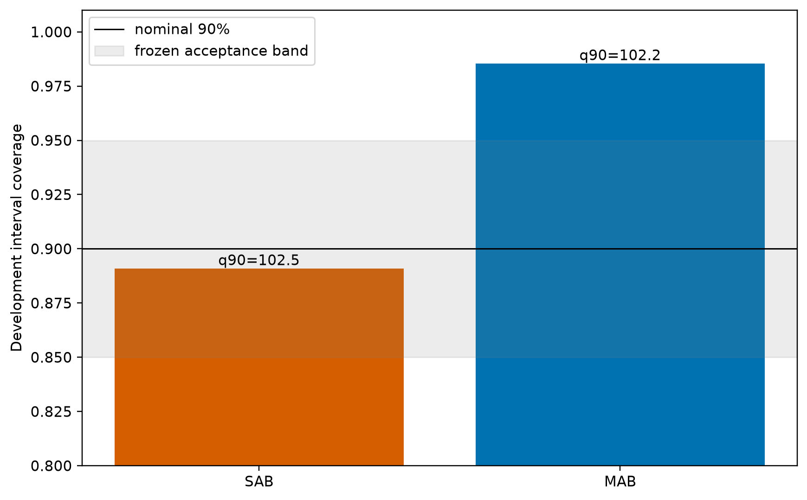
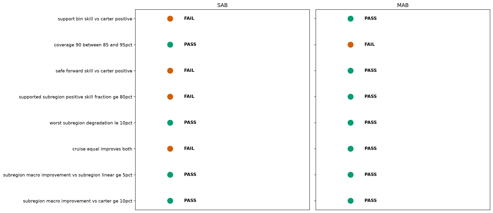

# Reviewer archive: P1.3b SAB/MAB TA viability

## Scientific question and permitted claim

This experiment asks whether surface TA reconstruction passes the frozen P1.3 development gate independently in the South Atlantic Bight (SAB) and broad geographic Mid-Atlantic Bight (MAB). SAB is the LME-6 shelf segment from Cape Canaveral to Cape Hatteras; MAB is the LME-7 segment from Cape Hatteras to Cape Cod and includes Southern New England. The permitted evidence is train/development, cruise-grouped CV, safe-forward, support-distance, and leave-subregion-out analysis only. No locked-test, external-independent, continuous-product, or global claim is allowed.

The decisions are **SAB: `fail`** and **MAB: `diagnostic_only`**. SAB does not show deployable skill. MAB has strong development skill but its nominal 90% interval covers 0.985, outside the frozen 0.85-0.95 acceptance band, so it cannot advance to the locked gate in this experiment.

## Data, splits, and leakage controls

| region | train_rows | train_cruises | development_rows | development_cruises | safe_forward_train_rows | safe_forward_development_rows | decision |
|---|---|---|---|---|---|---|---|
| SAB | 276.000 | 10.000 | 165.000 | 4.000 | 275.000 | 0.000 | fail |
| MAB | 344.000 | 26.000 | 137.000 | 7.000 | 252.000 | 31.000 | diagnostic_only |

The v2.2 manifest, TA QC, primary-record rule, cruise groups, deterministic primary split, five frozen CV folds, background SSS input, and Carter/ESPER implementation are inherited unchanged from Issue #9. Each bight is filtered before fitting and trained independently. The offshore boundary comes from the frozen LME shelf polygons because the current cache has no bathymetry column. Estuary and shelf-depth stratification therefore remains a documented limitation. Locked and external labels were never materialized.

## Candidate models and training

Candidates are raw Carter/ESPER, train-only seasonal/subregion Carter correction, bight-wide robust TA-SSS, fixed subregion TA-SSS, hierarchical subregion/regime TA-SSS, and a three-seed residual MLP. The nonlinear candidate ran only where the frozen stopping rule triggered. SAB stopped after the hierarchical linear stage; MAB ran 4,000 steps for seeds 100-102. Partial-pooling alpha was selected from {1, 10, 100, 1000} using only five-fold cruise-grouped training CV.

## Main development results

| region | model_label | pooled_rmse_mean | pooled_mae_mean | pooled_bias_mean | pooled_r2_mean | cruise_equal_rmse_mean | lme_macro_rmse_mean |
|---|---|---|---|---|---|---|---|
| SAB | Hierarchical TA-SSS | 99.255 | 47.340 | 29.282 | -0.063 | 101.313 | 50.613 |
| MAB | Hierarchical residual MLP | 43.125 | 31.964 | 3.895 | 0.664 | 38.062 | 43.278 |

The selected SAB hierarchical linear model has pooled RMSE 99.255 µmol kg⁻¹ versus 98.468 for Carter/ESPER and R² -0.063. Its central subregion, containing 141 of 165 development records, has negative skill. It also has no safe-forward development cruise under the frozen intersection. SAB is therefore classified `fail` rather than diagnostic-only.

The selected MAB three-seed ensemble has pooled RMSE 39.945 µmol kg⁻¹, MAE 29.682, bias 3.895, and R² 0.713. The three-seed mean cruise-equal RMSE is 38.062 versus 110.474 for Carter and 71.939 for fixed subregion TA-SSS. Five-fold CV is less decisive: hierarchical linear reaches 62.044, while the residual MLP reaches 63.970 µmol kg⁻¹. This model-ranking disagreement and the single-cruise forward set limit the claim.

*Development TA RMSE for independently trained SAB and MAB candidates under pooled, cruise-equal, and frozen subregion-macro aggregation. The in-situ-SSS Carter oracle is diagnostic only and excluded from selection; lower is better.*

*Five-fold cruise-grouped training cross-validation subregion-macro RMSE. Error bars show one standard deviation across folds. SAB estimates are unstable because one frozen fold contains only one training record, while MAB favors the simpler hierarchical linear relation over the nonlinear residual model in CV.*

*Development observation-prediction density for Carter/ESPER and each region's selected model. The selected SAB model has RMSE 99.3 µmol kg⁻¹ and fails to improve pooled Carter error; the selected MAB ensemble reaches 39.9 µmol kg⁻¹.*

*Development MSE skill relative to Carter/ESPER in the preregistered south, central, and north latitude subregions. Labels give record counts. SAB central skill is negative and dominates the regional sample, whereas all three populated MAB subregions show positive skill.*

*Development MSE skill relative to Carter/ESPER by haversine distance to the nearest training TA observation. Every populated bin is retained regardless of sample size; SAB fails in its dominant 0-25 km bin, while all populated MAB bins are positive.*

*Development skill relative to Carter/ESPER stratified by collocated observed salinity, which is used only for evaluation. Sparse low-salinity SAB records have very large errors, and the main 33-36 band also degrades; MAB remains positive but has weak improvement in the 33-36 band.*

*Safe forward-time evaluation uses only primary-train groups assigned to forward train and primary-development groups assigned to forward development. SAB has 0 eligible development records, so no forward claim is possible; MAB has 31 records from one cruise.*

*Leave-one-subregion-out transfer skill for the hierarchical linear TA-SSS relation relative to Carter/ESPER. Only subregions meeting the frozen minimum of 30 rows and three cruises are evaluated; sparse SAB edge subregions cannot support a complete transfer test.*

*Development coverage of symmetric conformal intervals calibrated from five-fold training OOF absolute residuals. SAB coverage falls inside the frozen 85-95% band, while MAB coverage is 98.5%, showing that its 90% interval is materially overconservative.*

*Frozen development gates evaluated separately by bight. SAB fails multiple prediction and evidence gates and is classified fail. MAB passes every skill gate but fails uncertainty calibration, so it remains diagnostic-only and the locked test stays sealed.*

## Decision and limitations

SAB is `fail`: the selected model is worse than Carter in pooled and cruise-equal error, its data-rich central subregion degrades, the dominant support-distance bin is negative, and no safe-forward development group exists. This experiment provides no basis for a SAB TA product.

MAB is `diagnostic_only`: its selected ensemble strongly beats both frozen baselines across all three subregions and every populated support-distance bin, but uncertainty is overconservative and the nonlinear model is not the CV winner. The correct next experiment is a preregistered MAB-only calibration study with more development cruises and explicit estuary/depth masks; the present result must not be promoted by simply retuning the interval on development.

The LME/end-point masks are reproducible but do not yet separate estuaries, inner shelf, middle shelf, and outer shelf. SAB has only four development cruises and severely imbalanced subregions. MAB has seven development cruises; its safe-forward evidence contains 31 records from one cruise. Sparse bins are retained and cannot be discarded after observing their errors.

## Figure and table index

Figures 1-10 are embedded above with complete captions. Source CSVs `table01`-`table11` are stored in `tables/`; per-observation predictions and checkpoints remain in the ignored source experiment directory and are referenced by SHA256 in `archive_manifest.json`.
