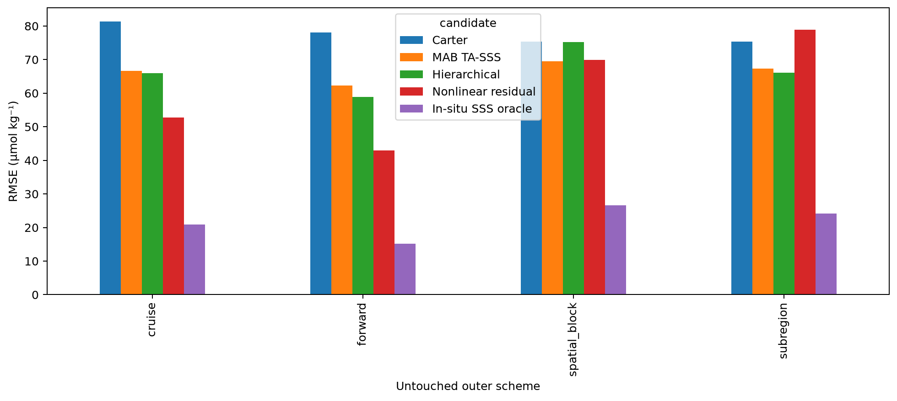
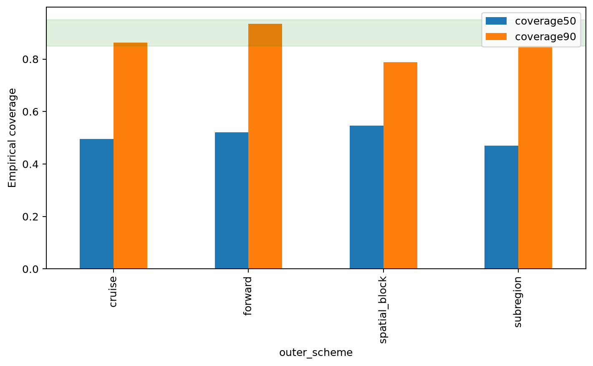
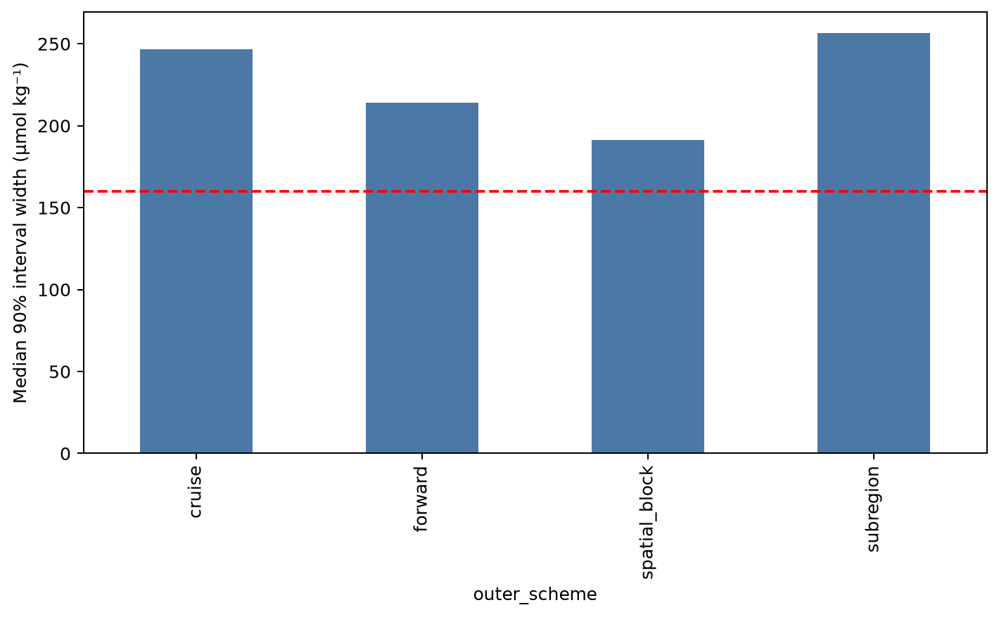
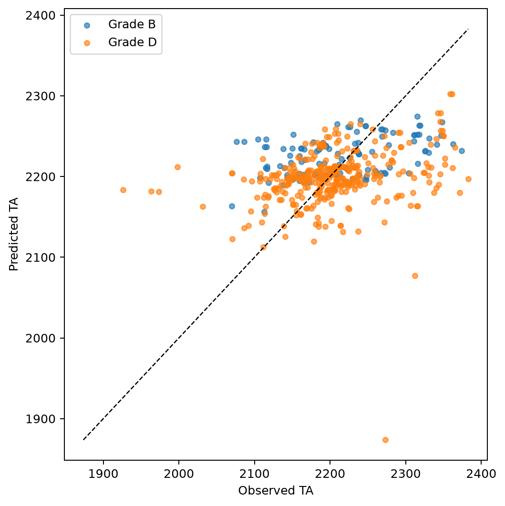
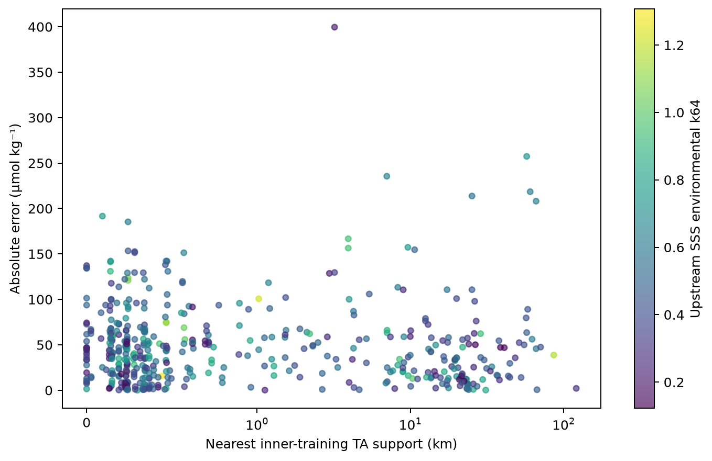
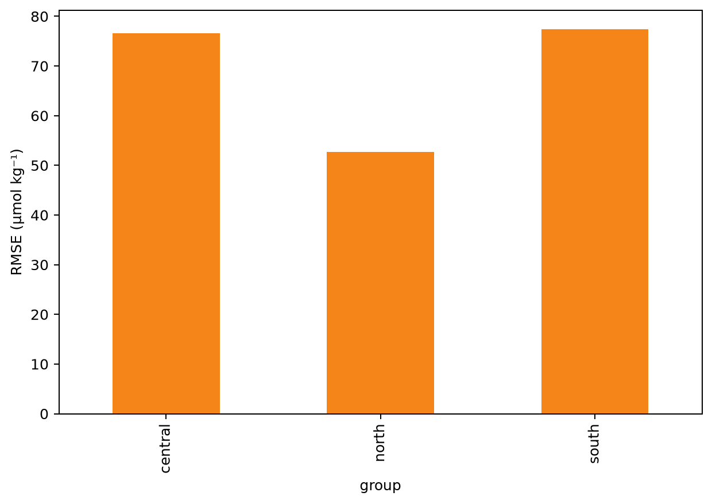
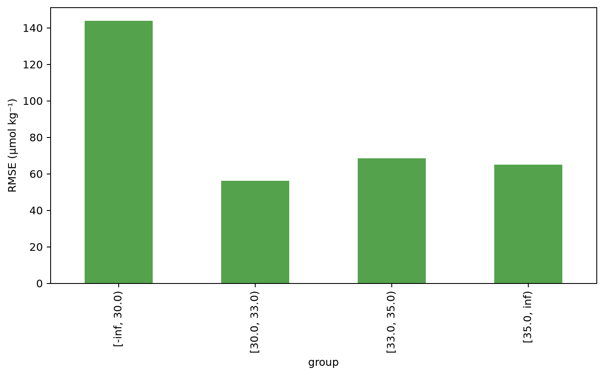
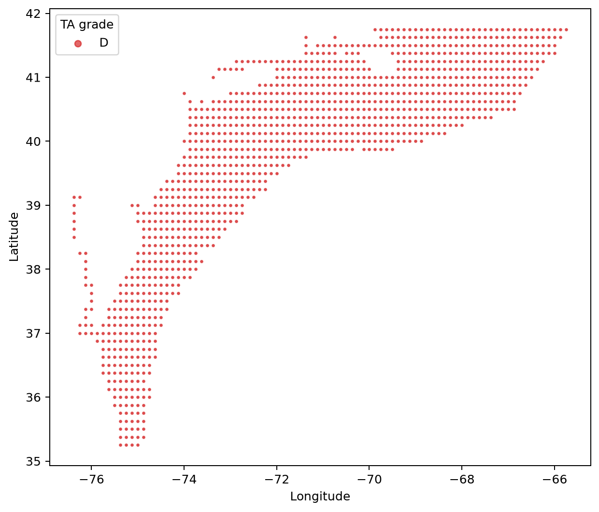

# Issue #27 — MAB TA applicability and calibrated uncertainty

## Scientific question and permitted claim

**`diagnostic_only`.** The MAB TA regional product does not pass unless every frozen cruise, spatial-block, complete-subregion, forward, interval-width, calibration, evidence-count, and retained-area gate passes. Failed gates: beats_robust_regional_all_outer_schemes, coverage90_all_schemes_85_to_95pct, median_width90_all_schemes_le_160, at_least_2_supported_folds_per_repeated_scheme, grade_ab_retained_area_ge_50pct.

The frozen hierarchical model has cruise/spatial/subregion/forward RMSE of 65.93, 75.22, 66.15, and 58.83 µmol kg⁻¹. The forward partition contains 6 cruises across 2 years and passes the frozen minimum evidence count, but it does not rescue the spatial, interval, or retained-area failures. Grid-weighted 2025 retained area is D=100.0%.

## Data, splits, and leakage controls

CODAP-NA/GLODAP surface TA records in canonical MAB (LME 7, 35.20-41.75°N) are evaluated with four untouched outer schemes. Within every outer training partition, complete cruises are held aside for interval calibration before the point model is fit. Issue #25 SSS checkpoints generate row-wise outer-cross-fitted salinity: cruise checkpoints for cruise evaluation, spatial-block checkpoints for spatial/subregion evaluation, and the training-era checkpoint for forward evaluation. Observed in-situ salinity is an oracle only.

Locked TA and 41 external CODAP groups remain sealed. The permitted claim is limited to unsealed MAB diagnostic evidence; this experiment neither validates a released TA product nor changes the prior SAB failure.

## Candidate models and training

Candidates are Carter/ESPER with predicted SSS, robust MAB-wide TA-SSS, hierarchical subregion/regime TA-SSS, a fixed-budget nonlinear residual model, and the in-situ-SSS hierarchical oracle. The hierarchical predicted-SSS candidate was frozen as primary before results. Every outer-fold model is trained only after its evaluation rows and nested calibration cruises are removed.

## Main development results

| Outer scheme | n | cruises | Primary RMSE | Carter RMSE | Regional TA-SSS RMSE | 90% coverage | median 90% width |
|---|---:|---:|---:|---:|---:|---:|---:|
| cruise | 481 | 33 | 65.93 | 81.31 | 66.60 | 0.863 | 246.8 |
| spatial_block | 481 | 33 | 75.22 | 75.38 | 69.45 | 0.788 | 191.3 |
| subregion | 481 | 33 | 66.15 | 75.38 | 67.38 | 0.850 | 256.4 |
| forward | 123 | 6 | 58.83 | 78.12 | 62.30 | 0.935 | 213.9 |

## Decision and limitations

The test asks whether MAB can support a defensible regional TA product, not whether a flexible model can fit the existing records. A pass requires the primary model to beat both Carter and the simple regional relation in every outer scheme, useful independently calibrated intervals, at least three forward cruises across two years, and at least 50% grade-A/B retained grid area. A single row-rich cruise cannot satisfy the evidence rule.

Independent evidence counts for every observed-data grade are saved in `tables/grade_evidence.csv`. These counts describe the outer held observations; they do not upgrade the 2025 grid, whose TA grade is D everywhere under the frozen width and support rules.

| Outer scheme | grade | n | cruises | years |
|---|---|---:|---:|---:|
| cruise | B | 120 | 8 | 6 |
| cruise | D | 361 | 25 | 11 |
| forward | C | 123 | 6 | 2 |
| spatial_block | B | 39 | 16 | 10 |
| spatial_block | C | 334 | 30 | 11 |
| spatial_block | D | 108 | 24 | 11 |
| subregion | B | 53 | 19 | 9 |
| subregion | C | 187 | 29 | 11 |
| subregion | D | 241 | 30 | 12 |

Bathymetry, shelf-zone, estuary masks, and explicit coast distance are absent from the frozen v2.2 cache. They are recorded as unavailable. Low-salinity, subregion, season, upstream-SSS OOD, and TA-support diagnostics are reported without silently introducing new post-registration covariates. SAB retains its previous `fail` decision.

## Figure and table index

Figure 1. TA RMSE under untouched cruise, 5° spatial-block, complete-subregion, and forward outer tests. Every bar uses nested cruise calibration and the matching cross-fitted upstream SSS prediction.

Figure 2. Empirical 50% and 90% coverage for the frozen hierarchical candidate. The green band is the preregistered acceptable range for the nominal 90% interval.

Figure 3. Median nested split-conformal 90% interval width. The dashed line is the frozen 160 µmol kg⁻¹ utility ceiling.

Figure 4. Cruise-outer cross-fitted hierarchical TA versus observed TA, colored by preregistered reliability grade. No locked or external label appears.

Figure 5. Cruise-outer absolute TA error against geographic support, colored by upstream SSS environmental risk. This separates sparse TA support from uncertain SSS input.

Figure 6. Cruise-outer hierarchical RMSE for southern, central, and northern MAB subregions. The plot exposes regional averaging that pooled RMSE can hide.

Figure 7. Cruise-outer hierarchical RMSE by predicted-SSS band. Low-salinity performance is the principal diagnostic for nonconservative and estuarine influence because no frozen estuary mask exists.

Figure 8. July 2025 MAB grid eligibility from nested TA interval width, TA support distance, and Issue #25 SSS risk. It is a label-free retained-area diagnostic, not independent accuracy evidence.

The source tables are `outer_metrics.csv`, `outer_fold_metrics.csv`, `diagnostic_metrics.csv`, `grade_evidence.csv`, `retained_area.csv`, `unavailable_diagnostics.csv`, `decision_checks.csv`, `interval_metrics.csv`, and `source_hashes.csv`. Row-level outer predictions remain outside Git.

## Reproducibility

Machine-readable outer predictions are intentionally kept outside Git. The archive contains aggregate source tables, captions, protocol, source hashes, and artifact hashes. `tables/unavailable_diagnostics.csv` records diagnostics that cannot be computed from frozen inputs. Generated row-level data live under `outputs/experiments/p1_ta_mab_reliability_v2.2`.
