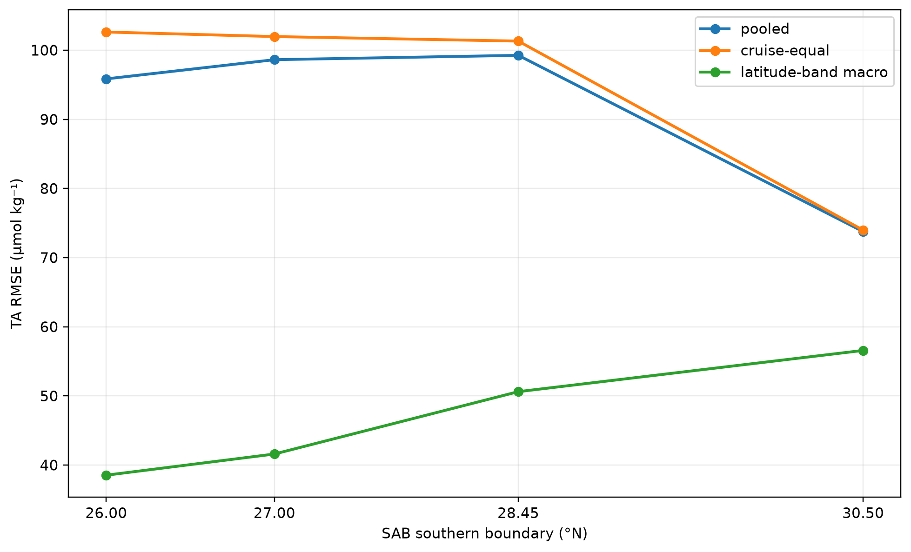
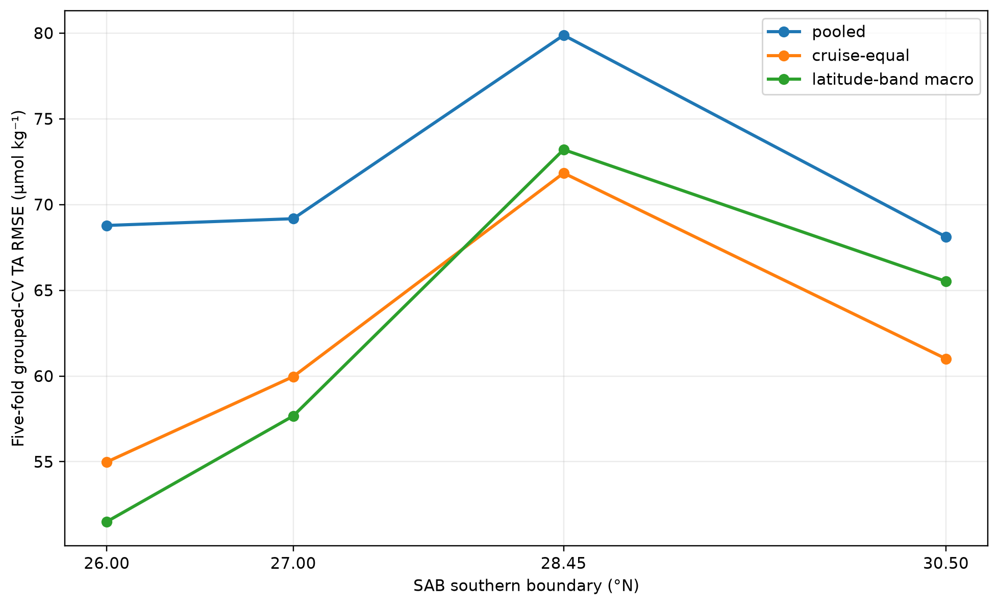
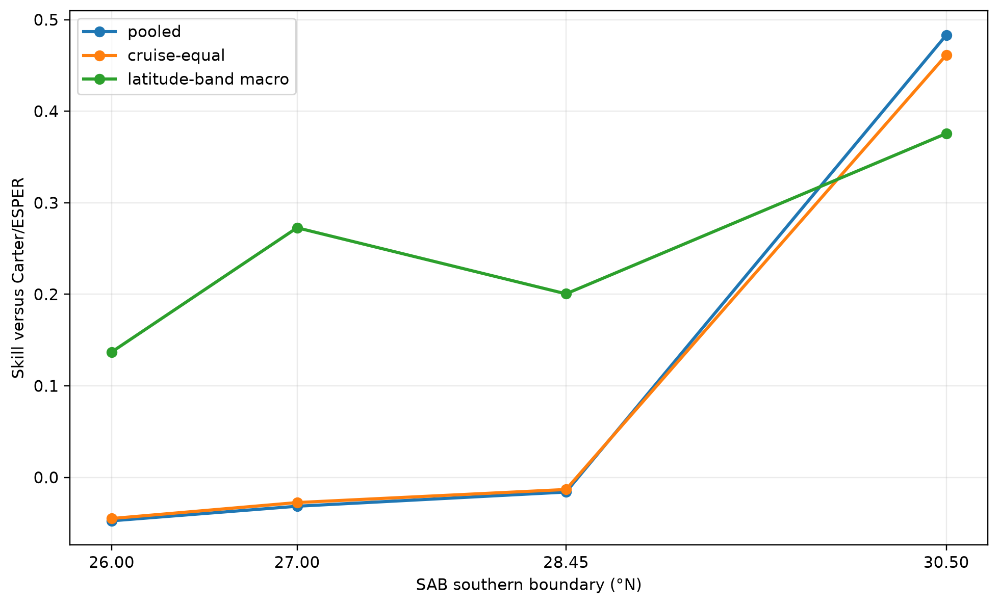
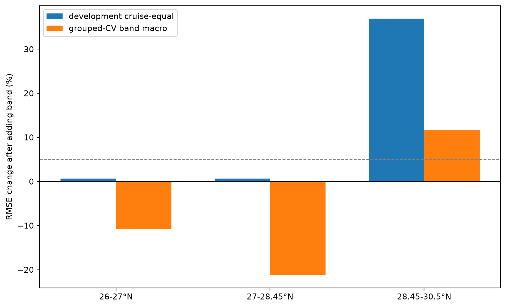
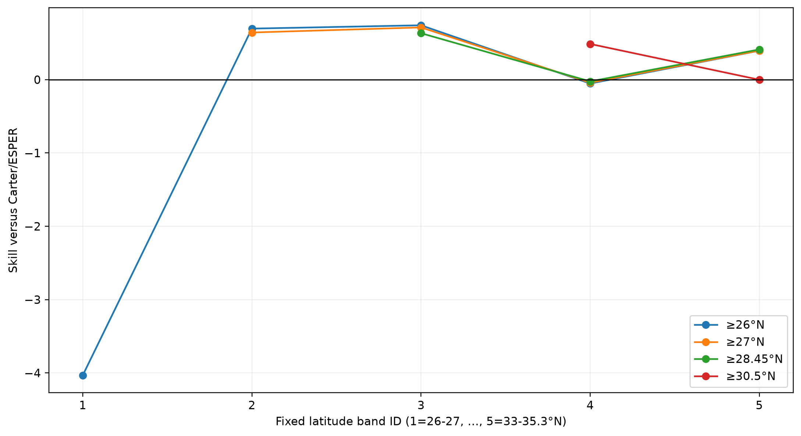
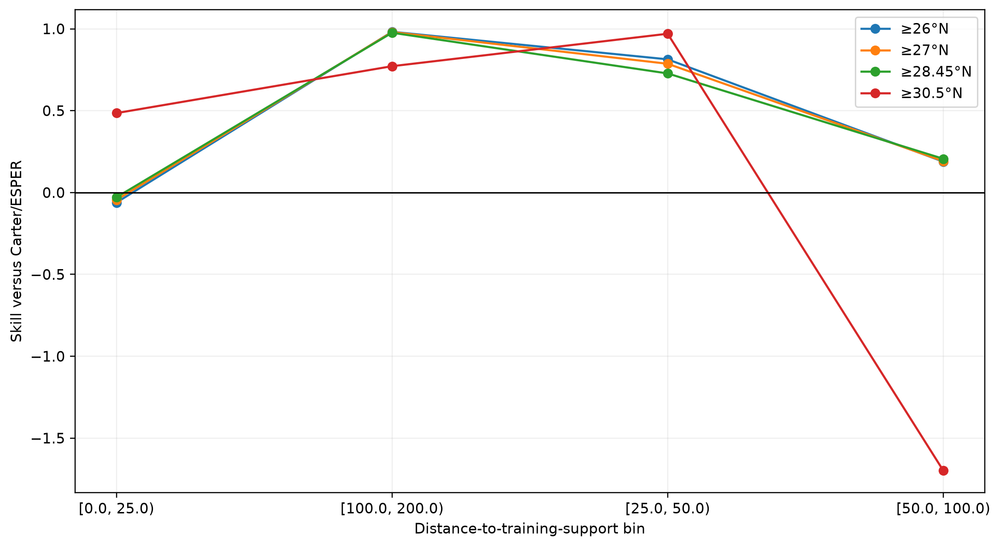
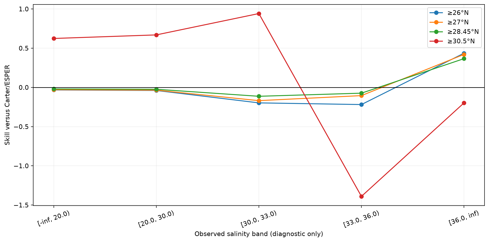
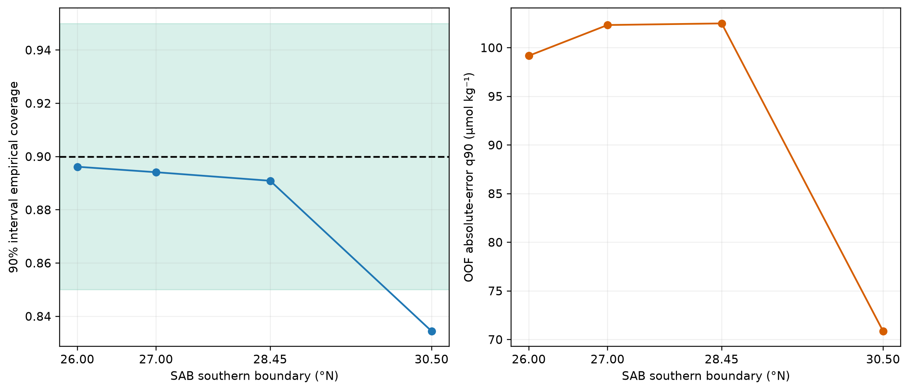
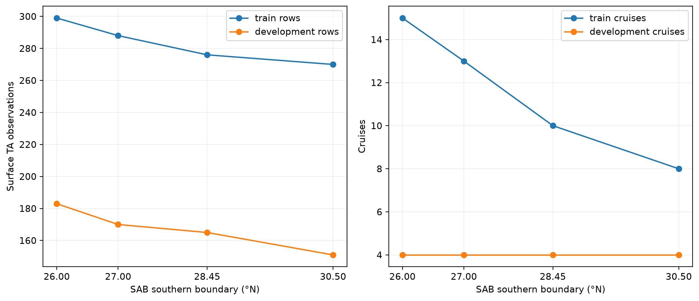
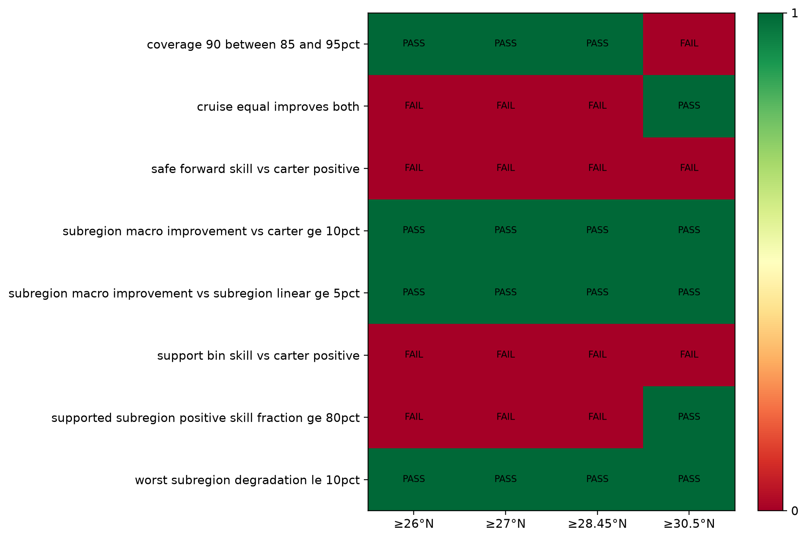

# SAB TA latitude-boundary sensitivity (P1.3c)

## Scientific question and permitted claim

This experiment tests whether adding southern SAB surface observations degrades TA reconstruction, especially the prior hypothesis that observations south of 27°N mix a different water mass into the relation. It supports only development/grouped-CV sensitivity claims. It does not validate a TA product or identify a causal water-mass boundary.

## Data, splits, and leakage controls

The four nested masks retain LME 6 observations from 26.0, 27.0, 28.45, or 30.5°N to 35.3°N. Only primary, TA-QC=2 observations at 0-5 m are used. Frozen cruise assignments, duplicate groups, CV folds, preprocessing, and evaluation bands are unchanged. The locked test and external-independent labels were not opened. Each development set contains 4 cruises; eligible development rows range from 151 to 183. The 30.5°N mask has four populated frozen CV folds because fold 0 has no eligible cruise; no samples were reassigned.

## Candidate models and training

Each boundary independently refits the frozen P1.3 candidates with 4,000 optimizer steps and seeds 100-102 for a nonlinear candidate when the preregistered A3 trigger fires. Selection uses development latitude-band macro RMSE. Boundaries through 28.45°N select hierarchical TA-SSS; 30.5°N triggers and selects the hierarchical residual MLP. This model-family discontinuity is a material confounder in the northern contrast.

## Main development results

The 27°N hypothesis is not supported by the preregistered rule. Adding 27-28.45°N changes development cruise-equal RMSE from 101.31 to 101.97 µmol kg⁻¹, while grouped-CV band-macro RMSE improves from 73.20 to 57.67. Adding 26-27°N similarly changes development cruise-equal RMSE from 101.97 to 102.63, while CV improves from 57.67 to 51.51.

- Adding 26-27°N: development cruise-equal RMSE +0.6%; grouped-CV band-macro RMSE -10.7%; preregistered harmful=false; model family changed=false.
- Adding 27-28.45°N: development cruise-equal RMSE +0.6%; grouped-CV band-macro RMSE -21.2%; preregistered harmful=false; model family changed=false.
- Adding 28.45-30.5°N: development cruise-equal RMSE +37.0%; grouped-CV band-macro RMSE +11.7%; preregistered harmful=true; model family changed=true.

The only band satisfying the frozen harmful-band rule is 28.45-30.5°N. However, the restricted 30.5°N experiment also activates a nonlinear model unavailable in the other three runs. Its development pooled RMSE is 73.77, R² is 0.450, and grouped-CV band-macro RMSE is 65.52; uncertainty coverage is below gate and worst support-bin skill is strongly negative. This is a hypothesis for a controlled follow-up, not evidence that the latitude band or a specific water mass causes the loss.

## Decision and limitations

No boundary passes the full P1.3 development gate, and no safe-forward SAB development observations are available. We therefore retain SAB TA as non-product evidence. The specific claim that data south of 27°N are responsible for degradation is rejected under the registered rule. A follow-up should force the same candidate family at every boundary and use cruise bootstrap or leave-one-cruise-out contrasts to separate geography from model selection and the four-cruise development composition. Depth sensitivity remains out of scope because this experiment uses only the project-defined 0-5 m surface layer.

## Figure and table index

All figure source data are the CSV files in `tables/`; exact source hashes are in `archive_manifest.json`. The corresponding large prediction files remain in the ignored experiment output directory.

Figure 1. Selected-model development RMSE across nested SAB southern boundaries. The apparent improvement at 30.5°N coincides with nonlinear-model activation and removal of the 28.45-30.5°N observations, so it is not a clean water-mass effect.

Figure 2. Frozen cruise-grouped cross-validation RMSE across boundaries. The 30.5°N variant has four populated folds because frozen fold 0 contains no eligible cruise; folds were not reassigned.

Figure 3. Development skill of each selected model relative to Carter/ESPER, where positive values favor the model. Pooled and cruise-equal skill are negative through 28.45°N despite positive latitude-band macro skill.

Figure 4. Percent RMSE change caused by adding each southern latitude band to the next restricted dataset. The preregistered harmful-band rule requires development cruise-equal degradation above 5% and grouped-CV band-macro degradation; only 28.45-30.5°N meets both, with a model-family change.

Figure 5. Selected-model skill versus Carter/ESPER within fixed latitude bands. Sparse bands contain only one or two cruises, and the central 30.5-33°N band dominates the development sample.

Figure 6. Skill versus Carter/ESPER by distance from training TA support. Negative worst-bin skill remains for every boundary, showing that boundary restriction does not solve extrapolation risk.

Figure 7. Skill versus Carter/ESPER by observed-salinity band, used only for diagnosis. Small low-salinity cells are unstable and must not be treated as evidence for operational coastal-estuarine performance.

Figure 8. Conformal interval coverage and out-of-fold absolute-error 90th percentile. The 30.5°N variant undercovers at 83.4%, outside the frozen 85-95% acceptance range.

Figure 9. Observation and cruise support retained by each nested boundary. All development variants contain only four cruises, while the 30.5°N training set has eight cruises and one empty frozen CV fold.

Figure 10. Frozen development-gate checks by boundary. No variant passes the full gate; safe-forward evaluation is unavailable because no SAB development record satisfies the frozen forward-time intersection.
