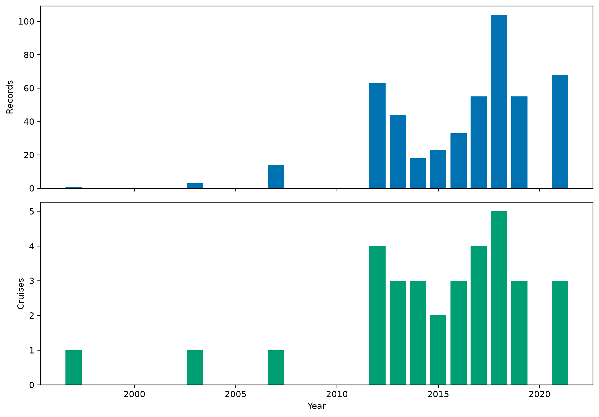
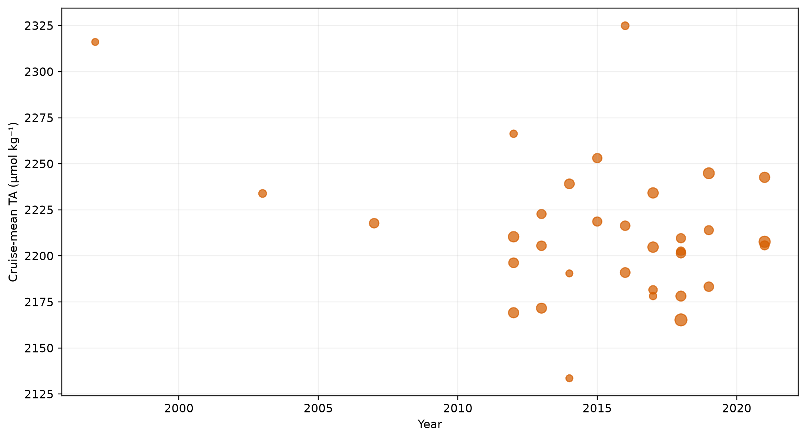
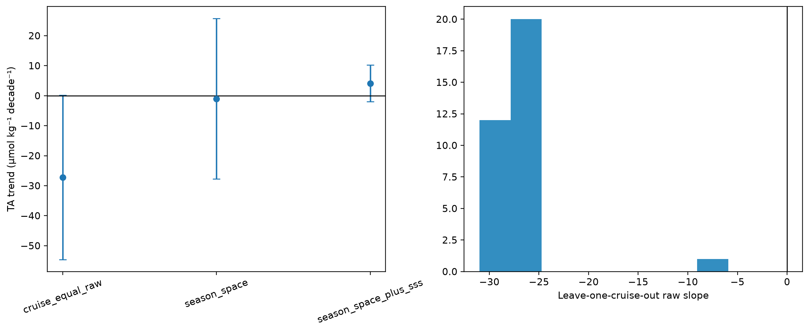
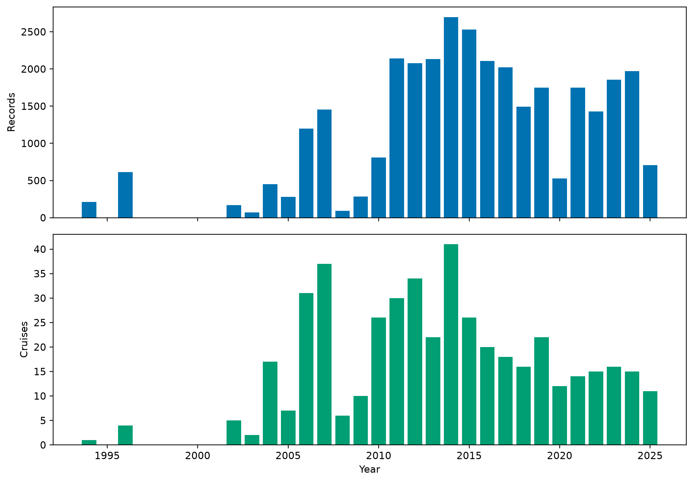
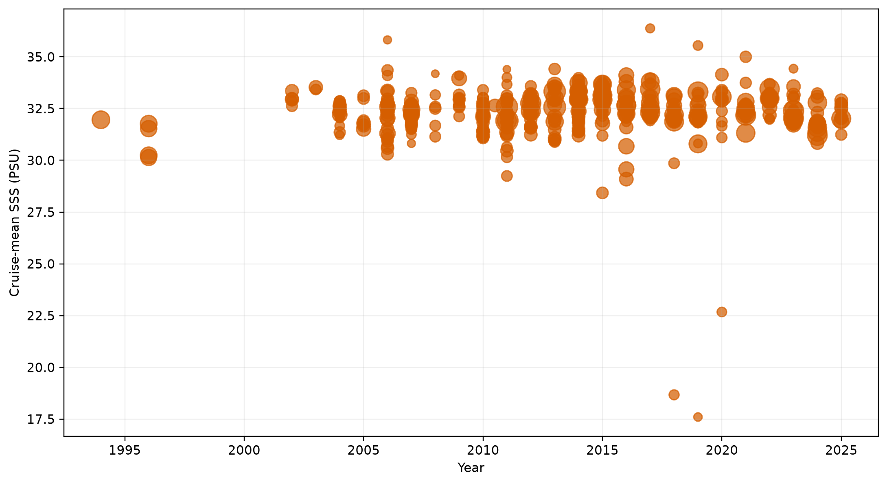
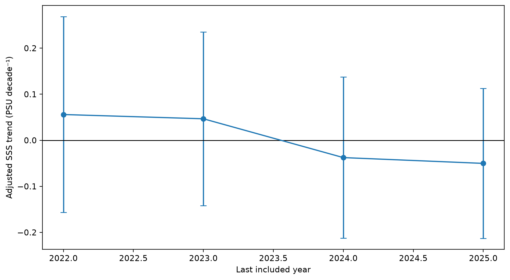
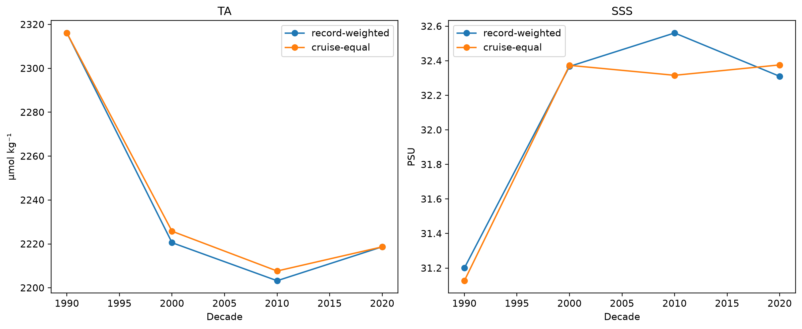
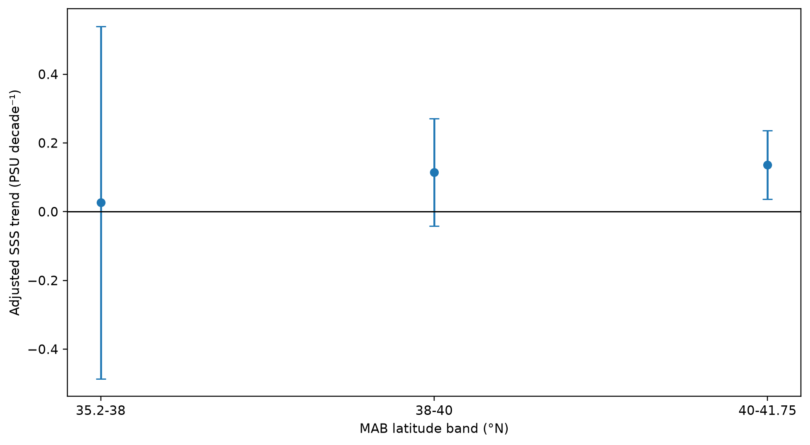

# MAB surface TA and SSS decadal-trend diagnostic

## Scientific question and permitted claim

This experiment repeats Issue #19 without changing its method or decision rule in canonical MAB (LME 7, 35.2-41.75°N). It diagnoses observational trend identifiability; it does not establish a spatially complete climate trend or validate a product.

## Data, splits, and leakage controls

TA uses primary QC=2 surface observations: CODAP-NA_v2026: 446 records/30 cruises, GLODAPv2.2023: 35 records/16 cruises. It has 481 records, 33 cruises and 12 sampled years (1997-2021). SSS uses 32829 SOCAT cruise-grid-month rows from 455 cruises and 26 years (1994-2025). Only train/development were read through the gateway; locked-test and external-independent labels remained sealed.

## Candidate models and training

No prediction model was trained. The frozen SAB methods were reused unchanged: cruise-equal WLS with cruise-clustered covariance, raw and harmonic-season/quadratic-space adjustment, TA adjustment for SSS, Theil-Sen cruise means, leave-one-cruise-out raw slopes, SSS end-year truncation, and three fixed latitude bands.

## Main development results

TA is not identifiable. Its raw estimate is -27.2 µmol kg⁻¹ decade⁻¹ (95% CI -54.6 to +0.2), but seasonal/spatial adjustment changes it to -1.0 and adding SSS changes it to +4.1. Leave-one-cruise raw slopes span -31.0 to -5.9; the raw decline is sampling-confounded.

SSS is diagnostic only. Raw and adjusted full-MAB estimates are +0.023 and -0.050 PSU decade⁻¹; the adjusted 95% CI is -0.213 to +0.113. End-year estimates are 2022: +0.056, 2023: +0.047, 2024: -0.038, 2025: -0.050. Fixed-band adjusted slopes are 35.2-38°N: +0.026, 38-40°N: +0.115, 40-41.75°N: +0.137. The opposing full-region and band behavior is consistent with changing spatial sampling, not a uniform MAB trend.

## Decision and limitations

TA receives `not_identifiable`; SSS receives `diagnostic_only`. Neither scattered-observation series supports a basin-wide trend claim. A publishable estimate requires fixed-grid monthly anomalies, area weighting, temporal-correlation treatment, and a validated reconstruction ensemble.

## Figure and table index

Every figure is backed by a CSV under `tables/`; hashes and mappings are in `archive_manifest.json`.

Figure 1. Annual MAB surface-TA records and cruises in unsealed train/development. Coverage is broader than SAB but remains temporally uneven.

Figure 2. Cruise-mean MAB TA through time, with point area proportional to record count. Spatial and seasonal cruise composition is large relative to temporal change.

Figure 3. MAB TA trends across adjustment choices and leave-one-cruise raw slopes. Removing the raw decline after spatial/seasonal adjustment diagnoses sampling confounding.

Figure 4. Annual MAB SOCAT in-situ SSS cruise-grid-month coverage. Dense coverage still varies materially by year and cruise.

Figure 5. Cruise-mean MAB SOCAT SSS through time. Cross-cruise spatial-regime scatter is much larger than the fitted basin-wide trend.

Figure 6. Adjusted MAB SSS trend under end-year truncation. The estimate changes from weakly positive through 2023 to weakly negative through 2024-2025.

Figure 7. Record-weighted and cruise-equal MAB observations by decade. They summarize sampling and are not spatially complete climatologies.

Figure 8. Adjusted MAB SSS trends by fixed latitude band. Positive central/northern estimates contrast with the weakly negative full-region estimate, exposing spatial-composition confounding.
