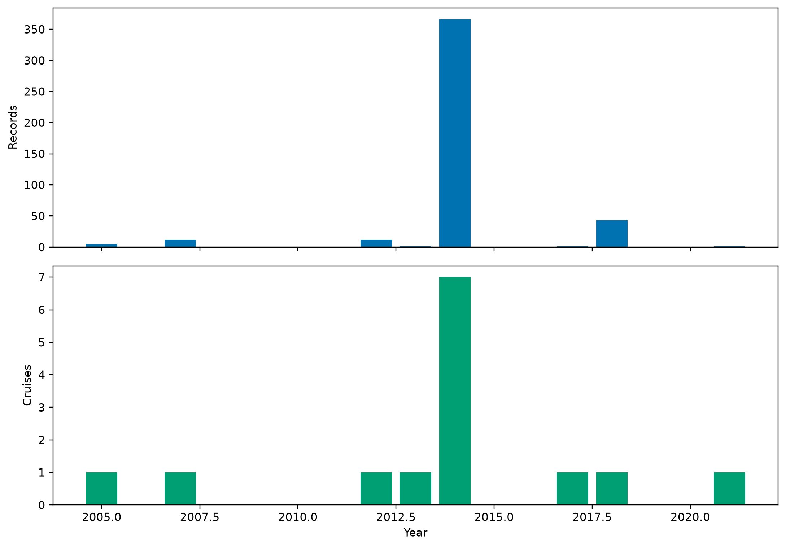
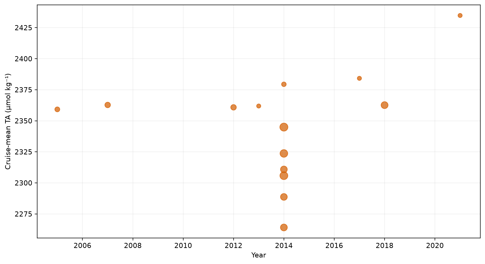
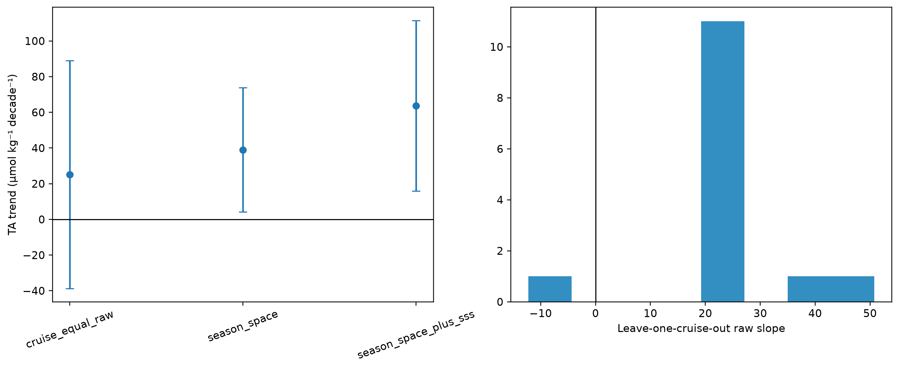
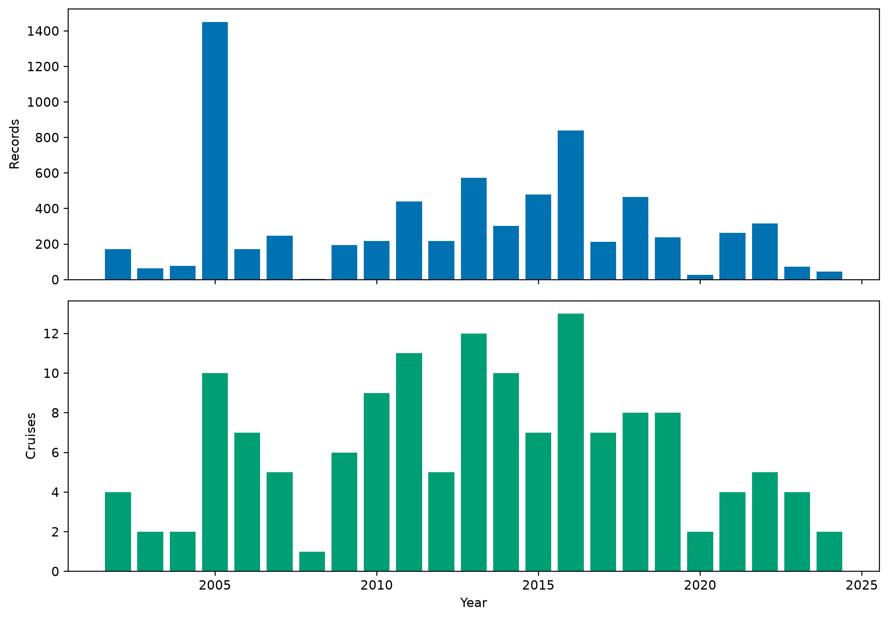
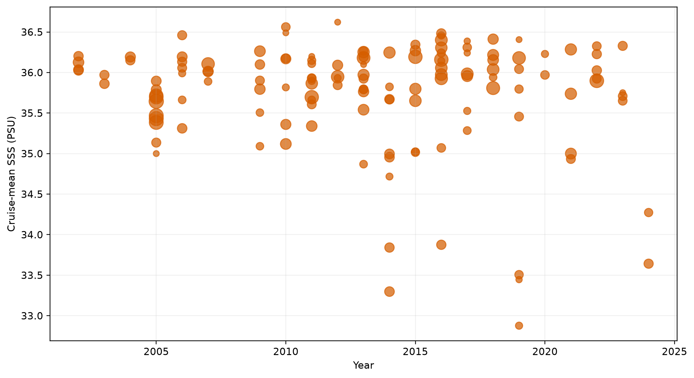
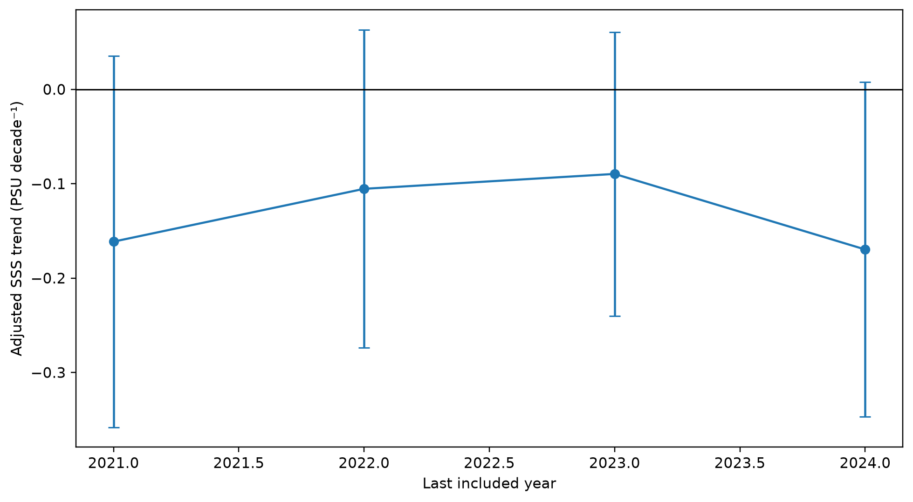
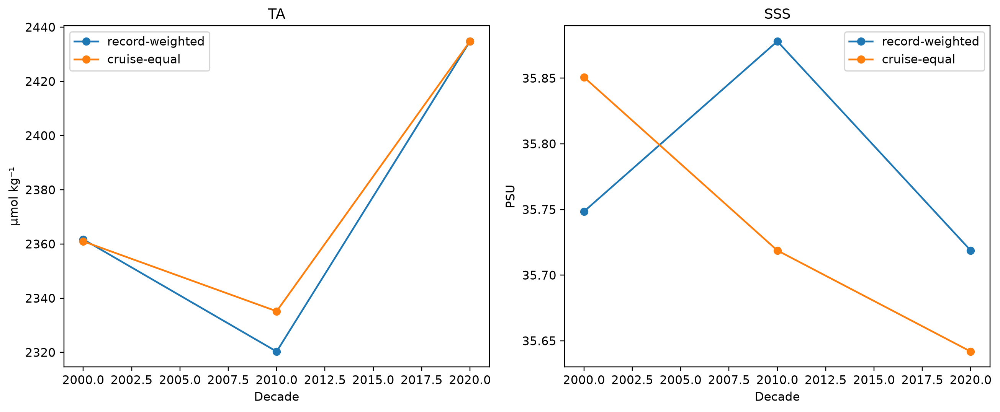
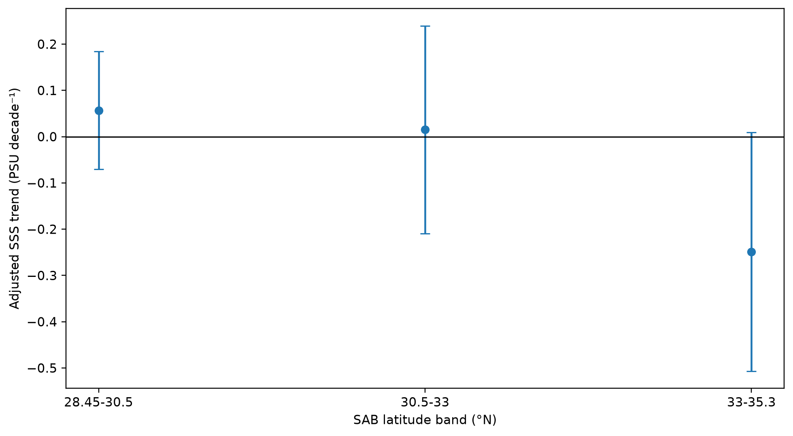

# SAB surface TA and SSS decadal-trend diagnostic

## Scientific question and permitted claim

This analysis asks whether the existing observations identify a decadal trend in canonical SAB (LME 6, 28.45-35.3°N). It may diagnose sampling adequacy and estimator sensitivity. It cannot establish a spatially complete climate trend, validate a product, or attribute a trend to a process.

## Data, splits, and leakage controls

TA uses primary QC=2 CODAP/GLODAP observations at 0-5 m. SSS uses SOCAT in-situ surface salinity. Only frozen train and development partitions were materialized through the P1 gateway; locked-test and external-independent labels remained sealed. TA has 441 records from 14 cruises in 8 sampled years (2005-2021), with 83.0% of records in one year. SSS has 7090 records from 136 cruises in 23 years (2002-2024).

## Candidate models and training

No predictive model was trained. Trends use cruise-equal weighted least squares with cruise-clustered covariance. Registered sensitivities include a raw temporal fit, harmonic seasonal plus quadratic spatial adjustment, TA adjustment for collocated SSS, Theil-Sen regression on cruise means, leave-one-cruise-out raw slopes, SSS end-year truncation, and separate latitude bands.

## Main development results

TA is not identifiable as a regional decadal trend. The raw cruise-equal estimate is 25.1 µmol kg⁻¹ decade⁻¹ (95% CI -38.7 to 89.0). Seasonal/spatial adjustment changes it to 39.0; adding SSS changes it to 63.6. Leave-one-cruise-out raw slopes span -12.3 to 50.8, including both signs.

SSS supports a diagnostic negative estimate, not a robust climate claim. The seasonally/spatially adjusted slope is -0.170 PSU decade⁻¹ (95% CI -0.347 to 0.008). Its end-year sensitivity moves from -0.161 through -0.090 to -0.170, demonstrating sensitivity to the final sparse sampling year.

## Decision and limitations

TA receives `not_identifiable`: too few cruises and years, severe 2014 concentration, and estimator/leave-one-cruise instability. SSS receives `diagnostic_only`: the adjusted estimate is weakly negative, but its confidence interval includes zero and its magnitude changes with end year and latitude band. A publishable trend requires a fixed gridded domain with monthly anomaly construction, explicit observation-error treatment, and preferably reconstruction/product ensembles evaluated against withheld stations or cruises. The present results describe only sampled, unsealed observations.

## Figure and table index

Every figure is backed by a CSV under `tables/`; hashes and mappings are in `archive_manifest.json`.

Figure 1. Annual SAB surface-TA record and cruise coverage in the unsealed train/development partitions. The series has only eight sampled years, and 2014 contributes 366 of 441 records.

Figure 2. Cruise-mean TA against time; point area scales with within-cruise record count. Fourteen cruises do not provide repeated, spatially balanced coverage for a regional climate trend.

Figure 3. TA trend estimates across adjustment choices and the leave-one-cruise-out raw-slope distribution. Large shifts among methods and sign changes under cruise omission diagnose non-identifiability.

Figure 4. Annual SOCAT in-situ SSS coverage in canonical SAB. Coverage is much denser than TA but remains strongly uneven among years and cruises.

Figure 5. Cruise-mean SOCAT SSS against time; point area scales with record count. The scatter shows that sampling different coastal and offshore regimes is large relative to the fitted decadal change.

Figure 6. Seasonally and spatially adjusted SSS trend as the final included year moves from 2021 to 2024. The negative estimate strengthens when sparse, fresher 2024 sampling is included.

Figure 7. Record-weighted and cruise-equal means by calendar decade. These points summarize the sampled observations and must not be interpreted as spatially complete SAB decadal climatologies.

Figure 8. Adjusted SSS trends fitted separately in three SAB latitude bands. Heterogeneity and uncertainty across bands limit a single basin-wide trend claim.
