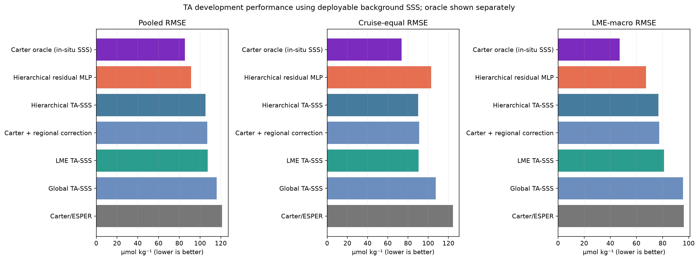
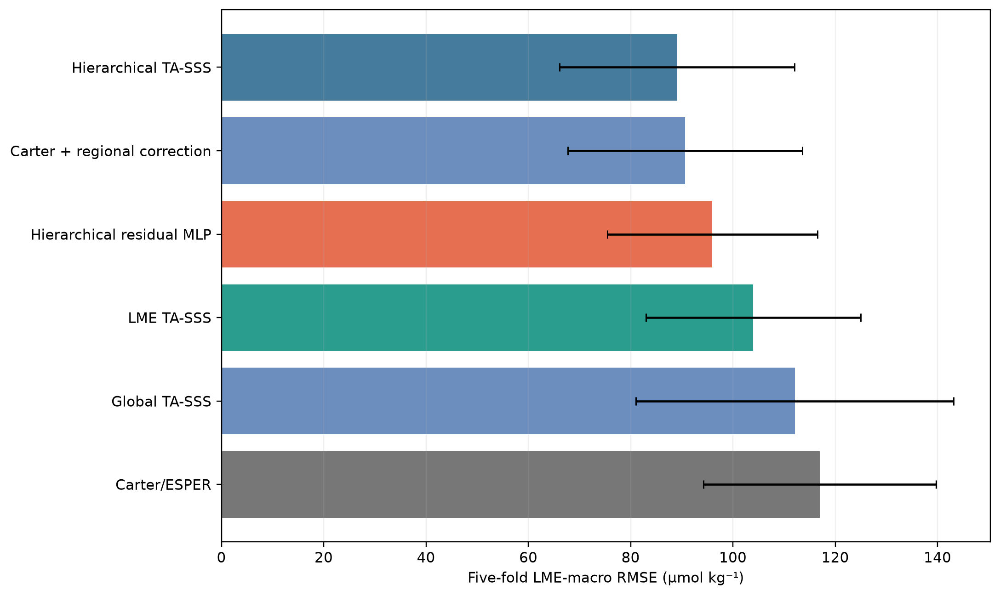
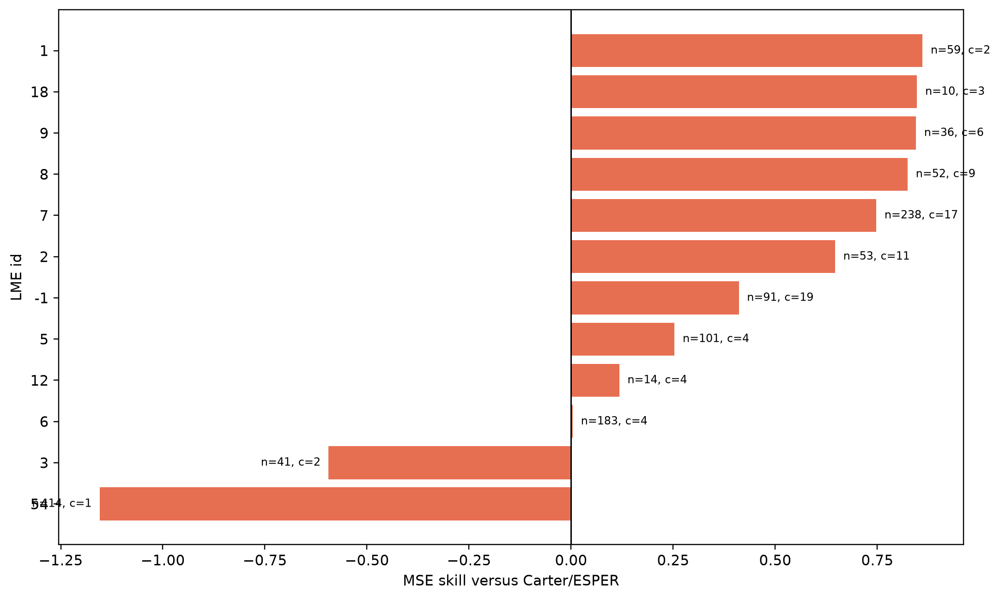
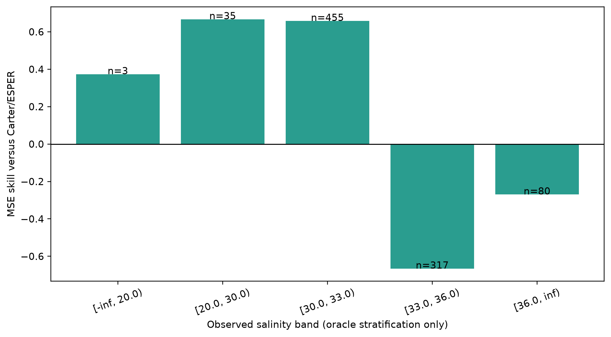
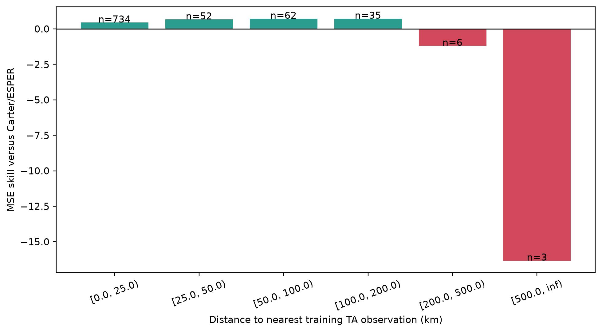
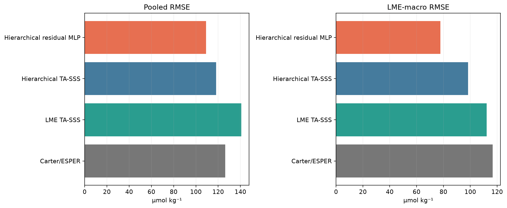
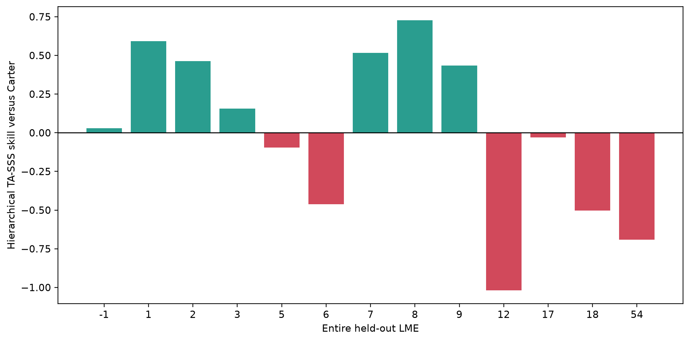
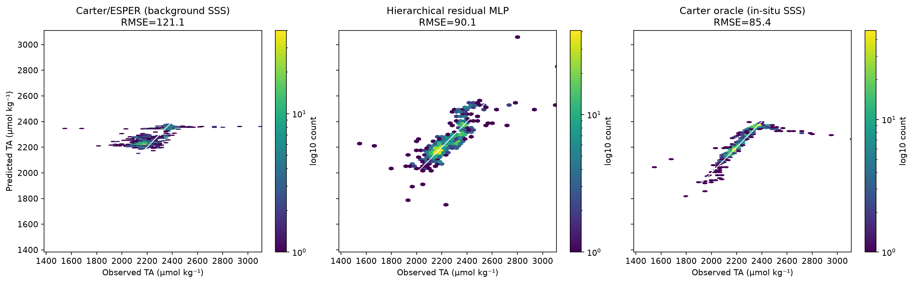
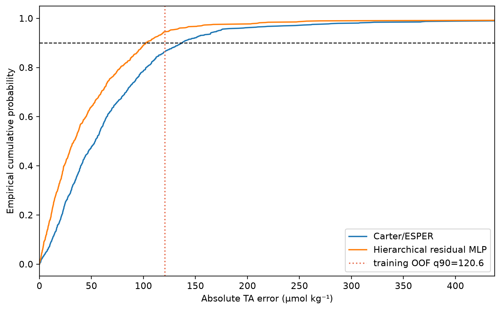
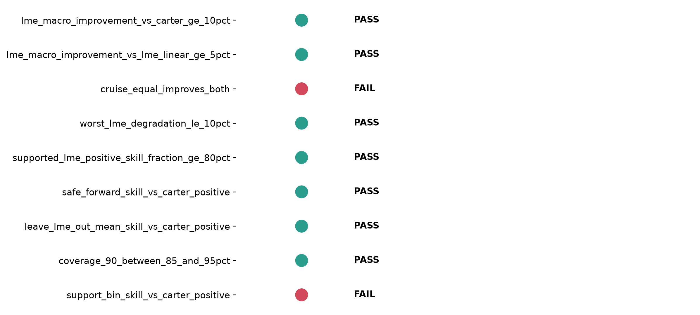

# Reviewer archive: P1.3 North-American coastal TA viability

## Executive finding

The preregistered experiment selected **Hierarchical residual MLP** by development LME-macro RMSE. Its three-seed mean LME-macro RMSE is 67.277 µmol kg⁻¹ versus 96.212 for Carter/ESPER and 81.115 for the fixed LME TA-SSS baseline. The ensemble pooled RMSE is 90.131 µmol kg⁻¹. However, the frozen development gate failed because `cruise_equal_improves_both, support_bin_skill_vs_carter_positive` did not pass. The final status is `diagnostic_only_do_not_open_locked_test`; locked-test and external-independent labels remain sealed.

## Scientific question and permitted claim

This experiment asks whether TA can be reconstructed at North-American coastal grid cells using inputs available at product inference time. Background SSS is the primary salinity input. Collocated in-situ salinity appears only in an oracle Carter diagnostic and in evaluation strata. The allowed claim is development, grouped-CV, safe-forward, and leave-LME-out evidence within the frozen North-American domain. No global or independent-test claim is allowed.

## Data, splits, and leakage controls

- Product-ready train: 3,737 records from 229 cruises.
- Product-ready development: 892 records from 49 cruises.
- Rows require observed TA, background SSS, valid coordinates, and finite Carter coefficients; this explains the reduction from all TA-QC records.
- Safe forward evaluation uses 3,029 train rows and 146 development rows after intersecting primary and forward assignments. It never loads primary locked groups.
- Support distance is recomputed from training TA coordinates; the zero-valued observation-anchor cache field is not used.
- The frozen data manifest `46b01085fbb577b24dbb62b6ff7b7a53a5d402d6ab93d4c076d67f37f32e9e9f` passed full verification of 12 files.
- `locked_test_opened=false`; `external_independent_opened=false`.

## Candidate models and training

Candidates are raw Carter/ESPER, train-only Carter regional correction, global robust TA-SSS, fixed LME TA-SSS, hierarchical varying-intercept/varying-slope TA-SSS, and a three-seed nonlinear residual MLP. Partial-pooling alpha 100 was selected from the frozen grid {1, 10, 100, 1000} using five cruise-grouped training folds. The A3 residual MLP ran only because hierarchical A2 beat Carter and LME-linear under both development LME-macro and cruise-equal RMSE. A3 used 4,000 steps and seeds 100-102.

## Main development results

| model | pooled_rmse_mean | pooled_bias_mean | pooled_r2_mean | cruise_equal_rmse_mean | lme_macro_rmse_mean | worst_lme_rmse_mean |
|---|---|---|---|---|---|---|
| Carter oracle (in-situ SSS) | 85.412 | -3.265 | 0.645 | 73.565 | 47.144 | 185.514 |
| Carter/ESPER | 121.128 | 32.816 | 0.285 | 124.412 | 96.212 | 211.66 |
| Carter + regional correction | 107.045 | -3.413 | 0.442 | 91.05 | 77.385 | 212.073 |
| Global TA-SSS | 115.93 | -11.936 | 0.345 | 107.555 | 95.604 | 214.435 |
| Hierarchical residual MLP | 91.397 | -1.005 | 0.593 | 102.853 | 67.277 | 164.078 |
| Hierarchical TA-SSS | 105.202 | -5.862 | 0.461 | 90.129 | 76.831 | 208.956 |
| LME TA-SSS | 107.365 | 2.217 | 0.438 | 90.369 | 81.115 | 212.76 |

*Development TA RMSE under pooled, cruise-equal, and LME-macro aggregation. All deployable models use background SSS; the purple Carter oracle uses collocated in-situ salinity only to show the information ceiling and is excluded from selection. Lower is better.*

The selected ensemble improves pooled and LME-macro error substantially over raw Carter. It does not beat the fixed LME-linear model on cruise-equal RMSE: the three-seed mean is 102.853 µmol kg⁻¹, compared with 90.369 for LME TA-SSS. This is the first failed gate.

## Cruise-grouped cross-validation

| model | folds | pooled_rmse_mean | cruise_equal_rmse_mean | lme_macro_rmse_mean | lme_macro_rmse_sd |
|---|---|---|---|---|---|
| Carter/ESPER | 5 | 138.546 | 140.659 | 116.97 | 22.752 |
| Carter + regional correction | 5 | 118.078 | 109.009 | 90.643 | 22.898 |
| Global TA-SSS | 5 | 128.489 | 131.364 | 112.096 | 31.06 |
| Hierarchical residual MLP | 5 | 125.53 | 107.836 | 95.993 | 20.571 |
| Hierarchical TA-SSS | 5 | 117.395 | 108.463 | 89.091 | 22.95 |
| LME TA-SSS | 5 | 127.46 | 122.291 | 103.959 | 20.979 |

*Five-fold cruise-grouped training cross-validation LME-macro RMSE. Error bars show one standard deviation across folds. Hierarchical TA-SSS is more stable than the nonlinear residual model, which contrasts with the development ranking and limits the nonlinear claim.*

Hierarchical TA-SSS has the best five-fold LME-macro RMSE (89.091 µmol kg⁻¹), while the nonlinear residual model is worse (95.99 µmol kg⁻¹). Development selects A3, but grouped CV favors the simpler A2 relation; this disagreement is reported rather than resolved after observing results.

## Region, salinity, and observation-support diagnostics

7/7 supported LMEs have positive ensemble skill relative to Carter.

*Development MSE skill of the three-seed hierarchical residual ensemble relative to Carter/ESPER for each LME. Labels show records and cruises. Negative skill in LME 3 and LME 54 is retained; LME 54 has only one development cruise.*

*Development skill relative to Carter/ESPER stratified by collocated observed salinity. Observed salinity is used only for evaluation strata, never as a deployable model input; labels give record counts. Skill is negative in the 33-36 and >=36 bands, showing a high-salinity regime failure.*

The selected model degrades relative to Carter in both high-salinity bands (33-36 and >=36). This is not a separate frozen gate, but it is a material limitation for offshore and subtropical parts of the regional product.

*Development skill relative to Carter/ESPER by haversine distance to the nearest training TA observation. Skill is negative in the two most distant populated bins; the worst bin skill is -16.33. Sparse counts do not permit removing these preregistered failures.*

The 200-500 km and >500 km bins contain only 6 and 3 records, but their negative skill must remain in the frozen gate. This is the second failed gate and prevents spatial extrapolation claims.

## Safe forward-time and whole-region transfer

| model | n | pooled_rmse | pooled_bias | cruise_equal_rmse | lme_macro_rmse |
|---|---|---|---|---|---|
| Carter/ESPER | 146 | 126.336 | -19.848 | 136.175 | 116.671 |
| LME TA-SSS | 146 | 140.756 | 24.398 | 117.32 | 112.145 |
| Hierarchical TA-SSS | 146 | 118.182 | -42.827 | 102.198 | 98.389 |
| Hierarchical residual MLP | 146 | 109.134 | -21.996 | 87.285 | 77.704 |

*Safe forward-time evidence using only primary-train groups assigned to the frozen <=2018 training period and primary-development groups assigned to 2019-2021. No primary locked groups are materialized.*

*Leave-one-LME-out transfer skill for hierarchical TA-SSS relative to Carter/ESPER. Positive mean skill is marginal and several complete held-out LMEs degrade, showing that regional transfer remains weak.*

Safe-forward pooled MSE skill versus Carter is 0.254. Mean leave-LME-out skill for hierarchical TA-SSS is only 0.009; 6/13 held LMEs degrade. The mean gate technically passes, but the regional pattern does not support a broad transfer claim.

## Deployable-input gap and uncertainty

*Development observation-prediction density for Carter with background SSS, the selected three-seed ensemble, and the in-situ-SSS Carter oracle. The selected ensemble pooled RMSE is 90.1 µmol kg⁻¹. The oracle gap isolates the cost of deployable SSS inputs.*

The in-situ-SSS Carter oracle reaches pooled RMSE 85.412 and LME-macro RMSE 47.144 µmol kg⁻¹. This shows that salinity information is a major limiting factor: background SSS suppresses the full coastal/estuarine TA-SSS signal.

*Development absolute-error distributions. The selected interval half-width (120.6 µmol kg⁻¹) was calibrated only from five-fold training OOF residuals and attains 0.945 development coverage.*

The training-OOF 90% conformal half-width is 120.616 µmol kg⁻¹ and development coverage is 0.945. This is leakage-safe development calibration evidence, not locked or external-independent coverage.

## Decision and limitations

*Frozen P1.3 development gates. Cruise-equal improvement over both comparators and positive skill in every populated support-distance bin fail, so the locked test remains sealed and TA is diagnostic-only.*

Decision: `diagnostic_only_do_not_open_locked_test`. TA is predictable within well-supported North-American regions, and hierarchical/nonlinear corrections materially improve Carter in aggregate. It is not yet a publishable regional TA product because cruise-level robustness against the simple LME-linear baseline and remote-support extrapolation failed. Issue #10 may use this TA result only as a diagnostic sensitivity; it must not treat TA as a passed product or open the locked test.

## Figure and table index

All figures above have captions immediately below them. Source CSV files are in `tables/`; `archive_manifest.json` maps every figure to its source and records SHA256 provenance for all archived files and large local run artifacts.
