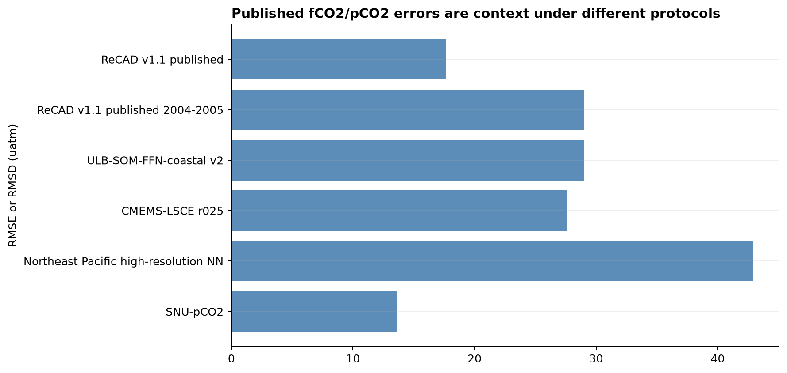
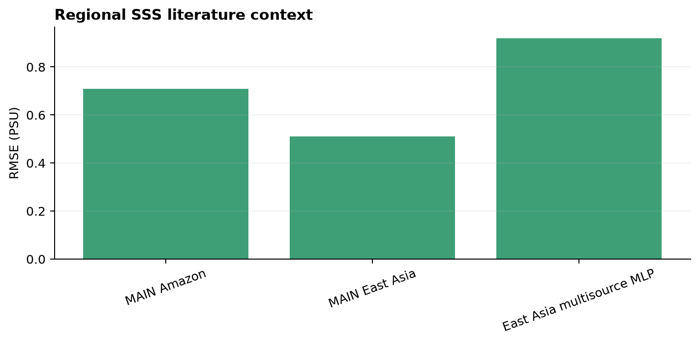
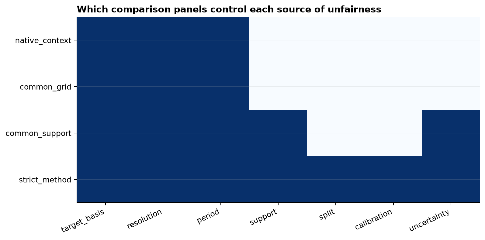
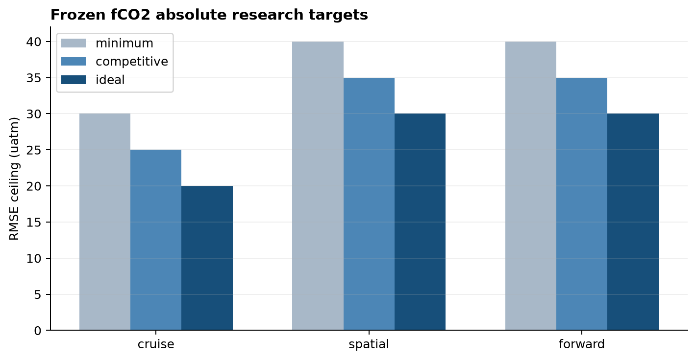
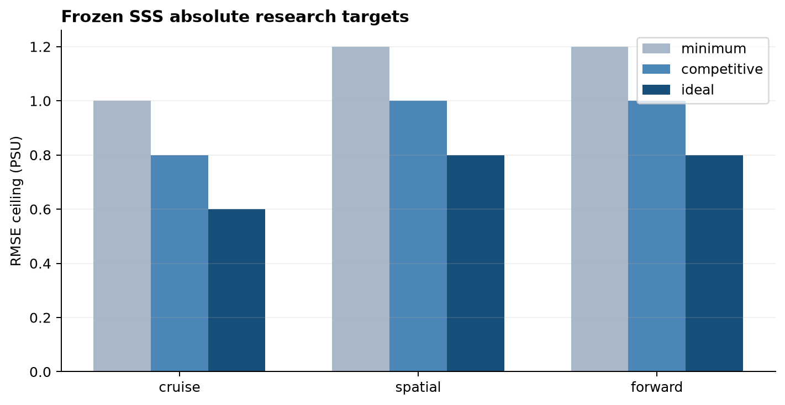
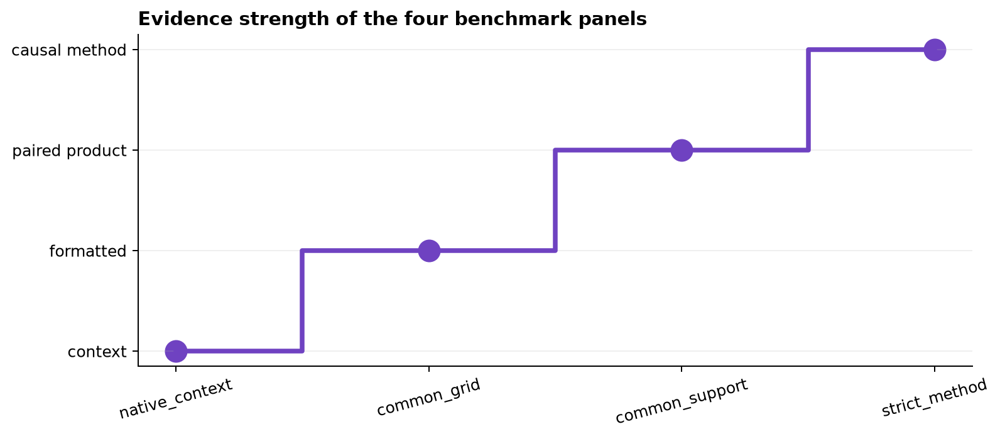
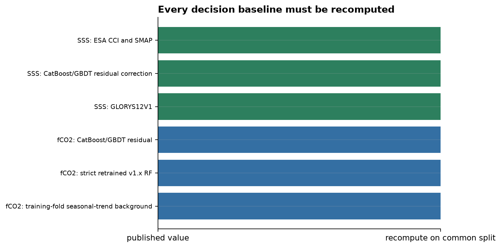
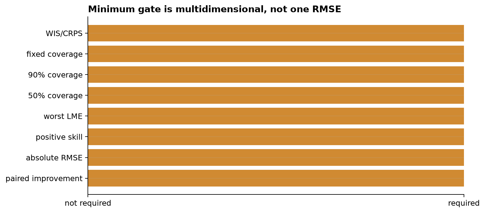

# Issue #37 literature benchmark and v1.x improvement contract

## Scientific question and permitted claim

What must ReCAD v2 demonstrate before it can be called better than ReCAD v1.x or competitive with modern coastal products? The answer is a frozen, target-specific contract. Published native scores are context. Model advancement requires an identical-data strict comparison against a fold-pure v1.x replica and the strongest same-split baseline, followed by common-support product comparison.

## Data, splits, and leakage controls

This governance experiment uses primary publications, official product documentation, and immutable ReCAD archives; it opens no observation labels. The published v1.1 random-test RMSE of 17.642 µatm and 2004-2005 RMSE of 28.975 µatm remain historical because full-period local calibration used those labels. The strict v1.x replica must use the original seven inputs, a 300-tree bagged RF, and training-fold-only calibration under cruise, spatial-block, and forward splits.

Four panels are frozen: native publication context; products standardized to 0.25° monthly with all available support; a paired common-observation intersection; and the identical-data strict method panel. pCO2 products are converted consistently with observations at matched SST/SSS using frozen PyCO2SYS settings before comparison with fCO2.

## Candidate models and training

No candidate was trained here. Future SSS candidates must beat GLORYS12V1 and the strongest same-split residual baseline. Future fCO2 candidates must beat the training-only seasonal-trend background, strict retrained v1.x RF, and strongest CatBoost/GBDT residual baseline. STTransformer, MoE, graph, and pretraining candidates receive no special allowance.

## Main development results

The literature review confirms that direct numerical ranking would be invalid. Roobaert et al. report 29 µatm for a global coastal reconstruction; CMEMS-LSCE reports coastal RMSD 27.6 µatm under reconstruction-month exclusion; RFR-LMEs uses random five-fold grid-cell validation; Duke et al. report 42.9 µatm under regional EXPOCODE withholding; Cho et al. report global-ocean 10-fold RMSE 13.57 µatm and external errors above 20 µatm. Recent regional SSS studies report 0.51-0.92 PSU, but do not establish a global coastal gate.

The minimum fCO2 ceilings are 30 µatm for cruise and 40 µatm for spatial/forward transfer. Competitive ceilings are 25/35/35; ideal ceilings are 20/30/30. SSS minimum ceilings are 1.0/1.2/1.2 PSU; competitive 0.8/1.0/1.0; ideal 0.6/0.8/0.8. Each tier additionally requires at least 5/10/15% paired improvement, positive skill in every scheme, no supported-LME RMSE ratio above 1.10, and no major scheme regression above 2%.

## Decision and limitations

Decision: **`benchmark_contract_frozen`**. Literature scores do not select models. A minimum pass also requires 50% coverage in [0.45, 0.55], 90% coverage in [0.85, 0.95], WIS and CRPS where samples exist, and improved risk at 80% retained coverage. Paired uncertainty uses 2,000 cruise-level bootstrap replicates, with a spatial-block variant and macro-region stratification. These thresholds are research gates, not claims that a specific public product is inferior; final product ranking awaits #38 observations and #40/#41 predictions on common support.

## Figure and table index

Tables 1-11 contain the literature catalog, four comparison panels, target tiers, shared gates, v1.x replica, conversion policy, bootstrap, comparability matrix, baseline roles, acceptance checks, and source catalog.

Figure 1. Published fCO2 or pCO2 errors collected as scientific context. Bars are not a ranking because domains, target basis, observation support, calibration, and validation designs differ.

Figure 2. Regional coastal SSS errors reported for recent machine-learning studies. These satellite-era regional values motivate the tiers but cannot substitute for global cruise, spatial, and forward evaluation.

Figure 3. Controlled dimensions in the four frozen panels. Only the strict-method panel controls target, grid, period, support, split, calibration, and uncertainty well enough to select a model.

Figure 4. Frozen absolute fCO2 RMSE ceilings for minimum, competitive, and ideal evidence under cruise, spatial-block, and forward-time outer evaluation.

Figure 5. Frozen absolute SSS RMSE ceilings for minimum, competitive, and ideal evidence; spatial and forward transfer receive looser ceilings than new-cruise interpolation.

Figure 6. Benchmark evidence hierarchy from native publication context through a common format and paired product comparison to the identical-data strict method comparison.

Figure 7. Required decision baselines for SSS and fCO2. Every baseline must be recomputed on the same held observations rather than copied from a publication table.

Figure 8. The minimum advancement gate requires paired improvement, absolute accuracy, regional robustness, calibrated uncertainty, and fixed-coverage risk simultaneously.

## Primary references

- Roobaert et al. (2024), https://doi.org/10.5194/essd-16-421-2024
- Chau et al. (2024), https://doi.org/10.5194/essd-16-121-2024
- Sharp et al. (2024), https://doi.org/10.1038/s41597-024-03530-7
- Duke et al. (2024), https://doi.org/10.1029/2024JC021134
- Cho et al. (2026), https://doi.org/10.1016/j.apor.2026.105210
- Jung et al. (2025), https://doi.org/10.1016/j.marpolbul.2025.118462
- Sung et al. (2025), https://doi.org/10.1016/j.jag.2025.104427
- Copernicus GLORYS12V1, https://doi.org/10.48670/moi-00021
- ESA CCI SSS, https://climate.esa.int/en/projects/sea-surface-salinity/
- NASA JPL SMAP CAP v5, https://podaac.jpl.nasa.gov/dataset/SMAP_JPL_L3_SSS_CAP_8DAY-RUNNINGMEAN_V5
