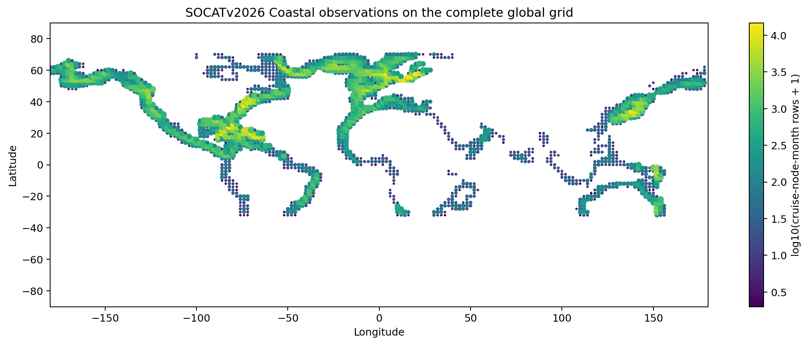
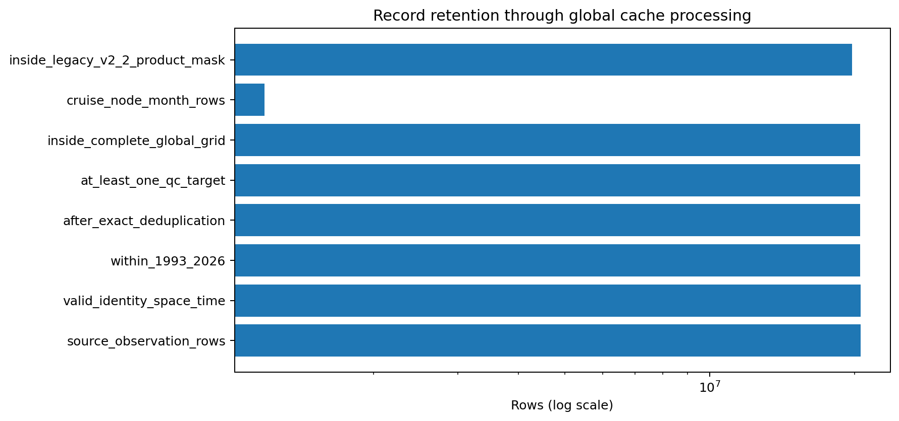
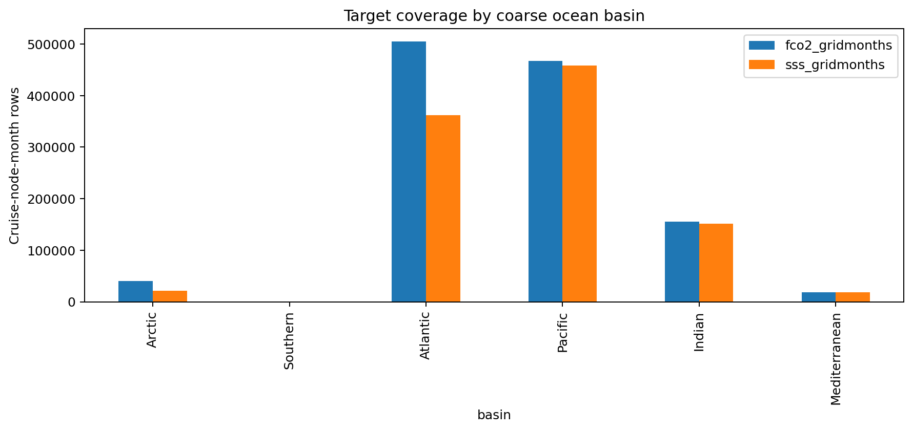
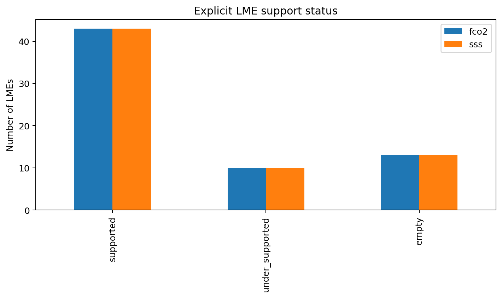
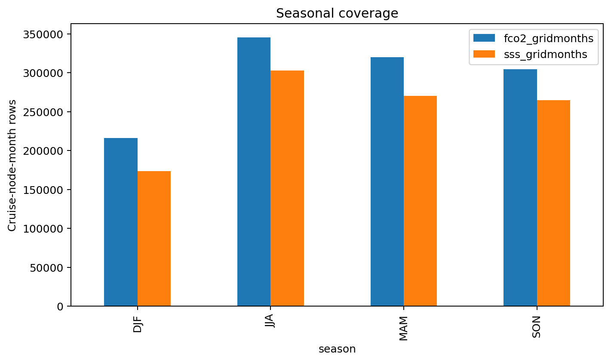
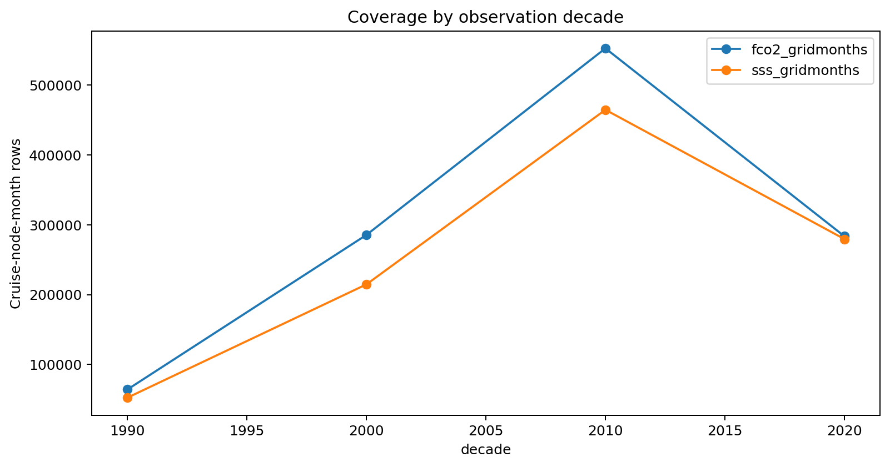
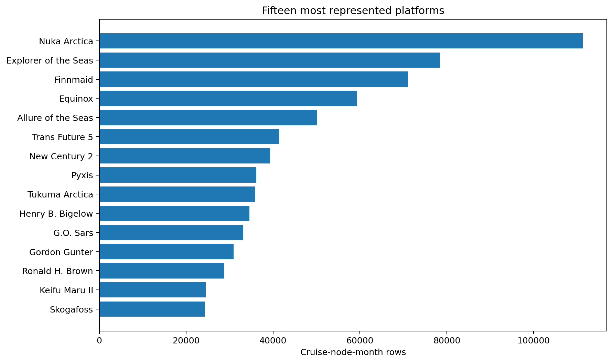
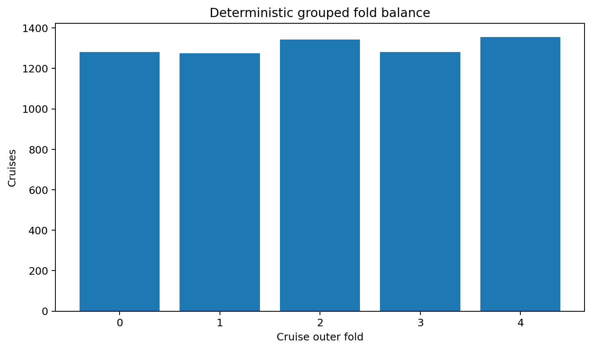
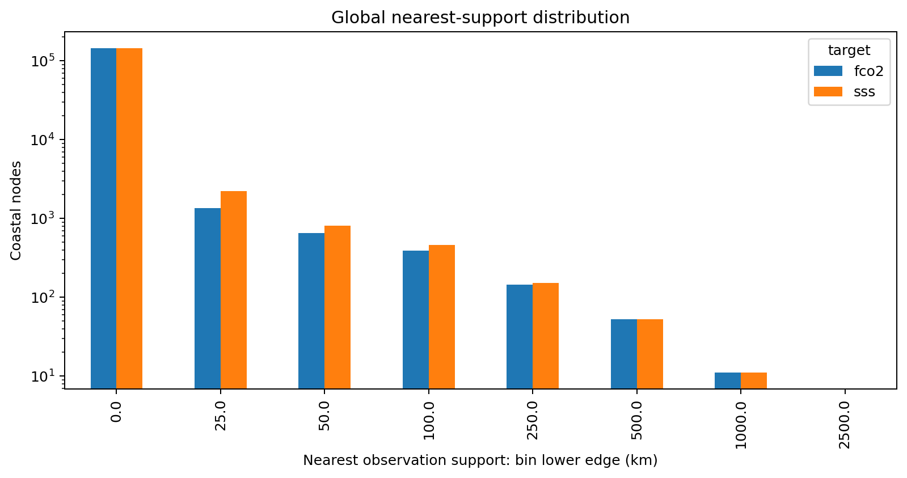
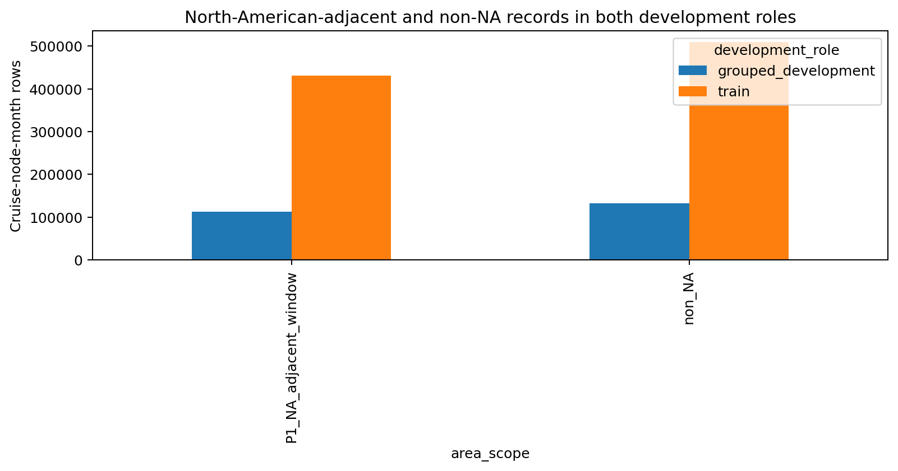

# P2.2 global coastal observation cache v2.3

## Scientific question and permitted claim

Issue #38 asks whether ReCAD has a genuinely global **observation-indexed** development cache for SSS and fCO2, rather than a global predictor grid supported only by North-American-adjacent labels. The permitted claim is limited to data coverage and split integrity: the cache contains 1,186,205 core cruise-node-month rows from 6,536 cruises on 148,376 observed coastal nodes. It does not establish global reconstruction skill.

The acceptance gate passes because non-North-American records occur in both roles (grouped_development, train) and all formal group-overlap checks equal 0. Of 66 LMEs, fCO2 has 43 supported, 10 under-supported, and 13 empty; SSS has 43 supported, 10 under-supported, and 13 empty. These labels are audit strata, not release grades.

## Data, splits, and leakage controls

The target source is `SOCATv2026_Coastal.tsv`. SSS is the SOCAT in-situ `sal` field after 0-50 QC; fCO2 is the recommended `fCO2rec` after 1-1000 µatm and flag ≤2 QC. For this observation cache, coastal means membership in the official SOCAT Coastal synthesis. Every QC record is assigned to the complete configured 1/8-degree grid from 78°S to 84°N; the source occupies -30.125° to 70.125° and 148,376 grid cells. LME polygons and the neutral basin/5-degree fallback are assigned over all occupied cells. Unobserved basins and LMEs remain explicit rather than being inferred from predictor coverage.

The audit found that the v2.2 product `coastal_mask` spans only -30.125° to 70.250° latitude and was generated by the pipeline's observed-fCO2 fallback. It is retained as `on_v2_2_product_mask` metadata and is not allowed to filter this cache. #39 must replace it with an observation-independent global product mask before predictor extraction or atlas training.

Normalized Expocode is assigned before QC and before cruise-node-month aggregation. Exact duplicate samples are removed before target filtering. The compact cache retains provenance, platform, source DOI, source QC, raw sample counts, and target-specific counts. The generated row-level files remain outside Git:

- cache: `C:\backup\phd\data\processed\recad_v2_3\global_socat_cache_v2.3.parquet`
- group split manifest: `C:\backup\phd\data\processed\recad_v2_3\global_group_split_manifest_v2.3.parquet`
- all-node support table: `C:\backup\phd\data\processed\recad_v2_3\global_node_support_v2.3.parquet`
- machine audit: `C:\backup\phd\data\processed\recad_v2_3\global_coastal_cache_audit_v2.3.json`

Cruise folds hash whole normalized Expocodes. Spatial folds hash each cruise's dominant 5-degree block and still move the whole cruise. Whole-LME evaluation must remove every cruise touching the held LME from training. Forward roles use cruise maximum year: ≤2018 train, 2019-2021 forward development, 2022-2025 late development, and 2026 provisional. All SOCATv2026 labels are marked development-accessible; none are represented as newly blind. The only SSS/fCO2 external candidate is a later SOCAT release with groups absent from the frozen source hash, recorded as metadata without labels.

## Candidate models and training

No model is trained in P2.2. This issue freezes the observation, grouping, provenance, and split contract used by #39-#44. Later candidates must consume identical target rows and outer partitions, fit preprocessing and calibration inside training folds, and report cruise, spatial, whole-LME, and forward evidence separately.

## Main development results

The full SOCAT source was scanned rather than inferred from prepared-grid variable names. The processing funnel in Table 1 records every loss stage and separately reports how many valid records the incomplete legacy mask would have retained. Basin, LME, neutral region, season, decade, platform, and target coverage are materialized as source CSV files. Target-specific distances from every observed node to the nearest training-support node are computed for all 148,376 occupied cells. The cache contains 221 named platforms and 6,536 cruise groups; 0 compact rows contain multiple DOI variants and remain auditable.

Non-NA coverage is not treated as automatically representative: dense regions can dominate row-weighted results, so later issues must report macro-LME and worst-region metrics and abstain in empty or under-supported regions.

## Decision and limitations

Decision: **pass_data_freeze**. P2.2 supplies a genuinely global observation-indexed development cache and zero-leakage group contracts. #39 may add deployable predictors against this fixed target universe only after replacing the incomplete, label-derived v2.2 product mask with an observation-independent global coastal mask.

Limitations: SOCAT sampling is opportunistic and platform-imbalanced; SSS is available only where SOCAT reports in-situ salinity; the observation-indexed support mask is not a product inference mask; the legacy v2.2 product mask is geographically incomplete; a dominant-block spatial fold is a grouped stress test rather than pure geographic independence; and SOCATv2026 cannot serve as a new independent test because its labels were accessible during cache construction. Future release labels remain unopened until P3.

## Figures

Figure 1. Global two-degree audit view of SOCATv2026 Coastal cruise-node-month observations on the complete configured 1/8-degree grid; color and marker size encode retained density, and the map is evidence of observation coverage rather than model skill.

Figure 2. Row counts at each ordered processing stage, from source observations through identity/time validation, exact duplicate removal, target QC, complete-grid matching, and cruise-node-month aggregation; the legacy v2.2 mask row is a diagnostic subset rather than a filter.

Figure 3. Retained fCO2 and in-situ SSS cruise-node-month coverage across the six frozen coarse basins; this exposes geographic imbalance that later macro-region scoring must prevent from being hidden by observation-weighted metrics.

Figure 4. Counts of the 66 LMEs classified as supported, under-supported, or empty for each target using the frozen audit thresholds; empty categories remain explicit and cannot inherit a global validation claim from covariate availability.

Figure 5. Seasonal target coverage after global QC and coastal matching; the counts diagnose temporal sampling imbalance and define strata required in later model evaluation rather than constituting a performance result.

Figure 6. Retained target coverage by decade, including the partial 2020s represented in SOCATv2026; the temporal expansion motivates forward-development evaluation and prevents random splits from being the sole evidence.

Figure 7. The fifteen platforms contributing the most compact grid-month rows; concentration in a small platform subset motivates platform and cruise grouped uncertainty analyses in subsequent issues.

Figure 8. Cruise counts in the five deterministic cruise-grouped outer folds; every normalized Expocode belongs to exactly one fold, and balance is descriptive rather than optimized using target values.

Figure 9. Distance from every occupied observation node to its nearest training-role fCO2 or SSS support node, binned in kilometres; long-distance tails quantify where grouped development depends on spatial transfer and may require abstention.

Figure 10. Retained rows inside and outside the exact P1 North-American-adjacent window, separated into train and grouped-development roles; non-NA observations occur in both roles, satisfying the central global-cache acceptance gate.

## Figure and table index

Figures 1-10 are embedded above with their reviewer-ready captions. Tables 1-14 in `tables/` are the exact source data for the figures and audit statements. `archive_manifest.json` maps every figure to its source table and hashes every tracked artifact. Generated row-level Parquet and JSON artifacts are referenced by path and SHA256 in the frozen repository manifest.
