# P2 global coastal product mask v2.3

## Scientific question and permitted claim

This experiment freezes an observation-independent spatial domain for the global ReCAD coastal product. The permitted claim is geometric: the mask identifies ocean grid nodes within 400 km of significant land, and separately marks the 0-200 m bathymetric shelf core. It does not claim that fCO2 or SSS is predictable at every included node.

## Data, splits, and leakage controls

Land distance comes from [landmetrics v1.0.0](https://zenodo.org/records/21959508) grids derived from GSHHG levels 1 and 5 at 0.05 degrees. Candidate minimum island areas are 0, 1,400, and 4,748 km². [GEBCO-2025](https://doi.org/10.5285/37c52e96-24ea-67ce-e063-7086abc05f29) ice-surface elevation supplies bathymetry and was sampled directly at native ReCAD nodes after official tile MD5 verification. The frozen SOCATv2026 cache from Issue #38 is queried only after each mask exists. No target value, split role, observation density, TA/DIC availability, or model prediction enters mask construction. Natural Earth 10m coastline vertices provide an independent deterministic distance audit.

## Candidate models and training

There is no trained statistical model in this experiment. The three deterministic geometry candidates share the same 400-km outer distance and differ only in minimum island area. The selected 1,400-km² threshold follows an established major-land sensitivity threshold used in IBTrACS/SHIPS tooling and retains major island systems such as Kauai. The 4,748-km² candidate is retained as a restrictive sensitivity case. This reproduces the broad SOCAT-style 400-km coastal convention but is not presented as an exact reconstruction of any historical SOCAT land mask.

## Main development results

The selected geometry contains **838,661 native nodes** and covers **98.566 million km²**. Its GEBCO shelf core contains **226,361 nodes** and covers **24.785 million km²**. It retains **97.807%** of rows in the frozen global SOCAT cache, used only as a post hoc diagnostic. In the independent coastline audit, the median absolute difference is **1.31 km**, **81.45%** of points agree within 10 km, and the 95th percentile is **73.48 km**. The long tail is concentrated around islands represented differently by GSHHG and Natural Earth; it records source-geometry sensitivity and is not treated as a raster interpolation error.

## Decision and limitations

Decision: **pass_geometry_freeze**. The released geometry is `distance_to_significant_land <= 400 km` over ocean, with significant land defined by the 1,400-km² GSHHG threshold. `shelf_core_mask` is a nested GEBCO class at depths from 0 to 200 m; it is not a second distance-based coastal domain. Observation support, predictor completeness, validation grade, and release eligibility must be computed as separate layers in later issues. The 0.05-degree distance raster and 1/8-degree target grid impose finite boundary uncertainty, so downstream area statistics must use the stored mask rather than recomputing a vector boundary.

The generated NetCDF is stored outside Git at `C:\backup\phd\data\processed\recad_v2_3\global_coastal_mask_v2.3.nc` with SHA256 `0e99ca53398a3f4c29d5058b3307857535c78195bcbabdadf06c59b0ee4957cf`. The NetCDF includes continuous signed distance, bathymetry, ocean geometry, selected product geometry, shelf, slope/deep, and unclassified masks.

## Figure and table index

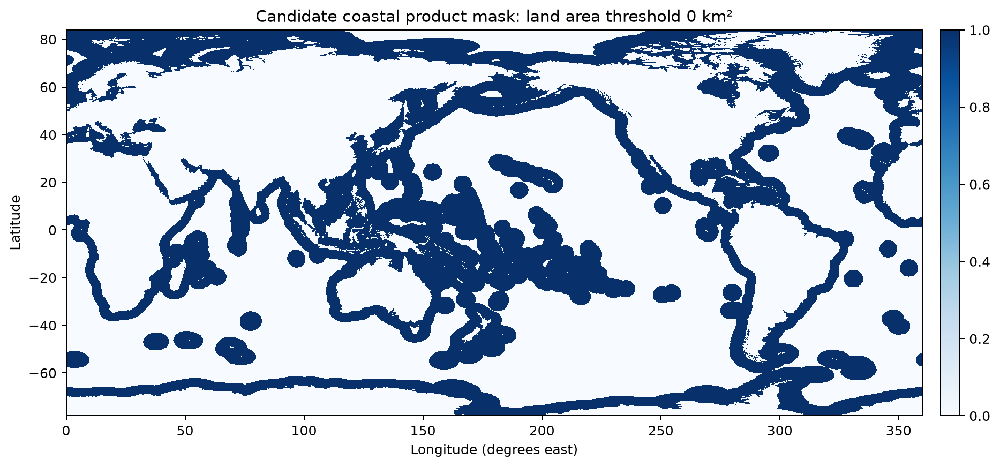

Figure 1. Observation-independent 400-km candidate using every GSHHG island as land; this maximizes small-island halos and supplies the inclusive sensitivity endpoint.

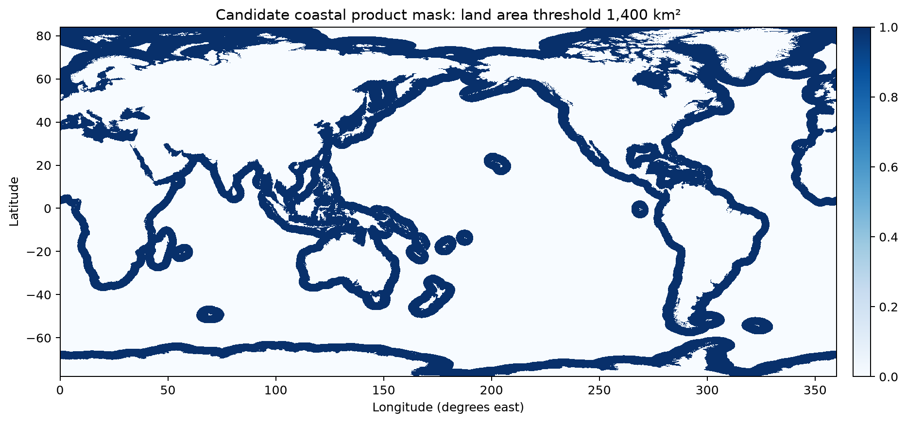

Figure 2. Frozen ReCAD product geometry: ocean nodes within 400 km of GSHHG land at least 1,400 km², evaluated on the native 1/8-degree grid.

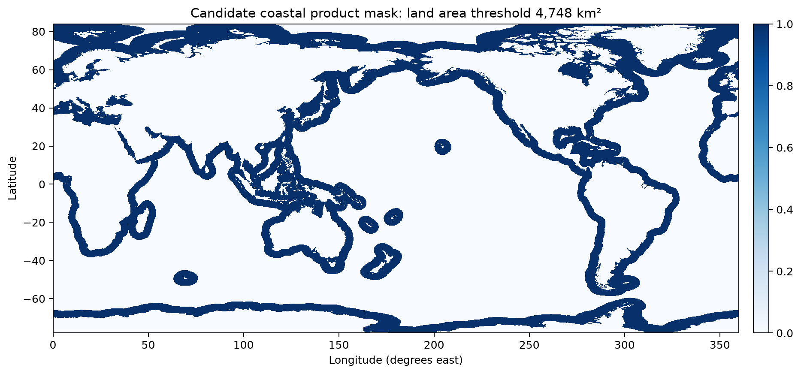

Figure 3. Restrictive 4,748-km² island-threshold candidate, included as the historical IBTrACS large-island sensitivity endpoint rather than the selected geometry.

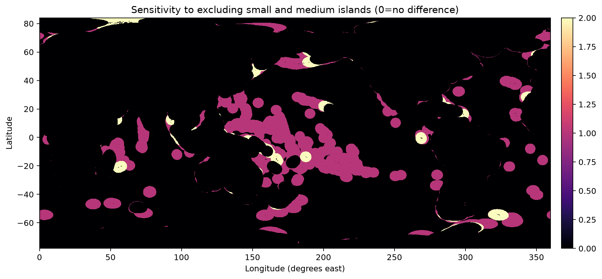

Figure 4. Cells removed as the minimum island area increases; class 1 is present only in the all-island candidate and class 2 is retained at 1,400 km² but removed at 4,748 km².

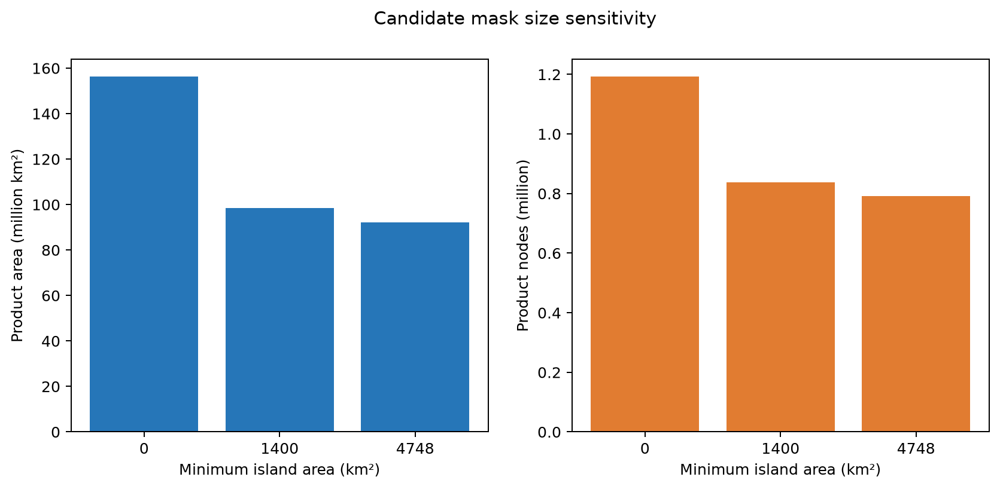

Figure 5. Total spherical area and native-grid node count for the three candidate product geometries, quantifying the consequence of the island-size choice.

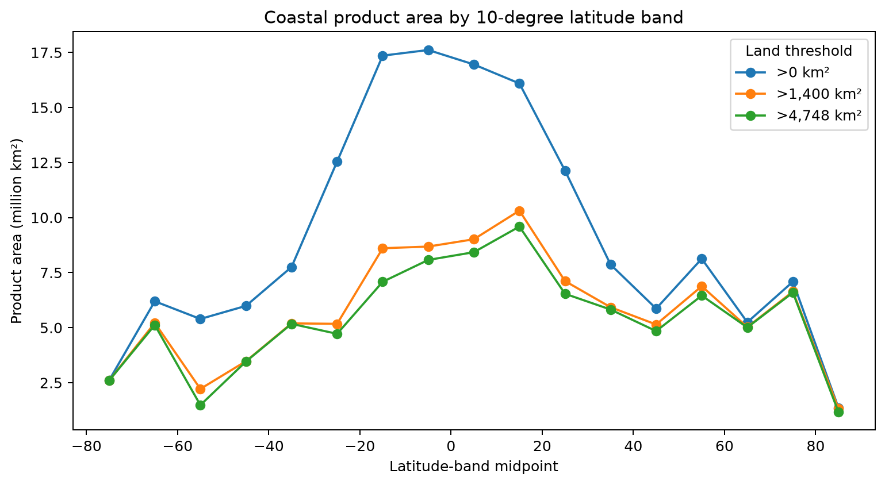

Figure 6. Spherical product area by ten-degree latitude band for each candidate, showing where the island threshold changes global coverage.

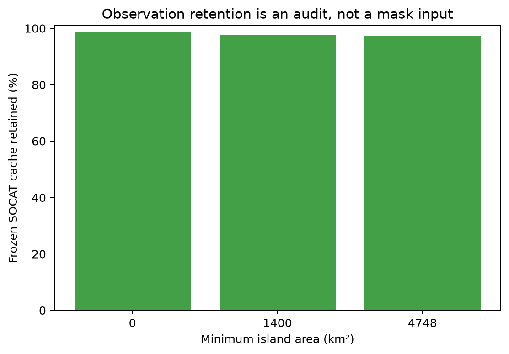

Figure 7. Fraction of the frozen SOCATv2026 cache falling inside each candidate; observations are used only after geometry construction as a sensitivity audit and never define the mask.

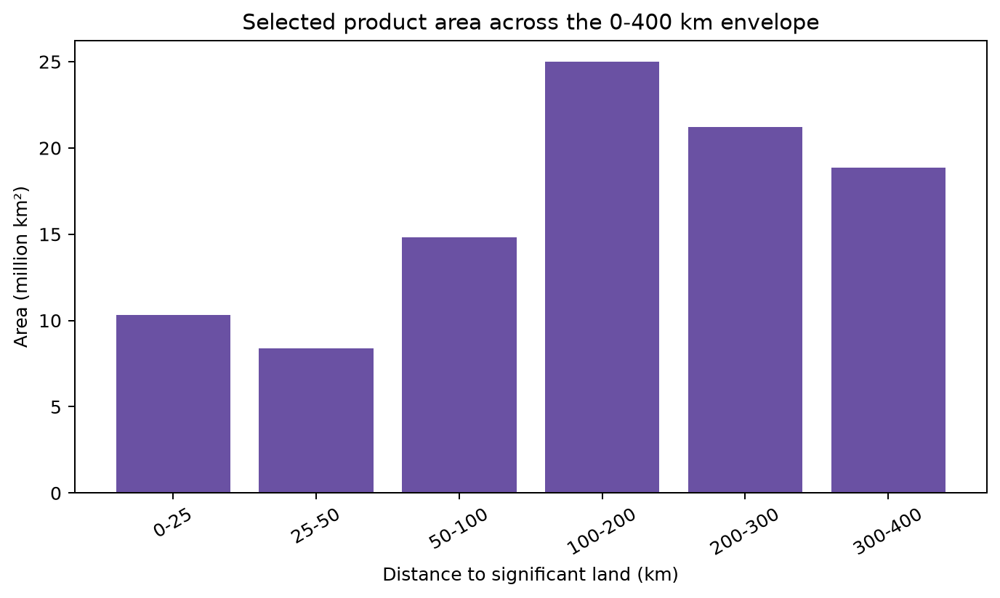

Figure 8. Area of the selected 1,400-km² product geometry by distance from significant land; the complete release envelope ends at 400 km.

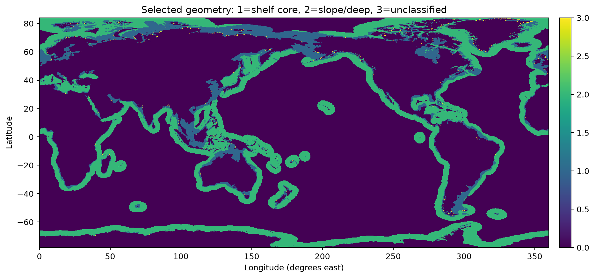

Figure 9. GEBCO-2025 subdivision of the selected product into a 0-200 m shelf core, waters deeper than 200 m, and any bathymetrically unclassified cells.

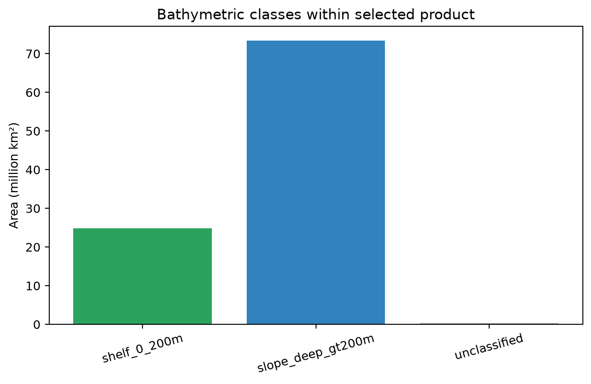

Figure 10. Spherical area of shelf, slope/deep, and unclassified cells within the selected 400-km product geometry.

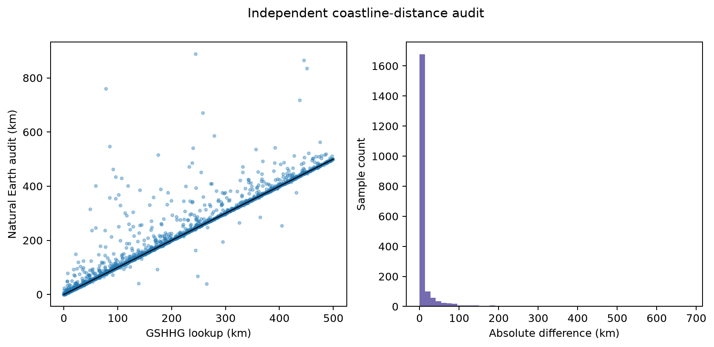

Figure 11. Deterministic 2,000-point comparison between the GSHHG distance lookup and an independent haversine nearest-coast calculation from Natural Earth 10m vertices; disagreement reflects both source geometry and raster resolution.

Tables 1-11 in `tables/` contain the exact plotted summaries, independent audit samples, source hashes, agreement thresholds, and frozen decision parameters. Every image has source-data mapping in `archive_manifest.json`.
