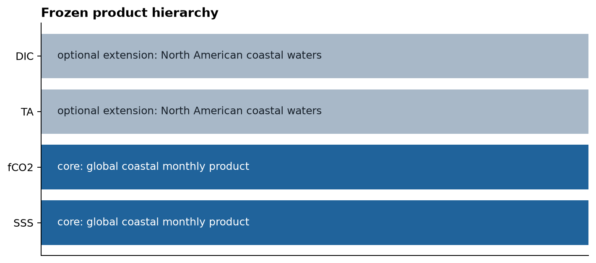
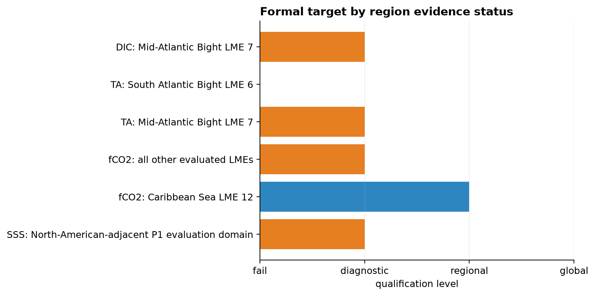
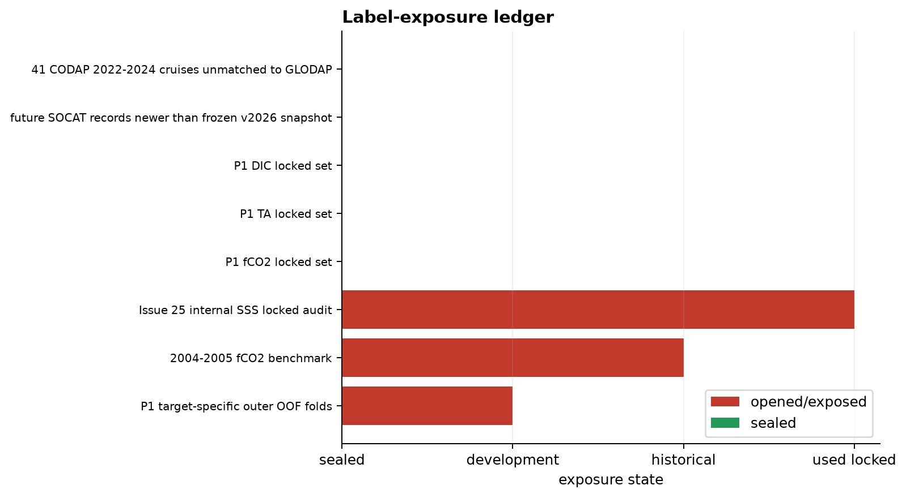
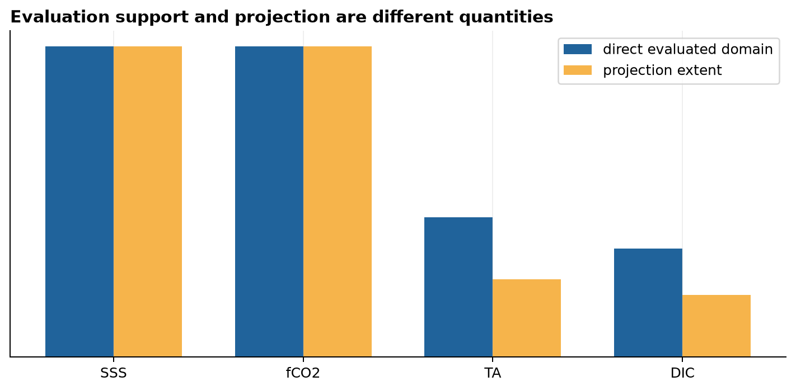
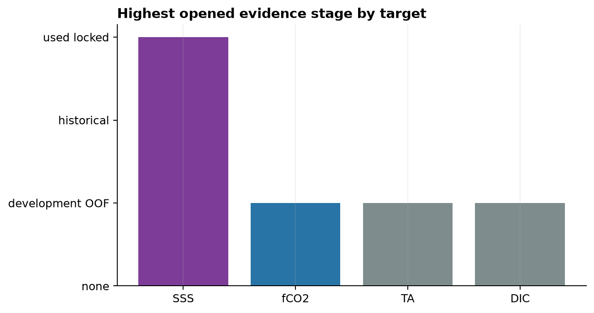
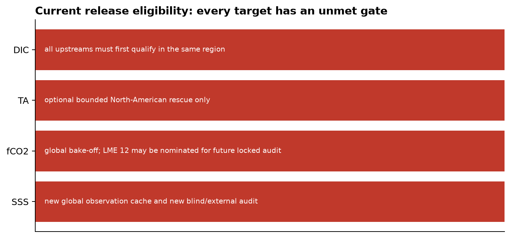
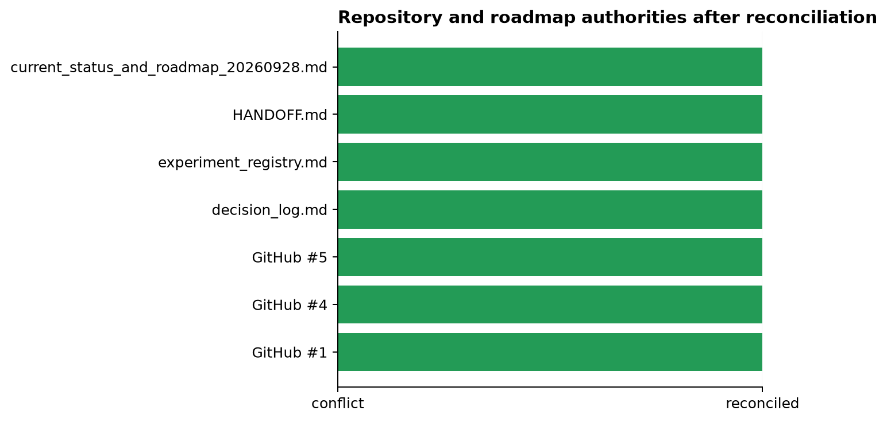
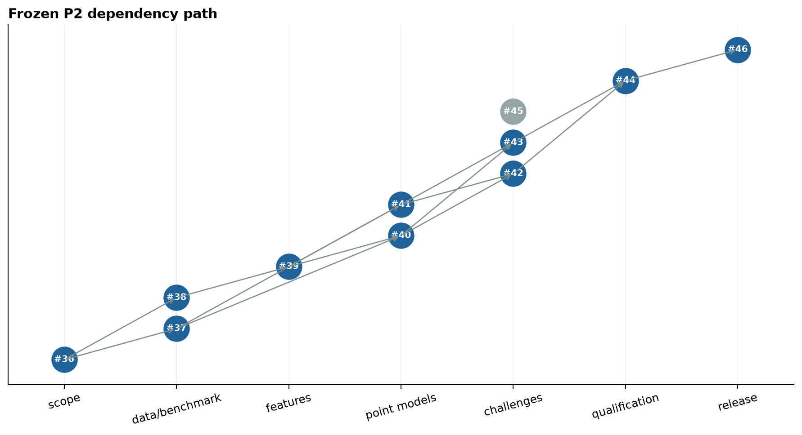

# Issue #36 product-scope and evidence reconciliation

## Scientific question and permitted claim

What can P2 legitimately build from the completed P1 evidence? The frozen answer is a **global-coastal SSS/fCO2 core research program**, with TA/DIC limited to an optional North-American extension. This describes product priority and intended domain, not current global qualification. Current formal statuses are: SSS `diagnostic_only`; fCO2 `pass_regional` only in Caribbean LME 12; MAB TA and DIC `diagnostic_only`; SAB TA `fail`.

## Data, splits, and leakage controls

This reconciliation reads only immutable P1 reports and manifests from Issues #25-#28 and #32 plus the frozen v2.2 data manifest. It does not read row-level labels or predictions and opens no new locked or external-independent set. The 2004-2005 fCO2 result is historical. Development OOF labels are exposed for selection. The Issue #25 SSS locked audit is permanently spent and cannot serve as a new blind test. fCO2, TA, DIC locked sets and future external candidates remain sealed.

Direct observation domains are recorded separately from grid projection domains. A global coastal atlas means that covariates and predictions exist on that grid. It cannot establish global accuracy, locked evidence, or statistical independence.

## Candidate models and training

No model was trained or selected in this governance experiment. Its candidate objects are competing scope statements and evidence labels. The machine-readable policy rejects global qualification without `pass_global`, rejects reuse of a used locked set as blind, rejects claims of direct global evidence from atlas projection, and requires every status to link to an existing immutable report and manifest.

## Main development results

All eight acceptance checks pass. Six target-region states are linked to 12 hashed upstream artifacts. Eight label pools cover development, historical, used locked, sealed locked, and external categories. Seven roadmap/repository authorities now carry the same hierarchy and evidence interpretation. No current target is release-eligible: Issues #37-#44 must establish genuinely global evidence and target-specific reliability before P3.

The SSS conflict is resolved in favor of the formal Issue #25 manifest: locked RMSE improved over GLORYS, but LME 17 failed the frozen worst-region gate, so the decision remains `diagnostic_only`. Later `pass_global` closure wording has no evidentiary authority.

## Decision and limitations

Decision: **`scope_reconciled`**. P2 may proceed to #37 and #38. Global coastal SSS and fCO2 are core targets but begin unqualified; their final status must be earned independently. TA/DIC may consume at most ten percent of P2 effort, cannot block the core, and may end suppressed or untrusted. This audit verifies governance consistency, not scientific accuracy; it creates no new predictive evidence.

## Figure and table index

Tables 1-9 contain target-region status, label exposure, domain semantics, upstream hashes, authority consistency, release gates, hierarchy, roadmap dependencies, and acceptance checks.

Figure 1. Frozen product hierarchy: global coastal SSS and fCO2 are the two core targets; TA and DIC are an optional, non-blocking North-American extension capped at ten percent of the P2 budget.

Figure 2. Formal status by target and evaluated region. SSS remains diagnostic-only, fCO2 passes only regionally in Caribbean LME 12, MAB TA/DIC remain diagnostic-only, and SAB TA fails.

Figure 3. Label-exposure ledger separating development and historical labels, the spent SSS locked audit, and still-sealed locked or external candidates; green entries remain unopened.

Figure 4. Conceptual comparison of directly evaluated observation support and atlas projection extent. A global covariate grid expands where predictions can be computed, not where accuracy has been validated.

Figure 5. Highest opened evidence stage by target. Only SSS reached a used internal locked audit, while current fCO2, TA, and DIC decisions rely on development evidence.

Figure 6. No current target is release-eligible. Each bar records the next target-specific evidence gate rather than treating one target's success as qualification of another.

Figure 7. Consistency audit after reconciliation across GitHub roadmap issues and repository governance documents; all seven named authorities now express the same scope and evidence status.

Figure 8. Frozen P2 dependency graph. Scope reconciliation unlocks benchmark and data work; target-specific models then feed reliability qualification, while TA/DIC remains a bounded side path.
